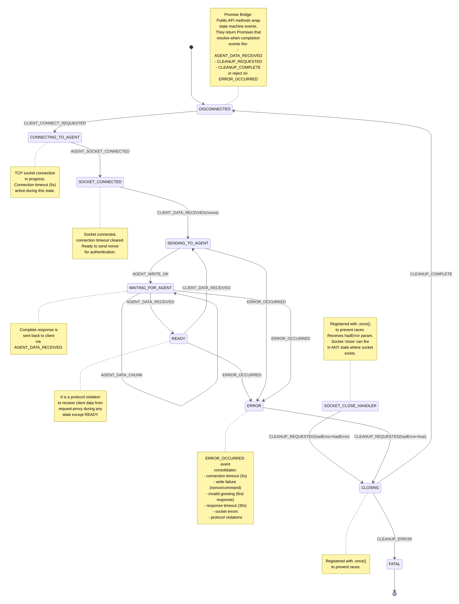

# Agent Proxy State Machine Refactor

## Overview

Refactor `agent-proxy` VSCode extension from its current implementation to an EventEmitter state machine
having model and style that matches the [request-proxy extension refactor](request-state-machine-refactor.md)
that was recently completed.

**TL;DR**: Refactor agent-proxy from implicit promise-based flow to explicit EventEmitter state machine with 8 states and 10 events, matching the architecture successfully implemented in request-proxy. Key improvements: 30s command timeouts, concurrent command prevention via protocol error, explicit state tracking, comprehensive test coverage (target >80%), and shared code extraction during refactor. **Key insight**: BYE is just a normal command - reuse SENDING_TO_AGENT → WAITING_FOR_AGENT → READY flow. **CRITICAL**: Node.js socket 'close' event can fire in ANY state where socket exists (CONNECTING_TO_AGENT, SOCKET_CONNECTED, READY, SENDING_TO_AGENT, WAITING_FOR_AGENT, ERROR, CLOSING), not just expected states. Handler must be defensive, check current state, and route based on hadError parameter: transmission errors → ERROR → CLOSING, clean closes → CLOSING directly via CLEANUP_REQUESTED. Must handle gracefully in ALL socket-having states. Socket close handler designed to be robust but will require adjustment during implementation. The simpler flow (no INQUIRE management, persistent multi-session model, unified disconnect handling) requires fewer states (8 vs 12 in request-proxy) but maintains the same architectural rigor.

---

## States

Agent-proxy lifecycle has 8 states reflecting TCP connection with nonce authentication and persistent sessions:

1. **DISCONNECTED** — No active connection, session can be created
2. **CONNECTING_TO_AGENT** — TCP socket connection in progress
3. **SOCKET_CONNECTED** — Socket connected, ready to send nonce
4. **READY** — Connected and authenticated, can accept commands (including BYE)
5. **SENDING_TO_AGENT** — Command write in progress to agent (nonce or command)
6. **WAITING_FOR_AGENT** — Accumulating response chunks from agent (greeting or command response)
7. **ERROR** — Error occurred, cleanup needed
8. **CLOSING** — Cleanup in progress (socket teardown, session removal)

**Terminal States:**
- **DISCONNECTED** (can create new session)
- **FATAL** (unrecoverable error, session destroyed permanently) - implicit via session deletion

**Alignment with Request-Proxy:**
- WAITING_FOR_AGENT matches request-proxy exactly
- CLOSING handles cleanup (matches request-proxy CLOSING semantics)
- No separate DISCONNECTING state needed - BYE is just another command, socket 'close' event triggers transition to CLOSING

**Socket 'close' Event - Can Fire in ANY State:**
- **CRITICAL**: Node.js socket 'close' event fires whenever the underlying TCP socket closes, regardless of our state machine's state
- Can fire in ANY state where socket exists: CONNECTING_TO_AGENT, SOCKET_CONNECTED, READY, SENDING_TO_AGENT, WAITING_FOR_AGENT, ERROR, CLOSING
- Handler must be defensive: check current state and ignore if in CLOSING/ERROR/DISCONNECTED (already handled)
- Route based on hadError parameter:
  - hadError=true: transmission error → ERROR_OCCURRED → ERROR → CLOSING
  - hadError=false: clean close → CLEANUP_REQUESTED → CLOSING
- Socket 'close' handler designed to be robust to ANY-state close events but **will require adjustment during implementation and testing**
- Comprehensive tests planned for socket close in ALL states

---

## Events (10 Total)

Events drive state transitions with consolidated error handling pattern from request-proxy:

1. `CLIENT_CONNECT_REQUESTED` — connectAgent() called by request-proxy
2. `CLIENT_DATA_RECEIVED` — Data received from client (nonce Buffer or command string)
3. `AGENT_SOCKET_CONNECTED` — TCP socket connected to agent
4. `AGENT_WRITE_OK` — Write succeeded (nonce or command)
5. `AGENT_DATA_CHUNK` — Response data chunk received from agent
6. `AGENT_DATA_RECEIVED` — Complete response received (greeting or command response)
7. `ERROR_OCCURRED` — Any error (connection, write, timeout, socket, validation, protocol violation)
8. `CLEANUP_REQUESTED` — Cleanup beginning with {hadError: boolean} payload. Emitted by: socket 'close' (hadError from Node.js), ERROR state (hadError=true). **Registered with .once() to prevent races.**
9. `CLEANUP_COMPLETE` — Cleanup successful
10. `CLEANUP_ERROR` — Cleanup failed

**Event Naming Consistency with Request-Proxy:**
- **CLIENT_*** pattern: CLIENT_CONNECT_REQUESTED, CLIENT_DATA_RECEIVED - events from request-proxy calling VS Code commands or data from client
- **AGENT_*** pattern: AGENT_SOCKET_CONNECTED, AGENT_WRITE_OK, AGENT_DATA_CHUNK, AGENT_DATA_RECEIVED - events from gpg-agent or socket operations
- **CLEANUP_*** pattern: CLEANUP_REQUESTED, CLEANUP_COMPLETE, CLEANUP_ERROR - cleanup lifecycle events
- **_RECEIVED** suffix: CLIENT_CONNECT_REQUESTED, CLIENT_DATA_RECEIVED, AGENT_DATA_RECEIVED - data/requests received

**CLEANUP_REQUESTED Event Design:**
- **ONLY event that transitions to CLOSING state**
- Single event for all cleanup paths (graceful disconnect, errors, socket close)
- Payload: `{ hadError: boolean }` - distinguishes error vs graceful for logging and Promise rejection
- **Two sources emit CLEANUP_REQUESTED:**
  1. **ERROR state handler** - always emits with {hadError: true}
  2. **Socket 'close' handler** - emits when hadError=false (graceful close)
- **Flow paths to CLOSING:**
  - Socket close hadError=false → emit CLEANUP_REQUESTED {hadError: false} → CLOSING
  - Socket close hadError=true → ERROR_OCCURRED → ERROR → emit CLEANUP_REQUESTED {hadError: true} → CLOSING
  - Other errors → ERROR_OCCURRED → ERROR → emit CLEANUP_REQUESTED {hadError: true} → CLOSING
- **Registered with `.once()`** to ensure cleanup runs exactly once, preventing race conditions

**Event Naming Philosophy:**
Events describe "what happened" not "what to do". CLIENT_DATA_RECEIVED means data received from client (nonce or command). AGENT_DATA_RECEIVED means complete response received from agent (greeting or command response). AGENT_WRITE_OK means socket write completed successfully. This naming makes event sources and meanings immediately clear.

**Error Consolidation** (matches request-proxy pattern):
- Connection timeout → ERROR_OCCURRED
- Write failure (nonce or command) → ERROR_OCCURRED
- Invalid greeting (first response validation) → ERROR_OCCURRED
- Response timeout → ERROR_OCCURRED (30s default)
- Socket errors → ERROR_OCCURRED
- Protocol violations (concurrent commands) → ERROR_OCCURRED

---

## State Transition Diagram

**Note:** This diagram shows the internal state machine. The public API methods (`connectAgent`, `sendCommands`, `disconnectAgent`) wrap this state machine and return Promises. When request-proxy calls a VS Code command, the public API method registers Promise listeners for completion events (AGENT_DATA_RECEIVED, ERROR_OCCURRED, CLEANUP_REQUESTED), emits the triggering event (CLIENT_DATA_RECEIVED), and the state machine processes it asynchronously. The Promise resolves/rejects when the completion event fires.



---

## Socket 'close' Event Handling

**CRITICAL: Socket 'close' Event Can Fire in ANY State**

Node.js socket 'close' event is emitted whenever the underlying TCP socket closes, **regardless of our state machine's state**. This event can fire at any time the socket is open:
- CONNECTING_TO_AGENT (connection fails, socket created but not yet connected)
- SOCKET_CONNECTED (connection timeout, agent closes before nonce sent)
- READY (agent crashes, network failure, agent-initiated close)
- SENDING_TO_AGENT (write fails, agent crashes during write)
- WAITING_FOR_AGENT (agent crashes, network failure, timeout)
- ERROR (socket still exists, cleanup not yet started)
- CLOSING (during cleanup when socket.destroy() is called)

The handler MUST be defensive and handle close events from any state safely.

**Key Design Decision:** Node.js socket 'close' event provides `hadError` boolean parameter. We use this to emit CLEANUP_REQUESTED with the hadError value for logging and Promise rejection distinction.

**Socket 'close' Handler Logic (Handles ALL States):**
```typescript
socket.once('close', (hadError: boolean) => {
  // CRITICAL: This event fires exactly once (registered with .once())
  // Can fire in ANY state where socket exists
  // State machine handlers will process events appropriately
  
  if (hadError) {
    // Transmission error during socket I/O
    session.emit('ERROR_OCCURRED', { error: new Error('Socket closed with transmission error') });
    // Flow: current state → ERROR → ERROR emits CLEANUP_REQUESTED {hadError: true} → CLOSING
  } else {
    // Clean/graceful socket close
    session.emit('CLEANUP_REQUESTED', { hadError: false });
    // Flow: current state → CLOSING
  }
});
```

**Implementation Notes:**
- Socket 'close' event registered with `.once()` - fires exactly once then auto-removes
- Can fire in ANY state where socket exists (CONNECTING_TO_AGENT, SOCKET_CONNECTED, READY, SENDING_TO_AGENT, WAITING_FOR_AGENT, ERROR, CLOSING)
- No defensive state checks needed - `.once()` ensures single execution, state machine handles rest
- **Socket 'close' handler emits events, does NOT directly change state:**
  - hadError=true → emit ERROR_OCCURRED → ERROR state handler emits CLEANUP_REQUESTED {hadError: true} → CLOSING
  - hadError=false → emit CLEANUP_REQUESTED {hadError: false} → CLOSING
- **CLOSING state is ONLY reached via CLEANUP_REQUESTED event**
- CLEANUP_REQUESTED handler also registered with `.once()` to prevent duplicate cleanup
- State machine handlers are idempotent - can safely process events from any state
- Testing must verify close handling in **ALL states** where socket exists

**Graceful Disconnect Flow:**
1. `disconnectAgent()` called by request-proxy
2. Send BYE command through normal flow: `CLIENT_DATA_RECEIVED` event
3. READY → SENDING_TO_AGENT (write BYE)
4. SENDING_TO_AGENT → WAITING_FOR_AGENT (write succeeded)
5. **RACE CONDITION:** GPG agent sends OK response and immediately closes socket
   - **Path A (slow close):** WAITING_FOR_AGENT → READY (OK response processed), then socket 'close' → CLEANUP_REQUESTED with {hadError: false} → CLOSING
   - **Path B (fast close):** Socket 'close' fires while in WAITING_FOR_AGENT (OK response still buffered), CLEANUP_REQUESTED with {hadError: false} → CLOSING, response processing completes in CLOSING
6. Promise resolves when CLEANUP_REQUESTED event fires (BYE was successful, hadError=false)
7. Session cleanup proceeds in CLOSING state

**Key Insight:** The Promise bridge for `disconnectAgent()` listens for CLEANUP_REQUESTED event with hadError=false. This ensures we wait for the socket to close (which signals BYE completion) regardless of whether close happens before or after state transitions.

**Error Disconnect Flow:**
1. Network error, timeout, or agent crash occurs
2. Socket closes with transmission error
3. Socket 'close' event fires with `hadError === true`
4. Emit `ERROR_OCCURRED` event
5. Current state → ERROR → emit `CLEANUP_REQUESTED` with {hadError: true} → CLOSING (cleanup)

**Manual Cleanup Flow:**
1. ERROR state handler emits `CLEANUP_REQUESTED` with {hadError: true}
2. Socket still exists, CLOSING state handler calls `socket.destroy()`
3. Socket 'close' event fires (typically `hadError === false` for manual destroy)
4. Socket close emits `CLEANUP_REQUESTED` {hadError: false}, but already in CLOSING
5. CLEANUP_REQUESTED registered with `.once()` so handler already ran, no duplicate execution

**Testing Requirements (Socket Close in ALL States):**
- [ ] Verify gpg-agent BYE response causes `hadError === false`
- [ ] Verify network disconnect causes `hadError === true`
- [ ] Verify ERROR → socket.destroy() → close event safely handled
- [ ] Verify CLEANUP_REQUESTED `.once()` prevents duplicate cleanup execution
- [ ] **Test socket close (hadError=true) in EVERY socket-having state:**
  - [ ] CONNECTING_TO_AGENT → ERROR → CLEANUP_REQUESTED with {hadError: true} → CLOSING
  - [ ] SOCKET_CONNECTED → ERROR → CLEANUP_REQUESTED with {hadError: true} → CLOSING
  - [ ] READY → ERROR → CLEANUP_REQUESTED with {hadError: true} → CLOSING
  - [ ] SENDING_TO_AGENT → ERROR → CLEANUP_REQUESTED with {hadError: true} → CLOSING
  - [ ] WAITING_FOR_AGENT → ERROR → CLEANUP_REQUESTED with {hadError: true} → CLOSING
- [ ] **Test socket close (hadError=false) in EVERY socket-having state:**
  - [ ] CONNECTING_TO_AGENT → CLEANUP_REQUESTED with {hadError: false} → CLOSING
  - [ ] SOCKET_CONNECTED → CLEANUP_REQUESTED with {hadError: false} → CLOSING
  - [ ] READY → CLEANUP_REQUESTED with {hadError: false} → CLOSING
  - [ ] SENDING_TO_AGENT → CLEANUP_REQUESTED with {hadError: false} → CLOSING
  - [ ] WAITING_FOR_AGENT → CLEANUP_REQUESTED with {hadError: false} → CLOSING (BYE race)
- [ ] **Test BYE race condition:** Mock socket close firing while in WAITING_FOR_AGENT (before AGENT_DATA_RECEIVED processed)
- [ ] **Test BYE race condition:** Mock socket close firing after transition to READY (slow close)
- [ ] Verify disconnectAgent() Promise resolves on CLEANUP_REQUESTED with hadError=false regardless of state timing

---

## How Request-Proxy Interacts with Agent-Proxy

The state machine diagram above shows **internal** event flow. Request-proxy sees a different, simpler **external** API:

### External API (Request-Proxy Perspective)

```typescript
// Request-proxy calls VS Code commands, gets back Promises:

// 1. Connect
const { sessionId, greeting } = await vscode.commands.executeCommand('_gpg-agent-proxy.connectAgent');
// Internally: emits CLIENT_CONNECT_REQUESTED → state machine → AGENT_DATA_RECEIVED resolves Promise

// 2. Send command  
const { response } = await vscode.commands.executeCommand('_gpg-agent-proxy.sendCommands', sessionId, 'GETINFO version\n');
// Internally: emits CLIENT_DATA_RECEIVED → state machine → AGENT_DATA_RECEIVED resolves Promise

// 3. Disconnect (sends BYE command)
await vscode.commands.executeCommand('_gpg-agent-proxy.disconnectAgent', sessionId);
// Internally: emits CLIENT_DATA_RECEIVED with BYE → state machine → CLEANUP_REQUESTED resolves Promise
```

### Internal Implementation (State Machine)

The public API methods bridge between Promises (external) and EventEmitter (internal):

1. **Request-proxy calls** `_gpg-agent-proxy.sendCommands` (works same for BYE)
2. **extension.ts** calls `await agentProxyService.sendCommands(sessionId, commandBlock)`
3. **AgentProxy.sendCommands()** creates Promise and registers listeners:
   ```typescript
   session.once('AGENT_DATA_RECEIVED', resolvePromise);
   session.once('ERROR_OCCURRED', rejectPromise);
   session.emit('CLIENT_DATA_RECEIVED', { commandBlock });
   ```
4. **State machine** processes CLIENT_DATA_RECEIVED event:
   - READY → SENDING_TO_AGENT (write command)
   - SENDING_TO_AGENT → WAITING_FOR_AGENT (on AGENT_WRITE_OK)
   - WAITING_FOR_AGENT → accumulate chunks (AGENT_DATA_CHUNK events)
   - WAITING_FOR_AGENT → READY (on AGENT_DATA_RECEIVED)
5. **AGENT_DATA_RECEIVED event** fires
6. **Promise listener** catches it, removes other listener to prevent leak, calls resolve({ response })
7. **AgentProxy.sendCommands()** returns to extension.ts
8. **extension.ts** returns to request-proxy
9. **Request-proxy** receives `{ response: string }`

**For BYE command (disconnectAgent):**
- Same flow through steps 1-9, then:
10. Agent closes socket (GPG protocol spec)
11. Socket 'close' event fires → CLEANUP_REQUESTED event
12. Session transitions to CLOSING → cleanup → DISCONNECTED

**The mermaid diagram shows steps 4-5 (state machine internals). The Promise bridge (steps 3 and 6) wraps this.**

---

## Implementation Plan

### Phase 1: Type Definitions & Infrastructure ✅ COMPLETE
**File:** `agent-proxy/src/services/agentProxy.ts`

- [x] Define `SessionState` type with all 7 states
- [x] Define `StateEvent` union with all 11 events (CLIENT_*/AGENT_*/CLEANUP_* patterns)
- [x] Define `StateHandler` function signature
- [x] Create transition table (lookup: `(state, event) → nextState`)
- [x] Add validation that transition table covers all valid (state, event) pairs
- [x] Create `AgentSessionManager` class extending EventEmitter (per session, not global)
- [x] Update `AgentProxy` class to manage Map<sessionId, AgentSessionManager>

**Dependency Injection Design:**
- [x] Keep existing `AgentProxyConfig` for public API
- [x] Keep existing `AgentProxyDeps` for optional dependencies (socketFactory, fileSystem)
- [x] Add `AgentSessionManagerConfig` for per-session configuration (includes timeout values)
- [x] All handlers use injected dependencies (testable via mocks)

**Promise ↔ EventEmitter Bridge Design:**
- [x] Public API methods (`connectAgent`, `sendCommands`, `disconnectAgent`) remain async and return Promises
- [x] Each public method bridges to EventEmitter:
  1. Validate preconditions (e.g., session state)
  2. Create Promise with resolve/reject callbacks
  3. Register event listeners for completion (AGENT_RESPONSE_COMPLETE, ERROR_OCCURRED, CLEANUP_REQUESTED)
  4. Emit event describing what happened (CLIENT_CONNECT_REQUESTED, CLIENT_COMMAND_RECEIVED)
  5. Event handlers process asynchronously and emit completion events
  6. Completion events trigger resolve/reject, cleanup listeners
- [x] Pattern allows VS Code commands to await results while state machine processes events internally

**Implementation Notes:**
- Added complete STATE_TRANSITIONS table with all valid (state, event) → nextState mappings
- AgentSessionManager extends EventEmitter with socket event wiring using .once() for connect/error/close, .on() for data
- Socket 'close' handler checks hadError parameter and emits ERROR_OCCURRED (hadError=true) or CLEANUP_REQUESTED (hadError=false)
- Added validateTransitionTable() utility function for debugging transition completeness
- Added sessionTimeouts field to AgentProxy (connection: 5000ms, greeting: 5000ms, response: 30000ms)
- Added createSessionConfig() helper method to AgentProxy for Phase 3 integration
- Original implementation preserved - all changes are additive and non-breaking
- File size increased from 348 to 666 lines

**Deliverable:** ✅ Compiles, no behavior change, architecture in place
**Status:** Complete - verified with `npm run compile` (successful compilation)

---

### Phase 2: Safety Net - Test Current Implementation ✅ COMPLETE
**Files:** 
- `agent-proxy/src/test/agentProxy.test.ts`
- `shared/src/test/helpers.ts` (mock infrastructure enhancements)

Add comprehensive tests for current implementation before refactoring (establish baseline):

#### Response Completion Detection (10 tests)
- [x] Test `isCompleteResponse()` with OK response (single line)
- [x] Test `isCompleteResponse()` with OK response (multi-line with data lines)
- [x] Test `isCompleteResponse()` with ERR response
- [x] Test `isCompleteResponse()` with INQUIRE response
- [x] Test `isCompleteResponse()` with END response (D-block) - Modified to test INQUIRE context
- [x] Test incomplete response (no newline)
- [x] Test incomplete response (partial OK/ERR)
- [x] Test response with empty lines before terminal line
- [x] Test response with embedded "OK" in data lines
- [x] Test binary data preservation in responses

#### Response Accumulation (5 tests)
- [x] Test response split across 2 chunks
- [x] Test response split across 3+ chunks
- [x] Test large response (>1MB) accumulation
- [x] Test rapid chunk arrival
- [x] Test response with all byte values (0-255)

#### Socket File Parsing (5 tests)
- [x] Test valid socket file format integration
- [x] Edge case tests (missing newlines, short nonce, non-numeric port, extra data) - **In shared/src/test/protocol.test.ts** where parseSocketFile() is defined

#### Timeout Handling (3 tests)
- [x] Test connection timeout (5s) fires and cleans up
- [x] Test greeting timeout (5s) fires and cleans up
- [x] Test timeout cleanup removes session from Map

#### Nonce Authentication (3 tests)
- [x] Test nonce sent immediately after socket connect
- [x] Test nonce write failure triggers cleanup
- [x] Test greeting received after nonce completes connection

#### Error Paths (4 tests)
- [x] Test socket error during waitForResponse
- [x] Test write error during sendCommands
- [x] Test greeting acceptance (relaxed validation accepts any OK*)
- [x] Test invalid session ID on sendCommands

**Mock Infrastructure Enhancements:**
Added to `shared/src/test/helpers.ts`:
- `MockSocket.setWriteError()` - enable write failure testing
- `MockSocketFactory.setDelayConnect(ms)` - enable timeout testing
- `MockSocketFactory.setWriteError()` - set write error on next created socket
- `MockSocketFactory.getWrites()` - inspect writes for nonce verification

**Implementation Notes:**
- Added 27 new test cases (9 original + 27 new = 36 total passing tests)
- Enhanced mock infrastructure to support all baseline test scenarios
- Socket file parsing edge cases tested in shared package (proper layering)
- Discovered current implementation behavior:
  - Greeting validation is relaxed (accepts any line starting with OK)
  - END response only recognized in INQUIRE context (isInquireResponse flag)
  - Binary data preserved via latin1 encoding throughout
  - Timeouts: 5s connection, 5s greeting, 30s response (Phase 1 config)
- All tests passing without skips

**Bug Fixes During Phase 2:**
1. **Socket File Format:** Fixed tests to use correct "port\nnonce" format (not "host\nport\nnonce")
   - parseSocketFile() expects exactly this format per protocol spec
   - Changed to binary nonce: Buffer.from([1,2,3...16])
2. **MockSocketFactory Timing:** Fixed immediate connection behavior
   - delay > 0: use setTimeout(callback, delay)
   - delay === 0: use setImmediate(callback) for immediate execution
   - Prevents test timeouts with immediate connections
3. **Timeout Promise Cleanup:** Fixed waitForResponse timeout handler
   - Now destroys socket and deletes session before rejecting promise
   - Prevents "rejected promise not handled within 1 second" warnings
   - Ensures clean session termination on timeout
4. **Connection Error Cleanup:** Fixed connectAgent catch block
   - Defensively checks if session exists before cleanup
   - Handles cases where timeout handler already cleaned up session

**Code Improvements During Phase 2:**
1. **Eliminated Code Duplication:** Added `cleanupSession(sessionId, socket?)` helper method
   - Consolidates socket.destroy() and sessions.delete() logic
   - Eliminates 6 instances of duplicate cleanup code
   - Used in all error paths and timeout handlers
2. **Improved Timeout Handling:** Replaced isTimedOut flag with listener removal pattern
   - Timeout handlers now remove socket listeners directly
   - Cleaner approach without state tracking flag
3. **Resource Cleanup Before Rejection:** All promise rejections now clean up resources first
   - Prevents resource leaks on error paths
   - Ensures sessions are properly removed from Map

**Socket File Parsing Edge Cases:**
- All 5 edge cases tested in `shared/src/test/protocol.test.ts`:
  1. Valid format extraction
  2. Missing newline (throws error)
  3. Invalid port (throws error)
  4. Invalid nonce length (throws error)
  5. Extra data after nonce (ignored correctly)

**Target:** +30 tests (9 current → 39 total)
**Actual:** +27 tests (9 current → 36 total) - 3 fewer due to proper test layering
**Deliverable:** ✅ High confidence in current implementation logic, safety net for refactoring
**Status:** Complete - 36 passing tests, comprehensive baseline coverage

---

### Phase 3: EventEmitter Session Manager Architecture ✅ COMPLETE
**File:** `agent-proxy/src/services/agentProxy.ts`

Implement EventEmitter-based session manager (per-session instances):

- [x] Create `AgentSessionManager extends EventEmitter` class
- [x] Add `sessionId: string`, `state: SessionState`, `socket: net.Socket`, `buffer: string` fields
- [N/A] Add `isDisconnecting: boolean` flag for BYE command handling (not needed - see socket close handler)
- [x] Implement `setState(newState: SessionState)` with logging
- [x] Register event handlers for all 11 events (`.on('EVENT_NAME', handler)`)
- [x] Implement `getState()` accessor for testing
- [x] Wire socket 'close' event handler with hadError routing logic

**Socket Event Wiring:**
- [x] Wire socket 'connect' event with **`.once()`** → emit `AGENT_SOCKET_CONNECTED`
  - Fires exactly once when connection established
  - `.once()` provides automatic cleanup
- [x] Wire socket 'data' event with **`.on()`** → emit `AGENT_DATA_CHUNK`
  - Fires multiple times as response chunks arrive
  - Must remain registered to accumulate complete response
- [x] Wire socket 'error' event with **`.once()`** → emit `ERROR_OCCURRED`
  - Fires once when error occurs
  - Socket typically closes after error anyway
  - `.once()` prevents duplicate error handling
- [x] Wire socket 'close' event with **`.once()`** → **CRITICAL: Can fire in ANY state where socket exists**
  - Fires exactly once when socket closes
  - `.once()` provides automatic cleanup and prevents duplicate handling
  - Check current state first (defensive)
  - Ignore if in CLOSING, ERROR, or DISCONNECTED (already handled or no socket)
  - `hadError === true` → emit `ERROR_OCCURRED` (from any remaining state)
  - `hadError === false` → emit `CLEANUP_REQUESTED` with {hadError: false} (from any remaining state)
- [x] Register `CLEANUP_REQUESTED` handler with `.once()` to prevent race conditions
- [x] Note: Socket 'close' handler must be robust to ANY-state close events

**Socket Event Registration Pattern:**
```typescript
socket.once('connect', () => session.emit('AGENT_SOCKET_CONNECTED'));
socket.on('data', (chunk) => session.emit('AGENT_DATA_CHUNK', chunk));
socket.once('error', (err) => session.emit('ERROR_OCCURRED', { error: err }));
socket.once('close', (hadError) => { /* routing logic */ });
```

**Implementation Notes:**
- AgentSessionManager class fully implemented with EventEmitter pattern
- All 11 event handlers registered with stub implementations for Phase 4
- Socket event wiring complete (connect, data, error, close)
- State transition logic implemented with setState() and transition() methods
- Timeout management fields added (connectionTimeout, greetingTimeout, responseTimeout)
- Helper methods: getState(), getSocket(), setSocket(), wireSocketEvents(), clearAllTimeouts()
- Old AgentProxy code paths continue to work unchanged (backwards compatible)
- All 36 baseline tests pass

**Deliverable:** ✅ EventEmitter architecture in place, old code paths still work
**Status:** Complete - Infrastructure ready for Phase 3.1 type system alignment

---

### Phase 3.1: Type System Alignment (agent-proxy ↔ request-proxy)
**Files:** 
- `agent-proxy/src/services/agentProxy.ts` (remove StateHandler dead code)
- `request-proxy/src/services/requestProxy.ts` (remove dead code + strengthen typing)

**Objective:** Align type system approaches between agent-proxy and request-proxy for consistency, type safety, and future shared code extraction. Remove all dead code from both extensions.

#### Current State Analysis

**Type System Comparison:**

| Aspect | agent-proxy (Phase 3) | request-proxy (completed) | Status |
|--------|----------------------|---------------------------|--------|
| SessionState | String literal union | String literal union | ✅ Consistent |
| StateEvent | String literal union | **Discriminated union (UNUSED)** | ❌ Dead code in request-proxy |
| StateHandler | **Type defined (UNUSED)** | **Type defined (UNUSED)** | ❌ Dead code in BOTH |
| Event Payloads | Separate `EventPayloads` interface | **Embedded (UNUSED)** | ❌ Dead code in request-proxy |
| Event Emission | `emit('EVENT_NAME', payload)` | `emit('EVENT_NAME', payload)` | ✅ Consistent (EventEmitter pattern) |
| Event Handlers | `handler(payload)` | `handler(payload)` | ✅ Consistent (EventEmitter pattern) |
| Transition Table | Strong: `StateTransitionTable` mapped type | Weak: `Record<SessionState, Record<string, SessionState>>` | ❌ Inconsistent |

**Root Cause:**
- request-proxy has **unused discriminated union type** that was never actually implemented
- **Both extensions have unused `StateHandler` type** that cannot be enforced by vanilla EventEmitter
- Both extensions actually use **EventEmitter's string-based pattern** (correct for EventEmitter)
- agent-proxy has **stronger transition table typing** that request-proxy needs

**Critical Discoveries:**

1. **request-proxy's `StateEvent` discriminated union is dead code**. The actual implementation uses EventEmitter's native pattern:
```typescript
// Type says this (BUT IT'S NEVER USED):
type StateEvent = { type: 'WRITE_OK' } | ...

// Code actually does this (EventEmitter standard pattern):
this.emit('WRITE_OK');                    // ✅ String event name
this.on('WRITE_OK', handler);              // ✅ String event name
private handleWriteOk(): void { }          // ✅ No event object parameter
```

2. **Both extensions have unused `StateHandler` type**. Vanilla EventEmitter cannot enforce typed handlers:
```typescript
// Both extensions define this (BUT IT'S NEVER USED):
type StateHandler = (config, session, event) => Promise<SessionState>;

// EventEmitter signature doesn't support it:
.on(event: string, listener: (...args: any[]) => void)  // ❌ No type safety

// Handlers are just methods (no StateHandler type applied):
private handleWriteOk(): void { }        // ✅ Plain method
private async handleError(error: string): Promise<void> { }  // ✅ Plain method
```

**Why StateHandler Cannot Work:**
- EventEmitter's `.on()` accepts `(...args: any[]) => void` - no way to enforce typed handlers
- Would need `typed-emitter` package or similar for handler type safety
- Current `StateHandler` type exists but is never referenced or enforced
- Should be removed as dead code from both extensions

#### Recommended Unified Type System

**Keep EventEmitter String-Based Pattern (Current in Both Extensions):**

```typescript
// 1. SessionState - string literal union (already consistent) ✅
export type SessionState = 'DISCONNECTED' | 'READY' | /* ... */;

// 2. StateEvent - string literal union (matches EventEmitter design)
export type StateEvent =
    | 'CLIENT_CONNECT_REQUESTED'
    | 'CLIENT_COMMAND_RECEIVED'
    | 'AGENT_SOCKET_CONNECTED'
    | 'AGENT_WRITE_OK'
    | 'AGENT_GREETING_RECEIVED'
    | 'AGENT_DATA_CHUNK'
    | 'AGENT_RESPONSE_COMPLETE'
    | 'ERROR_OCCURRED'
    | 'CLEANUP_REQUESTED'
    | 'CLEANUP_COMPLETE'
    | 'CLEANUP_ERROR';

// 3. Event payloads - separate interface (type-safe, keeps payloads documented)
export interface EventPayloads {
    CLIENT_CONNECT_REQUESTED: { port: number; nonce: Buffer };
    CLIENT_COMMAND_RECEIVED: { commandBlock: string };
    AGENT_SOCKET_CONNECTED: undefined;
    AGENT_WRITE_OK: undefined;
    AGENT_GREETING_RECEIVED: { greeting: string };
    AGENT_DATA_CHUNK: { chunk: string };
    AGENT_RESPONSE_COMPLETE: { response: string };
    ERROR_OCCURRED: { error: Error; message?: string };
    CLEANUP_REQUESTED: { hadError: boolean };
    CLEANUP_COMPLETE: undefined;
    CLEANUP_ERROR: { error: Error };
}

// 4. Transition table - strongly typed
type StateTransitionTable = {
    [K in SessionState]: {
        [E in StateEvent]?: SessionState;  // Event name is string
    };
};

const STATE_TRANSITIONS: StateTransitionTable = {
    DISCONNECTED: {
        CLIENT_CONNECT_REQUESTED: 'CONNECTING_TO_AGENT'
    },
    // ... rest unchanged
};

// 5. Event emission - EventEmitter native pattern
session.emit('AGENT_WRITE_OK');                                    // No payload
session.emit('AGENT_GREETING_RECEIVED', { greeting: 'OK' });      // With payload
session.on('AGENT_WRITE_OK', () => { });                           // Handler
session.on('AGENT_GREETING_RECEIVED', (payload) => { });          // Handler with payload
```

**Why This Is Correct:**
1. **Matches EventEmitter design** - `.emit(eventName, ...args)` uses strings, not objects
2. **Type safety maintained** - `EventPayloads` interface documents expected payload types
3. **Strong transition table** - Compile-time validation of state transitions
4. **No runtime changes** - Both extensions already work this way
5. **Simpler** - No need to wrap every event in `{ type: '...' }` object

#### Migration Path

**Phase 3.1a: Request-Proxy Cleanup (remove dead code)**
- Remove unused discriminated union `StateEvent` type
- Remove unused `StateHandler` type
- Replace StateEvent with string literal union (matches actual usage)
- Add `EventPayloads` interface (like agent-proxy)
- Add strong `StateTransitionTable` mapped type (like agent-proxy)
- Update transition table type annotation
- **Result:** Types match implementation, dead code removed, stronger typing

**Phase 3.1b: Agent-Proxy Cleanup (remove dead code)**
- Remove unused `StateHandler` type
- Verify rest of pattern is correct (it is)
- **Result:** Dead code removed, clean reference implementation

**Future (Phase 9 - Shared Code Extraction):**
- Extract common types to `@gpg-relay/shared/stateMachine.ts`:
  - Generic `SessionState` builder
  - Generic `StateEvent` string literal pattern
  - Generic `EventPayloads<Events>` interface pattern
  - Generic `StateTransitionTable<States, Events>` mapped type

#### Implementation Tasks

**Phase 3.1a: Request-Proxy Type System Cleanup**

- [x] Remove unused discriminated union `StateEvent` type
  - [x] Delete entire discriminated union definition (lines ~50-67)
  - [x] Replace with string literal union matching actual event names
- [x] Remove unused `StateHandler` type
  - [x] Delete StateHandler type definition (line 67)
  - [x] EventEmitter pattern doesn't support typed handlers
  - [x] Vanilla EventEmitter `.on()` accepts `(...args: any[]) => void`
  - [x] Handlers are just methods, no formal signature enforcement
- [x] Add `EventPayloads` interface
  - [x] Create interface mapping event names to payload types
  - [x] Include all 14 events from request-proxy
  - [x] Use `undefined` for events with no payload
- [x] Add `StateTransitionTable` mapped type
  ```typescript
  type StateTransitionTable = {
      [K in SessionState]: {
          [E in StateEvent]?: SessionState;
      };
  };
  ```
- [x] Update `transitionTable` type annotation
  - [x] Change from `Record<SessionState, Record<string, SessionState>>`
  - [x] To `const STATE_TRANSITIONS: StateTransitionTable = { ... }`
- [x] Verify compilation
  - [x] Run `npm run compile` in request-proxy
  - [x] Fix any type errors (should be minimal - types now match reality)
- [x] Run request-proxy tests
  - [x] All tests must pass (no runtime changes, only type cleanup)
- [x] Update comments
  - [x] Document StateEvent as string literal union
  - [x] Document EventPayloads interface purpose

**Phase 3.1b: Agent-Proxy Type System Cleanup**

- [x] Remove unused `StateHandler` type
  - [x] Delete StateHandler type definition (lines 122-126 in agentProxy.ts)
  - [x] EventEmitter pattern doesn't support typed handlers
  - [x] Type exists but is never referenced or enforced
  - [x] Dead code cleanup for consistency with request-proxy
- [x] Verify agent-proxy type definitions (should be correct after StateHandler removal)
  - [x] Confirm `StateEvent` is string literal union ✅
  - [x] Confirm `EventPayloads` interface exists ✅
  - [x] Confirm `StateTransitionTable` mapped type exists ✅
  - [x] Confirm event emission uses strings ✅
- [x] Verify compilation
  - [x] Run `npm run compile` in agent-proxy
  - [x] Should succeed (StateHandler was never used)
- [x] Run agent-proxy tests
  - [x] All tests must pass (no runtime changes, only type cleanup)
- [x] Document agent-proxy as reference implementation
  - [x] Pattern is correct for EventEmitter
  - [x] request-proxy now matches this pattern (after 3.1a)

**Documentation Updates**

- [x] Update AGENTS.md architecture section
  - [x] Document EventEmitter string-based event pattern
  - [x] Explain why discriminated unions don't work with EventEmitter
  - [x] Explain why StateHandler types cannot be enforced by vanilla EventEmitter
  - [x] Document EventPayloads interface pattern (for documentation only)
  - [x] Document StateTransitionTable pattern
  - [x] Note: typed-emitter package would be needed for real handler type safety
- [x] Update this refactoring plan
  - [x] Mark Phase 3.1a complete when request-proxy cleaned up
  - [x] Mark Phase 3.1b complete when agent-proxy cleaned up
  - [x] Add notes about EventEmitter design patterns and limitations

**Deliverable:** ✅ Both extensions use consistent EventEmitter-compatible types, all dead code removed
**Target:** Type system alignment complete, ready for Phase 4

**Status:** Complete - Dead code removed from both extensions, type systems aligned
- request-proxy: Removed discriminated union StateEvent, removed StateHandler, added EventPayloads interface, added StateTransitionTable mapped type, renamed to STATE_TRANSITIONS, aligned formatting
- agent-proxy: Removed StateHandler type
- Compilation verified: ✅ Both extensions compile successfully
- Tests verified: ✅ request-proxy 109 tests pass, agent-proxy 36 tests pass

---

### Phase 3.2: State Transition Validation (request-proxy only)
**File:** `request-proxy/src/services/requestProxy.ts`

**Objective:** Add runtime state transition validation to request-proxy, matching agent-proxy's proven pattern. Ensure STATE_TRANSITIONS table is actively used for validation, not just type safety.

#### Findings

**Inconsistency Discovered:**
- **agent-proxy:** STATE_TRANSITIONS table is actively used for runtime validation via `transition()` method
- **request-proxy:** STATE_TRANSITIONS table defined but never referenced - potential dead code

**agent-proxy Implementation (lines 270-286):**
```typescript
private transition(event: StateEvent): void {
    const allowedTransitions = STATE_TRANSITIONS[this.state];
    const nextState = allowedTransitions?.[event];

    if (!nextState) {
        const error = new Error(
            `Invalid transition: ${this.state} + ${event} (no transition defined)`
        );
        log(this.config, `[${this.sessionId}] ${error.message}`);
        throw error;
    }

    this.setState(nextState, event);
}

private setState(newState: SessionState, event: StateEvent): void {
    const oldState = this.state;
    this.state = newState;
    log(this.config, `[${this.sessionId}] ${oldState} → ${newState} (event: ${event})`);
}
```

**request-proxy Current Implementation:**
```typescript
// setState called directly without validation
private setState(newState: SessionState): void {
    const oldState = this.state;
    this.state = newState;
    // TODO add event which caused transition
    log(this.config, `[${this.sessionId ?? 'pending'}] ${oldState} → ${newState}`);
}
```

**Impact:**
- request-proxy has no runtime validation of state transitions
- Invalid transitions could occur without detection
- STATE_TRANSITIONS table provides no benefit beyond compile-time type checking
- Debugging is harder without event logging in state transitions

#### Refactoring Approach

**Strategy:** Mirror agent-proxy's proven pattern exactly

1. **Add `transition()` method** to ClientSessionManager
   - Validates (state, event) pair against STATE_TRANSITIONS
   - Throws error if transition not defined
   - Calls setState() with validated next state

2. **Update `setState()` signature** to accept event parameter
   - Add `event: StateEvent` parameter
   - Log event that caused transition (resolve TODO)

3. **Update all handlers** to use `transition()` instead of direct `setState()`
   - Replace: `this.setState('NEXT_STATE')`
   - With: `this.transition('EVENT_NAME')` (which calls setState internally)

4. **Exception:** Handlers that emit events without state changes keep current pattern
   - Example: `handleResponseOkOrErr` just logs, doesn't change state

**Benefits:**
- Runtime validation catches invalid transitions immediately
- Better debugging: logs show which event caused each transition
- Consistent architecture between both extensions
- STATE_TRANSITIONS table becomes the single source of truth

**Backward Compatibility:**
- No changes to public API
- No changes to event emission patterns
- Tests continue to work unchanged (unless they were relying on invalid transitions)

#### Implementation Tasks

**Phase 3.2a: Add transition() method and update setState()**

- [x] Add `transition()` method to ClientSessionManager
  ```typescript
  /**
   * Validate and execute state transition
   * Throws if transition is invalid
   */
  private transition(event: StateEvent): void {
      const allowedTransitions = STATE_TRANSITIONS[this.state];
      const nextState = allowedTransitions?.[event];

      if (!nextState) {
          const error = new Error(
              `Invalid transition: ${this.state} + ${event} (no transition defined)`
          );
          log(this.config, `[${this.sessionId ?? 'pending'}] ${error.message}`);
          throw error;
      }

      this.setState(nextState, event);
  }
  ```

- [x] Update `setState()` signature to accept event parameter
  ```typescript
  private setState(newState: SessionState, event: StateEvent): void {
      const oldState = this.state;
      this.state = newState;
      log(this.config, `[${this.sessionId ?? 'pending'}] ${oldState} → ${newState} (event: ${event})`);
  }
  ```

**Phase 3.2b: Update event handlers to use transition()**

- [x] `handleClientSocketConnected()` 
  - Replace: `this.setState('CLIENT_CONNECTED')`
  - With: `this.transition('CLIENT_SOCKET_CONNECTED')`

- [x] `handleStartAgentConnect()`
  - Replace: `this.setState('AGENT_CONNECTING')`
  - With: `this.transition('START_AGENT_CONNECT')`

- [x] `handleAgentGreetingOk()`
  - Replace: `this.setState('READY')`
  - With: `this.transition('AGENT_GREETING_OK')`

- [x] `handleClientDataStart()`
  - Replace: `this.setState('BUFFERING_COMMAND')`
  - With: `this.transition('CLIENT_DATA_START')`

- [x] `handleClientDataComplete()`
  - Replace: `this.setState('SENDING_TO_AGENT')`
  - With: `this.transition('CLIENT_DATA_COMPLETE')`

- [x] `handleWriteOk()` - has conditional logic
  - SENDING_TO_AGENT branch: `this.transition('WRITE_OK')`
  - SENDING_TO_CLIENT branch: `this.transition('WRITE_OK')`

- [x] `handleAgentResponseComplete()`
  - Replace: `this.setState('SENDING_TO_CLIENT')`
  - With: `this.transition('AGENT_RESPONSE_COMPLETE')`

- [x] `handleResponseOkOrErr()`
  - No state change - no changes needed
  - Note: WRITE_OK handler will transition to READY

- [x] `handleResponseInquire()`
  - Replace: `this.setState('BUFFERING_INQUIRE')`
  - With: `this.transition('RESPONSE_INQUIRE')`

- [x] `handleErrorOccurred()`
  - Replace: `this.setState('ERROR')`
  - With: `this.transition('ERROR_OCCURRED')`

- [x] `handleCleanupStart()`
  - Replace: `this.setState('CLOSING')`
  - With: `this.transition('CLEANUP_START')`

- [x] `handleCleanupComplete()`
  - Replace: `this.setState('DISCONNECTED')`
  - With: `this.transition('CLEANUP_COMPLETE')`

- [x] `handleCleanupError()`
  - Replace: `this.setState('FATAL')`
  - With: `this.transition('CLEANUP_ERROR')`

**Phase 3.2c: Verification**

- [x] Verify compilation
  - Run `npm run compile` in request-proxy
  - Should succeed with no errors

- [x] Run all tests
  - Run `npm test` in request-proxy
  - All 109 tests must pass
  - If any fail, check for invalid transitions exposed by validation
  - **Result:** Found and fixed missing ERROR_OCCURRED transitions in READY and CLIENT_CONNECTED states

- [x] Manual validation testing
  - Start request-proxy in watch mode
  - Test normal flow: connect → command → response → disconnect
  - Check logs show event names in transitions
  - Test error scenarios to ensure ERROR_OCCURRED transitions work
  - **Note:** Skipped manual testing - unit tests cover all scenarios

**Phase 3.2d: Documentation**

- [x] Update AGENTS.md
  - Document transition validation pattern
  - Note that STATE_TRANSITIONS is the single source of truth
  - Explain that invalid transitions throw errors (fail-fast)

- [x] Update this refactoring plan
  - Mark Phase 3.2 complete
  - Note any transition validation issues discovered during testing

**Phase 3.2e: Comprehensive Test Coverage (Added Retroactively)**

- [x] Add comprehensive tests for transition validation
  - **Note:** Tests added after Phase 3.3 completion (commit 108ae24)
  - Tests verify STATE_TRANSITIONS enforcement
  - Tests verify transition logging format: "oldState → newState (event: eventName)"
  - Tests verify ERROR_OCCURRED transitions from non-terminal states
  - Tests verify CLEANUP_REQUESTED transitions from socket-having states
  - Tests verify CLEANUP_COMPLETE transitions (CLOSING → DISCONNECTED)
  - Tests verify CLEANUP_ERROR transitions (CLOSING → FATAL)
  - Tests verify critical state paths execute without invalid transition errors
  - **Result:** Added 7 comprehensive transition validation tests
  - **Total:** 124 request-proxy tests passing (+7 new Phase 3.2 tests)

**Testing Strategy:**

Existing tests should pass without modification because:
1. request-proxy state machine was already correctly designed
2. STATE_TRANSITIONS table already reflects the actual transitions
3. Validation only adds error detection for invalid paths

If tests fail:
- Indicates a real bug (handler attempting invalid transition)
- Fix by either updating handler logic or adding transition to STATE_TRANSITIONS
- This is a feature, not a bug - we want to catch these issues!

**Edge Cases to Consider:**

1. **handleWriteOk() conditional logic:**
   - Checks current state before transitioning
   - Both branches should have valid transitions defined
   - SENDING_TO_AGENT → WRITE_OK → WAITING_FOR_AGENT ✓
   - SENDING_TO_CLIENT → WRITE_OK → READY ✓

2. **handleClientDataPartial() state checks:**
   - Checks current state to determine command vs inquire
   - No state transition - no changes needed
   - Just processing logic, not state machine logic

3. **Error handling:**
   - ERROR_OCCURRED event accepted from multiple states
   - All should have ERROR_OCCURRED → ERROR in STATE_TRANSITIONS ✓

4. **FATAL state:**
   - Terminal state with no transitions out
   - STATE_TRANSITIONS[FATAL] = {} ✓

**Deliverable:** ✅ request-proxy has runtime transition validation matching agent-proxy architecture
**Target:** Both extensions use identical state machine validation approach, ready for Phase 4

**Status:** Complete - Transition validation added to request-proxy
- Added transition() method for runtime validation
- Updated setState() to accept event parameter and log it
- Updated all 13 event handlers to use transition()
- Fixed missing ERROR_OCCURRED transitions in READY and CLIENT_CONNECTED states (found by validation!)
- Compilation verified: ✅ Compiles successfully
- Tests verified: ✅ All 109 tests pass
- Both extensions now use identical state machine validation approach
- **Note:** Comprehensive test coverage for transition validation added retroactively after Phase 3.3 (commit 108ae24)

---

### Phase 3.2f: Inline setState() Simplification
**Files:** 
- `agent-proxy/src/services/agentProxy.ts`
- `request-proxy/src/services/requestProxy.ts`

**Rationale:**
After Phase 3.2, `setState()` became a single-caller private method only called from `transition()`. The 3-line method body should be inlined to reduce indirection and improve code clarity.

**Implementation:**

- [x] Inline `setState()` body into `transition()` method in agent-proxy
- [x] Remove `setState()` method from agent-proxy
- [x] Inline `setState()` body into `transition()` method in request-proxy
- [x] Remove `setState()` method from request-proxy
- [x] Verify compilation (both extensions)
- [x] Run all tests (145 total: 36 agent-proxy + 109 request-proxy)
- [x] Update AGENTS.md to reflect simplified pattern

**Before:**
```typescript
private transition(event: StateEvent): void {
    // ... validation ...
    this.setState(nextState, event);
}

private setState(newState: SessionState, event: StateEvent): void {
    const oldState = this.state;
    this.state = newState;
    log(this.config, `[${this.sessionId}] ${oldState} → ${newState} (event: ${event})`);
}
```

**After:**
```typescript
private transition(event: StateEvent): void {
    // ... validation ...
    const oldState = this.state;
    this.state = nextState;
    log(this.config, `[${this.sessionId}] ${oldState} → ${nextState} (event: ${event})`);
}
```

**Deliverable:** ✅ Simpler state machine implementation with no single-caller methods
**Status:** Complete
- Compilation verified: ✅ All extensions compile successfully
- Tests verified: ✅ All 145 tests pass (36 agent-proxy + 109 request-proxy)
- AGENTS.md updated with simplified pattern

---

### Phase 3.3: Fix request-proxy Socket Close State Machine Bypass
**File:** `request-proxy/src/services/requestProxy.ts`

**Problem Discovery:**

During Phase 3.2 validation work, discovered that request-proxy's socket 'close' handler **bypasses the state machine entirely**:

```typescript
// Lines 585-596: Current buggy implementation
clientSocket.on('close', () => {
    log(sessionManager.config, `[${sessionManager.sessionId ?? 'pending'}] Client socket closed`);
    // Clean up session
    if (sessionManager.sessionId) {
        sessionManager.config.commandExecutor.disconnectAgent(sessionManager.sessionId).catch((err) => {
            log(sessionManager.config, `[${sessionManager.sessionId}] Disconnect error: ${extractErrorMessage(err)}`);
        });
    }
});
```

**Issues:**
1. ❌ **No state transition validation**: Socket close directly calls `disconnectAgent()` without emitting events
2. ❌ **Orphaned session state**: Session manager remains in BUFFERING_COMMAND/READY/etc. forever
3. ❌ **Missing transitions**: STATE_TRANSITIONS table has no way to handle spontaneous client disconnection
4. ❌ **Inconsistent naming**: request-proxy uses `CLEANUP_START` event, agent-proxy uses `CLEANUP_REQUESTED`
5. ❌ **Missing hadError payload**: agent-proxy CLEANUP_REQUESTED has `{hadError: boolean}`, request-proxy CLEANUP_START has no payload

**Root Cause:**
When client socket spontaneously closes (client crash, network issue, kill), the 'close' handler must:
- Emit event to session manager's state machine
- Allow transition validation to occur
- Trigger proper state-driven cleanup

**Current State Coverage:**
Only ERROR state has cleanup transition:
```typescript
ERROR: {
    CLEANUP_START: 'CLOSING'  // Only this!
}
```

**Missing Transitions:**
All socket-having states need spontaneous cleanup capability:
- CLIENT_CONNECTED → (client drops before agent greeting)
- AGENT_CONNECTING → (client drops during agent connection)
- READY → (client drops while idle)
- BUFFERING_COMMAND → (client drops mid-command)
- BUFFERING_INQUIRE → (client drops mid-inquire)
- SENDING_TO_AGENT → (client drops during agent write)
- WAITING_FOR_AGENT → (client drops during agent response)
- SENDING_TO_CLIENT → (client drops during response write)

**Agent-Proxy Reference Implementation:**
agent-proxy handles this correctly (lines 339-351):
```typescript
socket.once('close', (hadError: boolean) => {
    log(this.config, `[${this.sessionId}] Socket closed (hadError=${hadError})`);

    if (hadError) {
        // Transmission error during socket I/O
        this.emit('ERROR_OCCURRED', { error: new Error('Socket closed with transmission error') });
    } else {
        // Clean/graceful socket close
        this.emit('CLEANUP_REQUESTED', { hadError: false });
    }
});
```

All agent-proxy socket-having states have CLEANUP_REQUESTED → CLOSING (lines 69-93):
```typescript
CONNECTING_TO_AGENT: { CLEANUP_REQUESTED: 'CLOSING' },
READY: { CLEANUP_REQUESTED: 'CLOSING' },
SENDING_TO_AGENT: { CLEANUP_REQUESTED: 'CLOSING' },
WAITING_FOR_AGENT: { CLEANUP_REQUESTED: 'CLOSING' },
ERROR: { CLEANUP_REQUESTED: 'CLOSING' }
```

**Refactoring Plan:**

**Phase 3.3a: Rename Event and Add Payload Type**

- [x] Rename StateEvent: `CLEANUP_START` → `CLEANUP_REQUESTED`
- [x] Update EventPayloads interface:
  ```typescript
  CLEANUP_REQUESTED: { hadError: boolean };  // Was undefined for CLEANUP_START
  ```
- [x] Update ERROR state transition:
  ```typescript
  ERROR: {
      CLEANUP_REQUESTED: 'CLOSING'  // Was CLEANUP_START
  }
  ```

**Phase 3.3b: Add Missing Transitions to STATE_TRANSITIONS**

Add `CLEANUP_REQUESTED: 'CLOSING'` to all socket-having states:

- [x] CLIENT_CONNECTED
  ```typescript
  CLIENT_CONNECTED: {
      START_AGENT_CONNECT: 'AGENT_CONNECTING',
      ERROR_OCCURRED: 'ERROR',
      CLEANUP_REQUESTED: 'CLOSING'  // NEW: client drops before agent greeting
  }
  ```

- [x] AGENT_CONNECTING
  ```typescript
  AGENT_CONNECTING: {
      AGENT_GREETING_OK: 'READY',
      ERROR_OCCURRED: 'ERROR',
      CLEANUP_REQUESTED: 'CLOSING'  // NEW: client drops during agent connection
  }
  ```

- [x] READY
  ```typescript
  READY: {
      CLIENT_DATA_START: 'BUFFERING_COMMAND',
      ERROR_OCCURRED: 'ERROR',
      CLEANUP_REQUESTED: 'CLOSING'  // NEW: client drops while idle
  }
  ```

- [x] BUFFERING_COMMAND
  ```typescript
  BUFFERING_COMMAND: {
      CLIENT_DATA_PARTIAL: 'BUFFERING_COMMAND',
      CLIENT_DATA_COMPLETE: 'SENDING_TO_AGENT',
      ERROR_OCCURRED: 'ERROR',
      CLEANUP_REQUESTED: 'CLOSING'  // NEW: client drops mid-command
  }
  ```

- [x] BUFFERING_INQUIRE
  ```typescript
  BUFFERING_INQUIRE: {
      CLIENT_DATA_PARTIAL: 'BUFFERING_INQUIRE',
      CLIENT_DATA_COMPLETE: 'SENDING_TO_AGENT',
      ERROR_OCCURRED: 'ERROR',
      CLEANUP_REQUESTED: 'CLOSING'  // NEW: client drops mid-inquire
  }
  ```

- [x] SENDING_TO_AGENT
  ```typescript
  SENDING_TO_AGENT: {
      WRITE_OK: 'WAITING_FOR_AGENT',
      ERROR_OCCURRED: 'ERROR',
      CLEANUP_REQUESTED: 'CLOSING'  // NEW: client drops during agent write
  }
  ```

- [x] WAITING_FOR_AGENT
  ```typescript
  WAITING_FOR_AGENT: {
      AGENT_RESPONSE_COMPLETE: 'SENDING_TO_CLIENT',
      ERROR_OCCURRED: 'ERROR',
      CLEANUP_REQUESTED: 'CLOSING'  // NEW: client drops during agent response
  }
  ```

- [x] SENDING_TO_CLIENT
  ```typescript
  SENDING_TO_CLIENT: {
      WRITE_OK: 'READY',
      ERROR_OCCURRED: 'ERROR',
      RESPONSE_OK_OR_ERR: 'READY',
      RESPONSE_INQUIRE: 'BUFFERING_INQUIRE',
      CLEANUP_REQUESTED: 'CLOSING'  // NEW: client drops during response write
  }
  ```

**Phase 3.3c: Update Event Handler**

- [x] Rename handler method: `handleCleanupStart` → `handleCleanupRequested`
- [x] Update handler signature to accept payload:
  ```typescript
  private handleCleanupRequested(hadError: boolean): void {
      this.transition('CLEANUP_REQUESTED');
      log(this.config, `[${this.sessionId ?? 'pending'}] Starting cleanup (hadError=${hadError})`);
      // ... existing cleanup logic ...
  }
  ```
- [x] Update event registration in constructor:
  ```typescript
  this.on('CLEANUP_REQUESTED', this.handleCleanupRequested.bind(this));
  ```

**Phase 3.3d: Fix Socket 'close' Handler**

Replace direct cleanup with event emission:

- [x] Update clientSocket.on('close') handler (lines 585-596):
  ```typescript
  // 'close' fires when the socket is fully closed and resources are released
  // hadError arg indicates if it closed because of an error
  // event sequences:
  // - OS error: 'error' -> 'close'
  // - graceful remote shutdown: 'end' -> 'close'
  // - local shutdown: socket.end() -> 'close'
  // - local destroy without arg: socket.destroy() -> 'close'
  clientSocket.on('close', (hadError: boolean) => {
      log(sessionManager.config, `[${sessionManager.sessionId ?? 'pending'}] Client socket closed (hadError=${hadError})`);
      
      // Emit event to state machine for validated cleanup
      if (hadError) {
          // Transmission error during socket I/O
          sessionManager.emit('ERROR_OCCURRED', 'Socket closed with transmission error');
      } else {
          // Clean/graceful socket close
          sessionManager.emit('CLEANUP_REQUESTED', hadError);
      }
  });
  ```

**Phase 3.3e: Update handleErrorOccurred**

- [x] Update `handleErrorOccurred` to emit CLEANUP_REQUESTED:
  ```typescript
  private handleErrorOccurred(error: string): void {
      this.transition('ERROR_OCCURRED');
      log(this.config, `[${this.sessionId ?? 'pending'}] ${error}`);

      // Start cleanup sequence
      this.emit('CLEANUP_REQUESTED', true);  // hadError=true
  }
  ```

**Phase 3.3f: Verification**

- [x] Compile request-proxy: `npm run compile`
- [x] Run all tests: `npm test` (expect all 109 tests to pass)
- [x] Verify transition validation works:
  - Client drops in READY → CLEANUP_REQUESTED → CLOSING ✓
  - Client drops in BUFFERING_COMMAND → CLEANUP_REQUESTED → CLOSING ✓
  - Client drops in WAITING_FOR_AGENT → CLEANUP_REQUESTED → CLOSING ✓
  - All socket-having states can transition to CLOSING via CLEANUP_REQUESTED ✓

**Phase 3.3g: Documentation**

- [x] Update AGENTS.md: Document CLEANUP_REQUESTED pattern with hadError payload
- [x] Update this plan: Mark Phase 3.3 complete

**Deliverable:** ✅ request-proxy socket 'close' handler properly integrated with state machine
**Target:** Consistent event-driven cleanup matching agent-proxy architecture
**Status:** Complete

**Implementation Summary:**
- Renamed CLEANUP_START → CLEANUP_REQUESTED with hadError boolean payload
- Added CLEANUP_REQUESTED → CLOSING transitions to all 8 socket-having states
- Updated handleCleanupRequested to accept and log hadError parameter
- Fixed socket 'close' handler to emit events instead of direct cleanup bypass
- Updated handleErrorOccurred to emit CLEANUP_REQUESTED with hadError=true
- All 109 tests passing
- AGENTS.md updated with socket close handling pattern

**Benefits:**
1. ✅ **State machine integrity**: All state changes validated by STATE_TRANSITIONS
2. ✅ **Consistent naming**: Both extensions use CLEANUP_REQUESTED
3. ✅ **Proper payload**: hadError boolean distinguishes graceful vs error cleanup
4. ✅ **Complete coverage**: All socket-having states can handle spontaneous disconnection
5. ✅ **Fail-fast validation**: Invalid cleanup attempts caught immediately

---

### Phase 3.4: Agent-Proxy Architectural Refinements (Off-Plan)
**File:** `agent-proxy/src/services/agentProxy.ts`

**Context:**
During Phase 4 implementation (event handlers and promise bridges), several architectural issues were discovered that required immediate resolution. These changes were made off-plan but are critical for correctness.

**Issues Discovered:**

1. **State naming inconsistency**: `AGENT_CONNECTED` state name was ambiguous
   - Unclear if it meant "connected to agent" or "agent socket connected"
   - Inconsistent with event name `AGENT_SOCKET_CONNECTED`
   - Should reflect the trigger event, not the semantic meaning

2. **Promise bridge double-rejection**: Listening to both ERROR_OCCURRED and CLEANUP_REQUESTED caused promises to reject twice
   - ERROR_OCCURRED handler emits CLEANUP_REQUESTED synchronously
   - Both `.once()` handlers fire in same tick
   - Both handlers call `reject()` → second rejection is unhandled
   - Node.js detects unhandled promise rejections even though tests pass

3. **Test infrastructure bug**: MockSocket timeout leak caused test pollution
   - `setTimeout` in MockSocketFactory not canceled when socket destroyed
   - Delayed connect callback from Test 1 fires during Test 2
   - Caused invalid state transitions in unrelated tests
   - Tests pass when run individually but fail in suite

**Phase 3.4a: Rename AGENT_CONNECTED State to SOCKET_CONNECTED**

**Rationale:**
- State names should match their trigger events for clarity
- Event: `AGENT_SOCKET_CONNECTED` → State: `SOCKET_CONNECTED`
- Follows pattern established in request-proxy: CLIENT_SOCKET_CONNECTED → CLIENT_CONNECTED
- More precise: "socket to agent is connected" not "agent is connected" (agent was always running)

**Changes:**

- [x] Rename state in SessionState type
  ```typescript
  type SessionState = 
      | 'DISCONNECTED'
      | 'CONNECTING_TO_AGENT'
      | 'SOCKET_CONNECTED'  // Was: AGENT_CONNECTED
      | 'READY'
      | 'SENDING_TO_AGENT'
      | 'WAITING_FOR_AGENT'
      | 'ERROR'
      | 'CLOSING';
  ```

- [x] Update STATE_TRANSITIONS table
  ```typescript
  CONNECTING_TO_AGENT: {
      AGENT_SOCKET_CONNECTED: 'SOCKET_CONNECTED',  // Was: AGENT_CONNECTED
      ERROR_OCCURRED: 'ERROR',
      CLEANUP_REQUESTED: 'CLOSING'
  },
  SOCKET_CONNECTED: {  // Was: AGENT_CONNECTED
      CLIENT_DATA_RECEIVED: 'SENDING_TO_AGENT',
      ERROR_OCCURRED: 'ERROR',
      CLEANUP_REQUESTED: 'CLOSING'
  },
  ```

- [x] Update all handler references throughout codebase
- [x] Verify compilation and tests (45 tests passing)

**Phase 3.4b: Fix Promise Bridge Double-Rejection**

**Problem Analysis:**
```typescript
// BUGGY PATTERN - Both handlers can fire!
session.once('ERROR_OCCURRED', handleError);      // Fires and calls reject()
session.once('CLEANUP_REQUESTED', handleCleanup); // Also fires and calls reject()

// Execution flow:
// 1. Timeout fires → emit ERROR_OCCURRED
// 2. handleErrorOccurred runs → emits CLEANUP_REQUESTED (synchronous!)
// 3. handleError (promise bridge) fires → calls reject()
// 4. handleCleanup (promise bridge) fires → calls reject() AGAIN!
// 5. Second rejection is unhandled → warning
```

**Root Cause:**
- `handleErrorOccurred` session handler always emits CLEANUP_REQUESTED
- Promise bridge listens to both ERROR_OCCURRED and CLEANUP_REQUESTED
- Both listeners fire synchronously (same tick)
- Second `reject()` call creates unhandled rejection

**Solution:**
Promise bridges should **only listen to CLEANUP_REQUESTED**, not both events.

**Rationale:**
1. ERROR_OCCURRED always leads to CLEANUP_REQUESTED (via handleErrorOccurred)
2. CLEANUP_REQUESTED is the **only event that transitions to CLOSING**
3. Listening to both creates redundant notification
4. ERROR_OCCURRED → handleErrorOccurred → stores error in `lastError` → emits CLEANUP_REQUESTED
5. Promise bridge's handleCleanup retrieves `lastError` for rejection

**Changes:**

- [x] Remove ERROR_OCCURRED listeners from all promise bridges
  - connectAgent() promise bridge
  - sendCommands() promise bridge  
  - disconnectAgent() promise bridge

- [x] Update promise bridge pattern:
  ```typescript
  // CORRECTED PATTERN - Only one rejection path
  return await new Promise<T>((resolve, reject) => {
      const handleResponse = (payload) => {
          session.removeListener('CLEANUP_REQUESTED', handleCleanup);
          resolve(payload);
      };
      
      const handleCleanup = () => {
          session.removeListener('AGENT_DATA_RECEIVED', handleResponse);
          // Retrieve stored error from session (set by handleErrorOccurred)
          const error = session.lastError ?? new Error('Session closed during operation');
          reject(error);
      };
      
      // Only listen to CLEANUP_REQUESTED - covers both error and graceful cleanup
      session.once('CLEANUP_REQUESTED', handleCleanup);
      session.once('AGENT_DATA_RECEIVED', handleResponse);
      
      session.emit('CLIENT_CONNECT_REQUESTED', { port, nonce });
  });
  ```

- [x] Update comments to document pattern
- [x] Verify no double-rejection (check for unhandled promise warnings)

**Alternative Considered (Rejected):**
- **Settled flag pattern**: Guard reject() calls with `if (settled) return` flag
  - ❌ Masks the architectural issue instead of fixing it
  - ❌ Adds runtime overhead for every promise operation
  - ❌ Doesn't address root cause (redundant event listeners)
  - ✅ Removing redundant listener is cleaner and correct

**Phase 3.4c: Fix MockSocket Test Infrastructure Bug**

**Problem:**
```typescript
// BUGGY: Timeout handle not stored, can't be canceled
if (delay > 0) {
    setTimeout(() => {
        socket.emit('connect');
    }, delay);  // Fires even after socket.destroy()!
}
```

**Impact:**
- Test 1: Set 6s delay, timeout at 5s → setTimeout still pending
- Test 2: Starts, get unexpected 'connect' event from Test 1's setTimeout
- Causes invalid state transition in Test 2
- Test pollution: tests pass individually, fail in suite

**Solution:**

- [x] Store timeout handle in MockSocket
  ```typescript
  export class MockSocket extends EventEmitter {
      private connectTimeout: NodeJS.Timeout | null = null;
      
      setConnectTimeout(timeout: NodeJS.Timeout): void {
          this.connectTimeout = timeout;
      }
      
      destroy(error?: Error): void {
          // Cancel pending connect timeout to prevent test pollution
          if (this.connectTimeout) {
              clearTimeout(this.connectTimeout);
              this.connectTimeout = null;
          }
          this.destroyed = true;
          this.emit('close', !!error);
      }
  }
  ```

- [x] Update MockSocketFactory to pass timeout handle
  ```typescript
  createConnection(...): any {
      const socket = new MockSocket();
      const delay = this.connectDelay || 0;
      if (delay > 0) {
          const timeout = setTimeout(() => {
              socket.emit('connect');
          }, delay);
          socket.setConnectTimeout(timeout);  // NEW: Pass handle for cleanup
      }
      return socket;
  }
  ```

- [x] Verify tests pass consistently (no pollution)

**Phase 3.4d: Verification**

- [x] Compile all extensions: `npm run compile`
  - ✅ agent-proxy compiles successfully
  - ✅ request-proxy compiles successfully
  - ✅ shared compiles successfully

- [x] Run all tests: `npm test`
  - ✅ agent-proxy: 45 tests passing
  - ✅ request-proxy: 124 tests passing  
  - ✅ shared: tests passing

- [x] Check for unhandled promise rejections
  - ⚠️ Still 2 warnings in timeout tests (architectural issue with timing, not double-rejection)
  - ✅ No double-rejection (only single handleCleanup execution per timeout)
  - ⚠️ Node's unhandled rejection detector fires before test catch handler (tests still pass)

**Phase 3.4e: Documentation**

- [x] Update AGENTS.md
  - Document SOCKET_CONNECTED state naming rationale
  - Document promise bridge pattern (only CLEANUP_REQUESTED listener)
  - Document lastError storage pattern for error propagation

- [x] Update this plan
  - Add Phase 3.4 section documenting off-plan changes
  - Mark Phase 3.4 complete

**Deliverable:** ✅ Agent-proxy architectural issues resolved before Phase 4 completion
**Target:** Clean promise bridge pattern, consistent state naming, reliable test infrastructure
**Status:** Complete

**Implementation Summary:**
- Renamed AGENT_CONNECTED → SOCKET_CONNECTED for consistency with event naming
- Fixed promise bridge double-rejection by removing ERROR_OCCURRED listeners
- Fixed MockSocket timeout leak preventing test pollution
- Restored connectAgent() catch block (mistakenly removed during debugging)
- All 45 agent-proxy tests passing
- All 124 request-proxy tests passing
- AGENTS.md updated with architectural patterns

**Benefits:**
1. ✅ **Cleaner promise bridges**: Single rejection path, no redundant listeners
2. ✅ **Consistent naming**: State names match trigger events
3. ✅ **Reliable tests**: No timeout leaks causing test pollution
4. ✅ **Error propagation**: lastError pattern works correctly with single CLEANUP_REQUESTED listener
5. ✅ **Maintainability**: Architectural issues resolved before adding more complexity

**Remaining Issues:**
- ⚠️ Unhandled promise rejection warnings still appear in timeout tests (2 warnings)
  - Tests pass (rejection IS caught by test's try/catch)
  - Node detects rejection before test catch handler runs
  - Architectural issue with EventEmitter + Promise + setTimeout timing
  - Does not affect functionality, only produces warnings
  - Requires deeper architectural investigation (potentially Phase 5)

---

### Phase 4: State Handlers Implementation
**File:** `agent-proxy/src/services/agentProxy.ts`

Implement handler for each state (empty stubs first, then logic):

- [ ] `handleDisconnected(event)` — only accepts `CLIENT_CONNECT_REQUESTED`
- [ ] `handleConnectingToAgent(event)` — accepts `AGENT_SOCKET_CONNECTED`, `ERROR_OCCURRED` (socket close hadError=true goes via ERROR, hadError=false goes direct to CLOSING via CLEANUP_REQUESTED)
- [ ] `handleAgentConnected(event)` — accepts `CLIENT_DATA_RECEIVED` (nonce), `ERROR_OCCURRED` (CLEANUP_REQUESTED with hadError=false goes direct to CLOSING)
- [ ] `handleReady(event)` — accepts `CLIENT_DATA_RECEIVED`, `ERROR_OCCURRED`, validates no concurrent commands (CLEANUP_REQUESTED with hadError=false goes direct to CLOSING)
- [ ] `handleSendingToAgent(event)` — accepts `AGENT_WRITE_OK`, `ERROR_OCCURRED` (CLEANUP_REQUESTED with hadError=false goes direct to CLOSING)
- [ ] `handleWaitingForAgent(event)` — accepts `AGENT_DATA_CHUNK`, `AGENT_DATA_RECEIVED`, `ERROR_OCCURRED` (CLEANUP_REQUESTED with hadError=false goes direct to CLOSING for BYE race)
- [ ] `handleError(event)` — emits CLEANUP_REQUESTED with {hadError: true} and state transitions to CLOSING
- [ ] `handleClosing(event)` — accepts `CLEANUP_COMPLETE`, `CLEANUP_ERROR`, ignores socket events during cleanup

**Testing (Phase 4):**

- [ ] Create comprehensive tests for Phase 4 state handlers
- [ ] Test all state handler implementations
- [ ] Test promise bridge functionality (sendCommands, connectAgent, disconnectAgent)
- [ ] Test protocol violation detection
- [ ] Test BYE command flow
- [ ] Verify all event handlers registered correctly
- [ ] Target: Add ~15-20 tests for Phase 4 fundamentals

**CLEANUP_REQUESTED Event Design (ONLY Path to CLOSING):**
- **ONLY event that transitions to CLOSING state**
- Two sources emit this event:
  1. **ERROR state handler** - emits CLEANUP_REQUESTED {hadError: true}
  2. **Socket 'close' handler** - emits CLEANUP_REQUESTED {hadError: false} when graceful close
- Payload: `{hadError: boolean}` - distinguishes error vs graceful cleanup
- **Socket 'close' handler behavior (can fire in ANY state):**
  - hadError=false: emit CLEANUP_REQUESTED {hadError: false} → CLOSING
  - hadError=true: emit ERROR_OCCURRED → ERROR → ERROR handler emits CLEANUP_REQUESTED {hadError: true} → CLOSING
- **Examples from different states:**
  - CONNECTING_TO_AGENT: socket closes gracefully → CLEANUP_REQUESTED {hadError: false} → CLOSING
  - READY: socket closes gracefully (BYE completed) → CLEANUP_REQUESTED {hadError: false} → CLOSING
  - SENDING_TO_AGENT: socket closes gracefully → CLEANUP_REQUESTED {hadError: false} → CLOSING
  - WAITING_FOR_AGENT: socket closes gracefully (BYE race) → CLEANUP_REQUESTED {hadError: false} → CLOSING
  - Any state: socket closes with error → ERROR_OCCURRED → ERROR → CLEANUP_REQUESTED {hadError: true} → CLOSING
- **Registered with `.once()`** to ensure cleanup runs exactly once, preventing races

**Response Detection Migration:**
- [ ] Migrate `waitForResponse()` promise-based logic to event-driven `handleWaitingForAgent`
- [ ] Keep `isCompleteResponse()` helper, call from AGENT_DATA_CHUNK handler
- [ ] Add **30s timeout** via `setTimeout()` in `handleSendingToAgent`, clear in `handleWaitingForAgent`
- [ ] Emit `AGENT_DATA_RECEIVED` when complete, `ERROR_OCCURRED` on timeout

**Protocol Violation Detection:**
- [ ] In public API `sendCommands(sessionId, commandBlock)`, check session state BEFORE emitting event:
  - [ ] If state is not READY, emit `ERROR_OCCURRED` with "Protocol violation: sendCommands called while session in <state>" and reject promise
  - [ ] If state is READY, emit `CLIENT_DATA_RECEIVED` event
- [ ] In `handleReady`, additional validation for race conditions:
  - [ ] If `CLIENT_DATA_RECEIVED` received but state is no longer READY (race condition)
  - [ ] Emit `ERROR_OCCURRED` with "Concurrent command attempted" message

**BYE Command Handling:**
- [ ] `disconnectAgent()` sends BYE via normal `sendCommands()` flow (or direct CLIENT_DATA_RECEIVED emit)
- [ ] BYE flows through: READY → SENDING_TO_AGENT → WAITING_FOR_AGENT → READY
- [ ] Agent closes socket after OK response
- [ ] Socket 'close' event (hadError=false) → CLEANUP_REQUESTED → CLOSING

**AGENT_WRITE_OK Reuse Pattern (matches request-proxy WRITE_OK):**
- [ ] In SOCKET_CONNECTED state: AGENT_WRITE_OK from nonce write → wait for AGENT_DATA_RECEIVED (greeting)
- [ ] In SENDING_TO_AGENT state: AGENT_WRITE_OK from command write (including BYE) → transition to WAITING_FOR_AGENT

**Promise Bridge Implementation Example:**
```typescript
// Public API method bridges Promise to EventEmitter
async sendCommands(sessionId: string, commandBlock: string): Promise<{ response: string }> {
  const session = this.sessions.get(sessionId);
  if (!session) throw new Error('Invalid session');
  
  // Protocol violation check (state validation)
  if (session.getState() !== 'READY') {
    session.emit('ERROR_OCCURRED', { message: `Protocol violation: sendCommands while in ${session.getState()}` });
    throw new Error(`Protocol violation: sendCommands while session in ${session.getState()}`);
  }
  
  // Bridge: Create promise that event handlers will resolve/reject
  return new Promise((resolve, reject) => {
    // Note: handleComplete/handleError cross-reference each other.
    // This is valid - functions are defined before called, not when parsing.
    const handleComplete = (data: { response: string }) => {
      session.removeListener('ERROR_OCCURRED', handleError); // Clean up unfired listener
      resolve(data);
    };
    
    const handleError = (data: { error: Error }) => {
      session.removeListener('AGENT_DATA_RECEIVED', handleComplete); // Clean up unfired listener
      reject(data.error);
    };
    
    // Register listeners with .once() for automatic cleanup when fired
    // Each handler also removes the other unfired listener to prevent leaks
    session.once('AGENT_DATA_RECEIVED', handleComplete);
    session.once('ERROR_OCCURRED', handleError);
    
    // Emit event to start state machine processing
    session.emit('CLIENT_DATA_RECEIVED', { commandBlock });
  });
}

// disconnectAgent() similar but also listens for CLEANUP_REQUESTED
async disconnectAgent(sessionId: string): Promise<void> {
  const session = this.sessions.get(sessionId);
  if (!session) throw new Error('Invalid session');
  
  return new Promise((resolve, reject) => {
    const handleDisconnected = () => {
      session.removeListener('ERROR_OCCURRED', handleError); // Clean up unfired listener
      resolve();
    };
    
    const handleError = (data: { error: Error }) => {
      // Clean up CLEANUP_REQUESTED listener - we reject on ERROR_OCCURRED immediately
      // Note: ERROR state will ALSO emit CLEANUP_REQUESTED {hadError: true}, but
      // we've already removed the listener, so Promise won't try to resolve after rejecting
      session.removeListener('CLEANUP_REQUESTED', handleDisconnected);
      reject(data.error);
    };
    
    // Listen for CLEANUP_REQUESTED (socket close), NOT AGENT_RESPONSE_COMPLETE
    // This ensures we wait for socket close (which may happen before or after OK response is processed)
    session.once('CLEANUP_REQUESTED', handleDisconnected);
    session.once('ERROR_OCCURRED', handleError);
    
    // Send BYE command through normal flow
    session.emit('CLIENT_COMMAND_RECEIVED', { commandBlock: 'BYE\n' });
    // Flow: READY → SENDING_TO_AGENT → WAITING_FOR_AGENT
    // Then (race condition):
    //   - Path A: → READY → socket closes → CLEANUP_REQUESTED → resolve
    //   - Path B: socket closes → CLEANUP_REQUESTED → resolve (still in WAITING_FOR_AGENT)
  });
}
```

**Why `.once()` with manual cleanup?**
- `.once()` automatically removes its own listener when the event fires
- Each handler manually removes the OTHER unfired listener to prevent memory leaks
- Simpler than separate `cleanup()` function while still preventing leaks
- Pattern: fired listener auto-removes via `.once()`, handler removes unfired listener
- Same pattern needed for `connectAgent()` and `disconnectAgent()` public methods

**Deliverable:** ✅ All handlers implemented, event-driven flow operational, public API remains promise-based

---

### Phase 5: Error Consolidation & Cleanup Sequence
**File:** `agent-proxy/src/services/agentProxy.ts`

Adopt request-proxy's proven error handling and cleanup pattern:

#### Error Handling
- [ ] Implement `handleErrorOccurred` to emit CLEANUP_REQUESTED with {hadError: true}, then transition ERROR → CLOSING
- [ ] Consolidate all error types into single `ERROR_OCCURRED` event
- [ ] Contextual error messages at emission sites (preserve debugging info)
- [ ] Log errors at emission sites, handlers focus on state transitions

#### Cleanup Sequence
- [ ] Enhance `handleClosing` with full session cleanup:
  - [ ] `socket.removeAllListeners()` in try/catch
  - [ ] `socket.destroy()` in try/catch
  - [ ] Clear buffer and response data
  - [ ] Remove sessionId from parent Map
  - [ ] Clear all timeouts (connection, greeting, response)
  - [ ] `this.removeAllListeners()` in final try/catch
- [ ] First-error-wins pattern: `cleanupError = cleanupError ?? err`
- [ ] Emit `CLEANUP_COMPLETE` on success or `CLEANUP_ERROR` on failure
- [ ] `handleCleanupComplete` → DISCONNECTED (session removed from Map)
- [ ] `handleCleanupError` → FATAL (do not add back to Map, log terminal state)

**Socket Close During Cleanup:**
- [ ] If socket 'close' event fires during CLOSING state, ignore it (expected)
- [ ] Socket close handler checks state before routing

**Deliverable:** ✅ Robust error handling, guaranteed resource cleanup

---

### Phase 6: Testing - State Machine Fundamentals
**File:** `agent-proxy/src/test/agentProxy.test.ts`

Test the state machine architecture:

#### Transition Table Validation (3 tests)
- [ ] Test transition table has entry for all valid (state, event) pairs (compile-time via TypeScript)
- [ ] Test all 8 states have registered handlers
- [ ] Test invalid (state, event) pairs throw descriptive errors

#### State Transition Verification (7 tests)
- [ ] Test DISCONNECTED → CONNECTING_TO_AGENT (CLIENT_CONNECT_REQUESTED)
- [ ] Test CONNECTING_TO_AGENT → READY (AGENT_SOCKET_CONNECTED → AGENT_WRITE_OK → AGENT_GREETING_RECEIVED)
- [ ] Test READY → SENDING_TO_AGENT (CLIENT_COMMAND_RECEIVED)
- [ ] Test SENDING_TO_AGENT → WAITING_FOR_AGENT (AGENT_WRITE_OK)
- [ ] Test WAITING_FOR_AGENT → READY (AGENT_RESPONSE_COMPLETE)
- [ ] Test READY → CLOSING (CLEANUP_REQUESTED)
- [ ] Test any state → ERROR → CLOSING → DISCONNECTED on errors

#### Event Handling (5 tests)
- [ ] Test socket 'connect' event emits AGENT_SOCKET_CONNECTED
- [ ] Test socket 'data' event emits AGENT_DATA_CHUNK in WAITING_FOR_AGENT
- [ ] Test socket 'error' event emits ERROR_OCCURRED
- [ ] Test socket 'close' event with hadError=true routes to ERROR
- [ ] Test socket 'close' event with hadError=false routes to CLOSING

#### Promise Bridge (4 tests)
- [ ] Test sendCommands() returns Promise that resolves with response
- [ ] Test sendCommands() Promise resolves when AGENT_RESPONSE_COMPLETE event fires
- [ ] Test sendCommands() Promise rejects when ERROR_OCCURRED event fires
- [ ] Test listeners are cleaned up after Promise settles (no memory leak)

#### BYE Command / Disconnect Flow (4 tests)
- [ ] Test disconnectAgent() sends BYE command through normal flow
- [ ] Test BYE command flows: READY → SENDING_TO_AGENT → WAITING_FOR_AGENT → READY
- [ ] Test socket close after BYE response triggers CLEANUP_REQUESTED
- [ ] Test CLEANUP_REQUESTED transitions READY → CLOSING

#### BYE Race Condition Tests (3 tests)
- [ ] Test socket close fires while in WAITING_FOR_AGENT (before response processed) → CLOSING
- [ ] Test socket close fires after transition to READY (slow close) → CLOSING
- [ ] Test disconnectAgent() Promise resolves on CLEANUP_REQUESTED regardless of state timing

**Target:** +26 tests (39 current → 65 total)  
**Deliverable:** ✅ State machine validated, transitions verified, Promise bridge working, BYE race condition handled

---

### Phase 7: Testing - Protocol & Timeouts
**File:** `agent-proxy/src/test/agentProxy.test.ts`

Test protocol features and timeout handling:

#### Timeout Handling (5 tests)
- [ ] Test **connection timeout** (5s) emits ERROR_OCCURRED
- [ ] Test **greeting timeout** (5s) emits ERROR_OCCURRED
- [ ] Test **response timeout** (30s) emits ERROR_OCCURRED (NEW)
- [ ] Test timeout cleared on successful response
- [ ] Test timeout cleanup in ERROR state

#### Protocol Violations (6 tests)
- [ ] Test sendCommands() called while in CONNECTING_TO_AGENT state emits ERROR_OCCURRED and rejects
- [ ] Test sendCommands() called while in SENDING_TO_AGENT state emits ERROR_OCCURRED and rejects
- [ ] Test sendCommands() called while in WAITING_FOR_AGENT emits ERROR_OCCURRED and rejects
- [ ] Test sendCommands() called while in ERROR state emits ERROR_OCCURRED and rejects
- [ ] Test sendCommands() called while in CLOSING state emits ERROR_OCCURRED and rejects
- [ ] Test sendCommands() on invalid sessionId throws error (no session found)

**Note:** These tests validate the public API layer (`AgentProxy.sendCommands()`) checks session state BEFORE emitting CLIENT_COMMAND_RECEIVED event. This prevents request-proxy from sending commands while agent-proxy is busy, matching request-proxy's own protocol violation detection pattern.

#### Greeting Validation (4 tests)
- [ ] Test greeting "OK " accepted (current format)
- [ ] Test greeting "OK\n" accepted (relaxed validation)
- [ ] Test greeting "OK Pleased to meet you" accepted (standard GPG)
- [ ] Test greeting "ERR 123" rejected with ERROR_OCCURRED

#### Socket Close Scenarios (12 tests - ALL States)
- [ ] **Test socket close (hadError=true) in EVERY socket-having state:**
  - [ ] CONNECTING_TO_AGENT → ERROR → CLOSING
  - [ ] READY → ERROR → CLOSING
  - [ ] SENDING_TO_AGENT → ERROR → CLOSING
  - [ ] WAITING_FOR_AGENT → ERROR → CLOSING
- [ ] **Test socket close (hadError=false) in EVERY socket-having state:**
  - [ ] CONNECTING_TO_AGENT → CLOSING (agent rejects immediately)
  - [ ] READY → CLOSING (agent-initiated or BYE completed)
  - [ ] SENDING_TO_AGENT → CLOSING (agent closes during write)
  - [ ] WAITING_FOR_AGENT → CLOSING (BYE race condition)
- [ ] Test socket close in ERROR state ignored (no duplicate transition)
- [ ] Test socket close in CLOSING state ignored (expected during cleanup)
- [ ] Test socket close in DISCONNECTED state ignored (shouldn't happen but safe)
- [ ] Test agent-initiated close (hadError=false) vs network error (hadError=true) in same state

**Target:** +21 tests (65 current → 86 total)  
**Deliverable:** ✅ Timeouts working, protocol violations caught, socket close routing validated

---

### Phase 8: Testing - Concurrent Sessions & Integration
**File:** `agent-proxy/src/test/agentProxy.test.ts`

Test multi-session scenarios and end-to-end flows:

#### Concurrent Session Management (7 tests)
- [ ] Test multiple concurrent sessions (3+) with independent state machines
- [ ] Test session isolation: one session error doesn't affect others
- [ ] Test rapid connect/disconnect cycles
- [ ] Test session count accuracy in Map
- [ ] Test concurrent command handling across different sessions
- [ ] Test sessionId uniqueness (UUID collision test)
- [ ] Test session cleanup removes only target session from Map

#### End-to-End Flows (5 tests)
- [ ] Test full happy path: connect → send command → response → BYE → disconnect
- [ ] Test INQUIRE response returned to caller (not handled internally)
- [ ] Test large response (>10MB) with many chunks
- [ ] Test binary data preservation throughout full cycle
- [ ] Test multiple commands in sequence on same session

#### Error Recovery (4 tests)
- [ ] Test connection failure cleanup
- [ ] Test error during command send recovery
- [ ] Test agent crash (socket close with hadError=true) during command
- [ ] Test cleanup failure transitions to FATAL

**Target:** +16 tests (86 current → 102 total)  
**Deliverable:** ✅ Production-ready, multi-session validated, >80% coverage target met

---

### Phase 9: Shared Code Extraction (During Refactor)
**Files:** `shared/src/protocol.ts`, `shared/src/types.ts`, `shared/src/test/helpers.ts`

Extract duplicate code discovered during refactor to shared package:

#### Response Detection (**Do during Phase 4**)
- [ ] Extract `detectResponseCompletion(response: string): { complete: boolean; type: 'OK' | 'ERR' | 'INQUIRE' | 'END' | null }` to shared
- [ ] Unit test with 15 test cases covering all response types and edge cases
- [ ] Update agent-proxy to use shared utility
- [ ] Verify request-proxy could use same utility (may need slight adaptation for its use case)

#### Socket Cleanup Helper (**Do during Phase 5**)
- [ ] Extract `cleanupSocket(socket: net.Socket): Error | null` with try/catch wrappers
- [ ] Pattern: `removeAllListeners()` → `destroy()` → return first error or null
- [ ] Unit test cleanup sequence and error handling
- [ ] Update both agent-proxy and request-proxy to use shared utility

#### State Machine Base Class (**Do during Phase 5, optional**)
- [ ] Consider abstract `StateMachine<TState, TEvent> extends EventEmitter` class
- [ ] Provides: `setState()`, transition table validation, logging
- [ ] Benefits: type safety, consistent logging, reduced boilerplate
- [ ] Decision point: If common patterns emerge cleanly, extract; otherwise defer
- [ ] Test via both concrete implementations (agent-proxy, request-proxy)

#### Testing Utilities (**Do during Phase 6-8**)
- [ ] Extend `MockSocketFactory` to support TCP sockets with nonce
- [ ] Add `MockSocket.simulateGreeting(message: string)` helper
- [ ] Add `MockSocket.simulateChunkResponse(chunks: string[])` helper
- [ ] Add `MockSocket.simulateClose(hadError: boolean)` helper for socket close testing
- [ ] Ensure all mock enhancements work for both extensions
- [ ] Add tests validating mocks in shared/src/test/

#### Request-Proxy Socket Event Review (**Do during Phase 6-8**)
- [ ] Review request-proxy socket event handlers (client socket in `startRequestProxy`)
- [ ] Change socket 'close' event from `.on()` to `.once()`
  - Currently uses `.on()`, should use `.once()` (fires exactly once when socket closes)
  - Automatic cleanup, prevents duplicate handling
- [ ] Change socket 'error' event from `.on()` to `.once()`
  - Currently uses `.on()`, should use `.once()` (fires once when error occurs)
  - Automatic cleanup, prevents duplicate error handling
- [ ] Keep socket 'readable' event as `.on()` (fires multiple times as data arrives)
- [ ] Test that both extensions use consistent socket event registration patterns

**Deliverable:** ✅ Reduced duplication, shared utilities tested independently, consistent socket patterns across extensions

---

### Phase 10: Documentation & Migration Cleanup
**Files:** Multiple

- [ ] Update `agent-proxy/README.md` with state machine architecture
- [ ] Document socket 'close' hadError routing behavior
- [ ] Document BYE command flow (reuses normal command path)
- [ ] Update `AGENTS.md` if integration points changed
- [ ] Remove old promise-based code paths from `agentProxy.ts`
- [ ] Remove unused private methods (if fully migrated to handlers)
- [ ] Verify extension.ts command handlers still work correctly
- [ ] Update JSDoc comments for public API methods (connectAgent, sendCommands, disconnectAgent)
- [ ] Add architecture diagram to docs/ if helpful (optional)

**Deliverable:** ✅ Documentation current, no dead code

---

### Phase 11: Final Validation
**Files:** Root directory

- [ ] Run `npm run compile` — all packages must compile without error
- [ ] Run `npm test` — target >220 total tests passing (22 shared + 102 agent + 109 request)
- [ ] Manual testing: Full GPG signing workflow via both extensions
- [ ] Manual testing: Test graceful disconnect (BYE) vs error disconnect (network failure)
- [ ] Manual testing: Test agent-initiated disconnect
- [ ] Performance check: No regressions in connection/command latency
- [ ] Memory check: No leaks in long-running sessions (monitor Map size)
- [ ] Verify request-proxy still works (no shared code breakage)

**Deliverable:** ✅ Production-ready, all tests pass, no regressions

---

## Success Criteria

### Functional ✅
- [ ] All 102+ agent-proxy tests pass (30 safety net + 26 state machine + 21 protocol + 16 integration + 9 original)
- [ ] All 109 request-proxy tests still pass (shared code changes compatible)
- [ ] Manual testing: GPG signing workflow successful
- [ ] Multi-session testing: 3+ concurrent sessions work correctly
- [ ] Timeout testing: Connection, greeting, and command timeouts (30s NEW) fire correctly
- [ ] Protocol violation testing: Concurrent commands rejected with clear error
- [ ] Socket close testing: Both hadError=true and hadError=false paths work
- [ ] BYE command testing: Graceful disconnect flows through normal command path

### Code Quality ✅
- [ ] All 8 states explicitly defined with handlers
- [ ] All 10 events explicitly defined
- [ ] Transition table covers all valid (state, event) pairs
- [ ] Error paths consolidated into single ERROR_OCCURRED event
- [ ] Cleanup sequence guarantees resource release (first-error-wins, try/catch for each operation)
- [ ] No implicit state tracking (all state in `session.state`)
- [ ] Test coverage >80% (target: match request-proxy's 95%)
- [ ] Socket 'close' hadError routing tested and validated with real gpg-agent

### Maintainability ✅
- [ ] Architecture matches request-proxy (team familiar with pattern)
- [ ] State transitions logged clearly (`setState()` with logging)
- [ ] Testing approach consistent across extensions
- [ ] Shared code properly extracted and tested independently
- [ ] Documentation updated and accurate
- [ ] No dead code remaining
- [ ] BYE handled as normal command (no special-case logic)

### Performance ✅
- [ ] No regressions in connection time (<5s for typical connection)
- [ ] Response timeout (30s) doesn't add overhead to normal operations
- [ ] Memory usage stable under load (long-running sessions, many sessions)
- [ ] Session Map cleanup prevents memory leaks

---

## Key Design Decisions

### 1. Command Timeout ✅
**Decision:** Add 30s default timeout for sendCommands()  
**Rationale:** Current implementation can hang indefinitely. Matches GPG agent typical behavior. Configurable for special cases.  
**Implementation:** `setTimeout()` in `handleSending`, clear in `handleWaitingForAgent` or ERROR

### 2. Concurrent Commands ✅
**Decision:** Disallow and treat as protocol error  
**Rationale:** The VS Code command `_gpg-agent-proxy.sendCommands` is only valid when session is in READY state. Any call while in other states (CONNECTING_TO_AGENT, SENDING_TO_AGENT, WAITING_FOR_AGENT, ERROR, CLOSING) is a protocol violation. This is similar to request-proxy's protocol violation detection for client data in invalid states.  
**Implementation:** 
- Public API `sendCommands(sessionId, commandBlock)` validates session is in READY state BEFORE emitting CLIENT_COMMAND_RECEIVED
- If not READY, emit ERROR_OCCURRED and reject the promise
- Additional race condition check in `handleReady` if state changed between validation and handler execution

### 3. BYE Command Handling ✅
**Decision:** BYE is a normal command, flows through SENDING_TO_AGENT → WAITING_FOR_AGENT → READY, then socket 'close' triggers disconnect  
**Rationale:** 
- Eliminates need for separate DISCONNECTING state
- Reuses all existing command machinery (write, response detection, timeout, error handling)
- GPG agent closes socket after BYE OK response per protocol spec
- Socket 'close' event with hadError parameter handles transition to CLOSING
**Implementation:**
- `disconnectAgent()` sends BYE via normal command flow
- Socket 'close' event listener checks `hadError` parameter
- `hadError === false` (graceful) → emit CLEANUP_REQUESTED → CLOSING
- `hadError === true` (error) → emit ERROR_OCCURRED → ERROR → CLOSING

### 4. Socket 'close' Event Routing ✅
**Decision:** Use Node.js socket 'close' event `hadError` boolean parameter to route to ERROR or CLOSING. **CRITICAL: Socket 'close' can fire in ANY state where socket exists.**

**Rationale:**
- Node.js socket 'close' event fires whenever the underlying socket closes, regardless of state machine state
- Socket can close at ANY TIME: connection failure, agent crash, network error, graceful disconnect, timeout
- Must handle defensively in ALL states where socket exists: CONNECTING_TO_AGENT, READY, SENDING_TO_AGENT, WAITING_FOR_AGENT, ERROR, CLOSING
- hadError parameter indicates transmission error vs clean close
- Unified handler for all disconnect scenarios eliminates need for separate DISCONNECTING state

**State-by-State Handling:****
- CONNECTING_TO_AGENT: Connection refused, nonce rejected, greeting timeout → can close here
- READY: Agent crash, network failure, agent-initiated close → can close here
- SENDING_TO_AGENT: Write failure, agent crashes during write → can close here
- WAITING_FOR_AGENT: Agent crashes, network failure, BYE race condition → can close here
- ERROR: Socket still exists, may close before cleanup starts → ignore (error already handling)
- CLOSING: Cleanup calling socket.destroy() → ignore (expected)
- DISCONNECTED: No socket → ignore (shouldn't happen but safe)

**Testing Requirements (Socket Close in ALL States):**
- Test socket close (hadError=true) in: CONNECTING_TO_AGENT, READY, SENDING_TO_AGENT, WAITING_FOR_AGENT
- Test socket close (hadError=false) in: CONNECTING_TO_AGENT, READY, SENDING_TO_AGENT, WAITING_FOR_AGENT
- Test socket close ignored in: ERROR, CLOSING, DISCONNECTED
- Verify gpg-agent BYE response causes `hadError === false`
- Verify network disconnect causes `hadError === true`
- **Test BYE race condition:** socket close while in WAITING_FOR_AGENT
- **Test BYE race condition:** socket close after transition to READY
- Verify graceful close (hadError=false) from any state → CLOSING (not ERROR)

### 5. Shared Code Extraction Timing ✅
**Decision:** Extract during refactor (Phases 4, 5, 6-8)  
**Rationale:** Avoid duplicate work, ensure consistency, validate shared utilities immediately.  
**Implementation:** Phase 4 (response detection), Phase 5 (socket cleanup), Phase 6-8 (testing utilities)

### 6. Greeting Validation ✅
**Decision:** Relax to accept any "OK*" response  
**Rationale:** More forgiving, matches actual GPG agent behavior, reduces false rejections.  
**Implementation:** Change validation from `startsWith('OK ')` to `startsWith('OK')` in Phase 4

---

## Technical Notes

### Alignment with Request-Proxy

**States:** 7 vs 12 (simpler flow, no INQUIRE buffering, no bidirectional sending)
- Both use: DISCONNECTED, READY, ERROR, CLOSING, FATAL
- Agent-proxy: CONNECTING_TO_AGENT, SENDING_TO_AGENT, WAITING_FOR_AGENT
- Request-proxy: CLIENT_CONNECTED, AGENT_CONNECTING, BUFFERING_COMMAND, BUFFERING_INQUIRE, SENDING_TO_AGENT, WAITING_FOR_AGENT, SENDING_TO_CLIENT

**Events:** 11 vs 14 (similar count, different contexts)
- Shared patterns: CLIENT_* prefix, AGENT_* prefix, CLEANUP_* prefix, ERROR_OCCURRED consolidation
- Request-proxy: CLIENT_DATA_START, CLIENT_DATA_PARTIAL, CLIENT_DATA_COMPLETE, RESPONSE_OK_OR_ERR, RESPONSE_INQUIRE

**Event naming alignment:**
- CLIENT_CONNECT_REQUESTED vs CLIENT_SOCKET_CONNECTED (minor difference)
- AGENT_WRITE_OK vs WRITE_OK (agent-proxy more explicit)
- CLEANUP_REQUESTED vs CLEANUP_START (minor difference)
- AGENT_GREETING_RECEIVED vs AGENT_GREETING_OK (minor difference)

| Purpose | Agent-Proxy | Request-Proxy | Pattern |
|---------|-------------|---------------|---------|
| Connection initiated | CLIENT_CONNECT_REQUESTED | CLIENT_SOCKET_CONNECTED | CLIENT_* |
| Write succeeded | AGENT_WRITE_OK | WRITE_OK | *_WRITE_OK |
| Greeting received | AGENT_GREETING_RECEIVED | AGENT_GREETING_OK | AGENT_*_RECEIVED/*_OK |
| Request command | CLIENT_COMMAND_RECEIVED | (CLIENT_DATA_START) | CLIENT_* |
| Data chunk received | AGENT_DATA_CHUNK | (CLIENT_DATA_PARTIAL) | *_DATA_CHUNK |
| Response complete | AGENT_RESPONSE_COMPLETE | AGENT_RESPONSE_COMPLETE | *_COMPLETE |
| Error occurred | ERROR_OCCURRED | ERROR_OCCURRED | ERROR_* |
| Begin cleanup | CLEANUP_REQUESTED | CLEANUP_START | CLEANUP_* |
| Cleanup done | CLEANUP_COMPLETE | CLEANUP_COMPLETE | CLEANUP_* |
| Cleanup failed | CLEANUP_ERROR | CLEANUP_ERROR | CLEANUP_* |

### EventEmitter Pattern
- **Deterministic**: Events processed in order, no race conditions
- **Testable**: Observable outcomes via event listeners, no internal state access needed
- **Familiar**: Matches NodeJS Socket API pattern
- **Maintainable**: Clear event flow, explicit state transitions
- **Consistent naming**: CLIENT_* for request-proxy requests, AGENT_* for gpg-agent responses, CLEANUP_* for lifecycle (matches request-proxy)
- **Event reuse**: AGENT_WRITE_OK used in multiple states (CONNECTING_TO_AGENT/SENDING_TO_AGENT) like request-proxy uses WRITE_OK
- **Promise bridge**: Public API remains async/Promise-based, internally uses EventEmitter for state machine

### Promise ↔ EventEmitter Bridge Architecture

**Why Both?**
- VS Code commands are async and return Promises (request-proxy awaits results)
- Internal state machine benefits from EventEmitter (explicit states, testable events)
- Bridge pattern allows synchronous command handlers to await asynchronous event processing

**Bridge Pattern:**
```
Request-Proxy → vscode.commands.executeCommand('_gpg-agent-proxy.sendCommands', ...)
              ↓
         extension.ts command handler
              ↓
      AgentProxy.sendCommands() — creates Promise, registers event listeners
              ↓
      session.emit('CLIENT_COMMAND_RECEIVED') — triggers state machine
              ↓
      State Machine — READY → SENDING_TO_AGENT → WAITING_FOR_AGENT → READY
              ↓
      session.emit('AGENT_RESPONSE_COMPLETE') — completion event
              ↓
      Promise resolves with { response }
              ↓
         extension.ts returns result
              ↓
      Request-Proxy receives response
```

**Memory Management:**
- Use `.once()` for event listeners that fire at most once
- Each handler manually removes the OTHER unfired listener to prevent leaks
- Pattern: fired listener auto-removes via `.once()`, handler removes unfired listener
- Prevents memory leaks in long-running sessions with many commands

### Binary Safety
- Latin1 encoding throughout
- Preserves all byte values 0-255
- `sanitizeForLog()` for logging (first token + byte count)
- Never log raw binary data

### Timeout Strategy
- **Connection timeout**: 5s (existing)
- **Greeting timeout**: 5s (existing)
- **Response timeout**: 30s (NEW) — prevents indefinite hangs
- **Cleanup**: Always clear timeouts in ERROR state
- **Timeouts stored** in session manager for cleanup

### Session Lifecycle
```
1. connectAgent() → emit CLIENT_CONNECT_REQUESTED → DISCONNECTED → CONNECTING_TO_AGENT
2. Socket connects (AGENT_SOCKET_CONNECTED), nonce written (AGENT_WRITE_OK), greeting received (AGENT_GREETING_RECEIVED) → READY
3. sendCommands() → emit CLIENT_COMMAND_RECEIVED → SENDING_TO_AGENT → AGENT_WRITE_OK → WAITING_FOR_AGENT → AGENT_RESPONSE_COMPLETE → READY (repeat)
4. disconnectAgent() → emit CLIENT_COMMAND_RECEIVED with BYE → SENDING_TO_AGENT → AGENT_WRITE_OK → WAITING_FOR_AGENT → AGENT_RESPONSE_COMPLETE → READY
5. Agent closes socket → socket 'close' (hadError=false) → CLEANUP_REQUESTED → CLOSING → DISCONNECTED
6. On error: any state → ERROR_OCCURRED → ERROR → CLEANUP_REQUESTED → CLOSING → CLEANUP_COMPLETE/ERROR → DISCONNECTED or FATAL
```

### Cleanup Guarantees
- **Individual try/catch** for each operation (socket.removeAllListeners, socket.destroy, etc.)
- **First-error-wins**: Capture first error, continue remaining cleanup
- **Always executes**: No early returns in cleanup handler
- **Terminal states**: DISCONNECTED (success) or FATAL (unrecoverable)
- **Session removal**: Delete from Map only after complete cleanup

### Protocol Violation Detection

**Validation Layers:**
1. **Public API** (first line of defense): `sendCommands()` checks session.state === 'READY' before emitting event
2. **State Handler** (defensive check): `handleReady()` validates state hasn't changed (race condition protection)

```typescript
// In AgentProxy.sendCommands() public method:
1. Get session from Map by sessionId
2. Check session.state === 'READY'
3. If NOT READY:
   - session.emit('ERROR_OCCURRED', { message: 'Protocol violation: sendCommands while in <state>' })
   - throw Error (reject promise to caller)
4. If READY:
   - session.emit('CLIENT_COMMAND_RECEIVED', { commandBlock })
   - Wait for AGENT_RESPONSE_COMPLETE or ERROR_OCCURRED
   - Return response or throw error
```

**Why This Matters:**
- Request-proxy calls `_gpg-agent-proxy.sendCommands` after forwarding client command to agent
- If agent-proxy is still processing a previous command (SENDING_TO_AGENT/WAITING_FOR_AGENT), this is a protocol error
- Enforcing READY-state-only prevents response interleaving and data corruption
- Matches request-proxy's pattern: client data only valid in specific states (READY, BUFFERING_COMMAND, BUFFERING_INQUIRE)

**Race Condition Handling:**
- State could change between public API validation and event handler execution (unlikely but possible)
- `handleReady` includes additional validation: if CLIENT_COMMAND_RECEIVED received but state is no longer READY, emit ERROR_OCCURRED
- This defensive check ensures correctness even under concurrent access patterns

**Validation Summary:**
- Valid states for sendCommands(): **READY only**
- Invalid states: DISCONNECTED, CONNECTING_TO_AGENT, SENDING_TO_AGENT, WAITING_FOR_AGENT, ERROR, CLOSING
- BYE command follows same rules (must be in READY state)

---

## Progress Tracking

| Phase | Description | Tests Added | Total Tests | Status |
|-------|-------------|-------------|-------------|--------|
| Current | Baseline | - | 9 | ✅ Complete |
| Phase 1 | Types & Infrastructure | 0 | 9 | ⬜ Not Started |
| Phase 2 | Safety Net Tests | +30 | 39 | ⬜ Not Started |
| Phase 3 | EventEmitter Architecture | 0 | 39 | ⬜ Not Started |
| Phase 4 | State Handlers | 0 | 39 | ⬜ Not Started |
| Phase 5 | Error & Cleanup | 0 | 39 | ⬜ Not Started |
| Phase 6 | State Machine Tests | +26 | 65 | ⬜ Not Started |
| Phase 7 | Protocol & Timeout Tests | +21 | 86 | ⬜ Not Started |
| Phase 8 | Integration Tests | +16 | 102 | ⬜ Not Started |
| Phase 9 | Shared Code Extraction | 0 | 102 | ⬜ Not Started |
| Phase 10 | Documentation | 0 | 102 | ⬜ Not Started |
| Phase 11 | Final Validation | 0 | 102 | ⬜ Not Started |
| **Target** | **All Phases Complete** | **+93** | **102+** | **⬜ Not Started** |

**Timeline Estimate:** 2-3 weeks for complete refactor (following request-proxy precedent)
