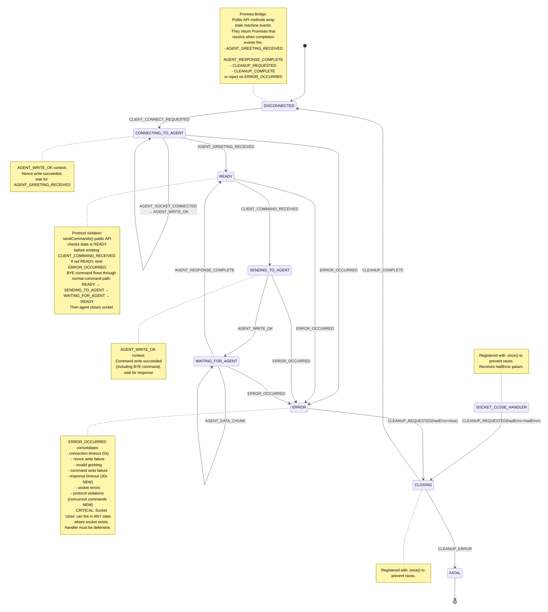

# Agent Proxy State Machine Refactor

## Overview

Refactor `agent-proxy` VSCode extension from its current implementation to an EventEmitter state machine
having model and style that matches the [request-proxy extension refactor](request-state-machine-refactor.md)
that was recently completed.

**TL;DR**: Refactor agent-proxy from implicit promise-based flow to explicit EventEmitter state machine with 7 states and 11 events, matching the architecture successfully implemented in request-proxy. Key improvements: 30s command timeouts, concurrent command prevention via protocol error, explicit state tracking, comprehensive test coverage (target >80%), and shared code extraction during refactor. **Key insight**: BYE is just a normal command - reuse SENDING_TO_AGENT → WAITING_FOR_AGENT → READY flow. **CRITICAL**: Node.js socket 'close' event can fire in ANY state where socket exists (CONNECTING_TO_AGENT, READY, SENDING_TO_AGENT, WAITING_FOR_AGENT, ERROR, CLOSING), not just expected states. Handler must be defensive, check current state, and route based on hadError parameter: transmission errors → ERROR → CLOSING, clean closes → CLOSING directly via CLEANUP_REQUESTED. Must handle gracefully in ALL socket-having states. Socket close handler designed to be robust but will require adjustment during implementation. The simpler flow (no INQUIRE management, persistent multi-session model, unified disconnect handling) requires fewer states (7 vs 12 in request-proxy) but maintains the same architectural rigor.

---

## States

Agent-proxy lifecycle has 7 states reflecting TCP connection with nonce authentication and persistent sessions:

1. **DISCONNECTED** — No active connection, session can be created
2. **CONNECTING_TO_AGENT** — TCP socket created, nonce authentication in progress, awaiting greeting
3. **READY** — Connected and authenticated, can accept commands (including BYE)
4. **SENDING_TO_AGENT** — Command write in progress to agent
5. **WAITING_FOR_AGENT** — Accumulating response chunks from agent
6. **ERROR** — Error occurred, cleanup needed
7. **CLOSING** — Cleanup in progress (socket teardown, session removal)

**Terminal States:**
- **DISCONNECTED** (can create new session)
- **FATAL** (unrecoverable error, session destroyed permanently) - implicit via session deletion

**Alignment with Request-Proxy:**
- WAITING_FOR_AGENT matches request-proxy exactly
- CLOSING handles cleanup (matches request-proxy CLOSING semantics)
- No separate DISCONNECTING state needed - BYE is just another command, socket 'close' event triggers transition to CLOSING

**Socket 'close' Event - Can Fire in ANY State:**
- **CRITICAL**: Node.js socket 'close' event fires whenever the underlying TCP socket closes, regardless of our state machine's state
- Can fire in ANY state where socket exists: CONNECTING_TO_AGENT, READY, SENDING_TO_AGENT, WAITING_FOR_AGENT, ERROR, CLOSING
- Handler must be defensive: check current state and ignore if in CLOSING/ERROR/DISCONNECTED (already handled)
- Route based on hadError parameter:
  - hadError=true: transmission error → ERROR_OCCURRED → ERROR → CLOSING
  - hadError=false: clean close → CLEANUP_REQUESTED → CLOSING
- Socket 'close' handler designed to be robust to ANY-state close events but **will require adjustment during implementation and testing**
- Comprehensive tests planned for socket close in ALL states

---

## Events (11 Total)

Events drive state transitions with consolidated error handling pattern from request-proxy:

1. `CLIENT_CONNECT_REQUESTED` — connectAgent() called by request-proxy
2. `AGENT_SOCKET_CONNECTED` — TCP socket connected to agent
3. `AGENT_WRITE_OK` — Write succeeded (nonce, command, or BYE) - context determined by state
4. `AGENT_GREETING_RECEIVED` — Valid greeting received from agent (relaxed: any "OK*")
5. `CLIENT_COMMAND_RECEIVED` — sendCommands() called by request-proxy (includes BYE command)
6. `AGENT_DATA_CHUNK` — Response data chunk received from agent
7. `AGENT_RESPONSE_COMPLETE` — Complete response detected (OK/ERR/INQUIRE/END)
8. `ERROR_OCCURRED` — Any error (connection, nonce, write, timeout, socket, validation, protocol violation)
9. `CLEANUP_REQUESTED` — Cleanup beginning with {hadError: boolean} payload. Emitted by: socket 'close' (hadError from Node.js), ERROR state (hadError=true). **Registered with .once() to prevent races.**
10. `CLEANUP_COMPLETE` — Cleanup successful
11. `CLEANUP_ERROR` — Cleanup failed

**Event Naming Consistency with Request-Proxy:**
- **CLIENT_*** pattern: CLIENT_CONNECT_REQUESTED, CLIENT_COMMAND_RECEIVED - events from request-proxy calling VS Code commands
- **AGENT_*** pattern: AGENT_SOCKET_CONNECTED, AGENT_WRITE_OK, AGENT_GREETING_RECEIVED, AGENT_DATA_CHUNK, AGENT_RESPONSE_COMPLETE - events from gpg-agent or socket operations
- **CLEANUP_*** pattern: CLEANUP_REQUESTED, CLEANUP_COMPLETE, CLEANUP_ERROR - cleanup lifecycle events
- **_COMPLETE** suffix: AGENT_RESPONSE_COMPLETE, CLEANUP_COMPLETE - multi-step sequences finishing
- **_RECEIVED** suffix: CLIENT_CONNECT_REQUESTED, CLIENT_COMMAND_RECEIVED, AGENT_GREETING_RECEIVED - data/requests received

**CLEANUP_REQUESTED Event Design:**
- **ONLY event that transitions to CLOSING state**
- Single event for all cleanup paths (graceful disconnect, errors, socket close)
- Payload: `{ hadError: boolean }` - distinguishes error vs graceful for logging and Promise rejection
- **Two sources emit CLEANUP_REQUESTED:**
  1. **ERROR state handler** - always emits with {hadError: true}
  2. **Socket 'close' handler** - emits when hadError=false (graceful close)
- **Flow paths to CLOSING:**
  - Socket close hadError=false → emit CLEANUP_REQUESTED {hadError: false} → CLOSING
  - Socket close hadError=true → ERROR_OCCURRED → ERROR → emit CLEANUP_REQUESTED {hadError: true} → CLOSING
  - Other errors → ERROR_OCCURRED → ERROR → emit CLEANUP_REQUESTED {hadError: true} → CLOSING
- **Registered with `.once()`** to ensure cleanup runs exactly once, preventing race conditions

**Event Naming Philosophy:**
Events describe "what happened" not "what to do". CLIENT_COMMAND_RECEIVED means request-proxy called sendCommands(). AGENT_GREETING_RECEIVED means gpg-agent sent greeting data. AGENT_WRITE_OK means socket write completed successfully. This naming makes event sources and meanings immediately clear.

**Error Consolidation** (matches request-proxy pattern):
- Connection timeout → ERROR_OCCURRED
- Nonce write failure → ERROR_OCCURRED
- Invalid greeting → ERROR_OCCURRED
- Command write failure → ERROR_OCCURRED
- Response timeout → ERROR_OCCURRED (NEW: 30s default)
- Socket errors → ERROR_OCCURRED
- Protocol violations (concurrent commands) → ERROR_OCCURRED (NEW)

---

## State Transition Diagram

**Note:** This diagram shows the internal state machine. The public API methods (`connectAgent`, `sendCommands`, `disconnectAgent`) wrap this state machine and return Promises. When request-proxy calls a VS Code command, the public API method registers Promise listeners for completion events (AGENT_RESPONSE_COMPLETE, ERROR_OCCURRED, CLEANUP_REQUESTED), emits the triggering event (CLIENT_COMMAND_RECEIVED), and the state machine processes it asynchronously. The Promise resolves/rejects when the completion event fires.



---

## Socket 'close' Event Handling

**CRITICAL: Socket 'close' Event Can Fire in ANY State**

Node.js socket 'close' event is emitted whenever the underlying TCP socket closes, **regardless of our state machine's state**. This event can fire at any time the socket is open:
- CONNECTING_TO_AGENT (connection fails, nonce write fails, greeting timeout)
- READY (agent crashes, network failure, agent-initiated close)
- SENDING_TO_AGENT (write fails, agent crashes during write)
- WAITING_FOR_AGENT (agent crashes, network failure, timeout)
- ERROR (socket still exists, cleanup not yet started)
- CLOSING (during cleanup when socket.destroy() is called)

The handler MUST be defensive and handle close events from any state safely.

**Key Design Decision:** Node.js socket 'close' event provides `hadError` boolean parameter. We use this to emit CLEANUP_REQUESTED with the hadError value for logging and Promise rejection distinction.

**Socket 'close' Handler Logic (Handles ALL States):**
```typescript
socket.once('close', (hadError: boolean) => {
  // CRITICAL: This event fires exactly once (registered with .once())
  // Can fire in ANY state where socket exists
  // State machine handlers will process events appropriately
  
  if (hadError) {
    // Transmission error during socket I/O
    session.emit('ERROR_OCCURRED', { error: new Error('Socket closed with transmission error') });
    // Flow: current state → ERROR → ERROR emits CLEANUP_REQUESTED {hadError: true} → CLOSING
  } else {
    // Clean/graceful socket close
    session.emit('CLEANUP_REQUESTED', { hadError: false });
    // Flow: current state → CLOSING
  }
});
```

**Implementation Notes:**
- Socket 'close' event registered with `.once()` - fires exactly once then auto-removes
- Can fire in ANY state where socket exists (CONNECTING_TO_AGENT, READY, SENDING_TO_AGENT, WAITING_FOR_AGENT, ERROR, CLOSING)
- No defensive state checks needed - `.once()` ensures single execution, state machine handles rest
- **Socket 'close' handler emits events, does NOT directly change state:**
  - hadError=true → emit ERROR_OCCURRED → ERROR state handler emits CLEANUP_REQUESTED {hadError: true} → CLOSING
  - hadError=false → emit CLEANUP_REQUESTED {hadError: false} → CLOSING
- **CLOSING state is ONLY reached via CLEANUP_REQUESTED event**
- CLEANUP_REQUESTED handler also registered with `.once()` to prevent duplicate cleanup
- State machine handlers are idempotent - can safely process events from any state
- Testing must verify close handling in **ALL states** where socket exists

**Graceful Disconnect Flow:**
1. `disconnectAgent()` called by request-proxy
2. Send BYE command through normal flow: `CLIENT_COMMAND_RECEIVED` event
3. READY → SENDING_TO_AGENT (write BYE)
4. SENDING_TO_AGENT → WAITING_FOR_AGENT (write succeeded)
5. **RACE CONDITION:** GPG agent sends OK response and immediately closes socket
   - **Path A (slow close):** WAITING_FOR_AGENT → READY (OK response processed), then socket 'close' → CLEANUP_REQUESTED with {hadError: false} → CLOSING
   - **Path B (fast close):** Socket 'close' fires while in WAITING_FOR_AGENT (OK response still buffered), CLEANUP_REQUESTED with {hadError: false} → CLOSING, response processing completes in CLOSING
6. Promise resolves when CLEANUP_REQUESTED event fires (BYE was successful, hadError=false)
7. Session cleanup proceeds in CLOSING state

**Key Insight:** The Promise bridge for `disconnectAgent()` listens for CLEANUP_REQUESTED event with hadError=false. This ensures we wait for the socket to close (which signals BYE completion) regardless of whether close happens before or after state transitions.

**Error Disconnect Flow:**
1. Network error, timeout, or agent crash occurs
2. Socket closes with transmission error
3. Socket 'close' event fires with `hadError === true`
4. Emit `ERROR_OCCURRED` event
5. Current state → ERROR → emit `CLEANUP_REQUESTED` with {hadError: true} → CLOSING (cleanup)

**Manual Cleanup Flow:**
1. ERROR state handler emits `CLEANUP_REQUESTED` with {hadError: true}
2. Socket still exists, CLOSING state handler calls `socket.destroy()`
3. Socket 'close' event fires (typically `hadError === false` for manual destroy)
4. Socket close emits `CLEANUP_REQUESTED` {hadError: false}, but already in CLOSING
5. CLEANUP_REQUESTED registered with `.once()` so handler already ran, no duplicate execution

**Testing Requirements (Socket Close in ALL States):**
- [ ] Verify gpg-agent BYE response causes `hadError === false`
- [ ] Verify network disconnect causes `hadError === true`
- [ ] Verify ERROR → socket.destroy() → close event safely handled
- [ ] Verify CLEANUP_REQUESTED `.once()` prevents duplicate cleanup execution
- [ ] **Test socket close (hadError=true) in EVERY socket-having state:**
  - [ ] CONNECTING_TO_AGENT → ERROR → CLEANUP_REQUESTED with {hadError: true} → CLOSING
  - [ ] READY → ERROR → CLEANUP_REQUESTED with {hadError: true} → CLOSING
  - [ ] SENDING_TO_AGENT → ERROR → CLEANUP_REQUESTED with {hadError: true} → CLOSING
  - [ ] WAITING_FOR_AGENT → ERROR → CLEANUP_REQUESTED with {hadError: true} → CLOSING
- [ ] **Test socket close (hadError=false) in EVERY socket-having state:**
  - [ ] CONNECTING_TO_AGENT → CLEANUP_REQUESTED with {hadError: false} → CLOSING
  - [ ] READY → CLEANUP_REQUESTED with {hadError: false} → CLOSING
  - [ ] SENDING_TO_AGENT → CLEANUP_REQUESTED with {hadError: false} → CLOSING
  - [ ] WAITING_FOR_AGENT → CLEANUP_REQUESTED with {hadError: false} → CLOSING (BYE race)
- [ ] **Test BYE race condition:** Mock socket close firing while in WAITING_FOR_AGENT (before AGENT_RESPONSE_COMPLETE processed)
- [ ] **Test BYE race condition:** Mock socket close firing after transition to READY (slow close)
- [ ] Verify disconnectAgent() Promise resolves on CLEANUP_REQUESTED with hadError=false regardless of state timing

---

## How Request-Proxy Interacts with Agent-Proxy

The state machine diagram above shows **internal** event flow. Request-proxy sees a different, simpler **external** API:

### External API (Request-Proxy Perspective)

```typescript
// Request-proxy calls VS Code commands, gets back Promises:

// 1. Connect
const { sessionId, greeting } = await vscode.commands.executeCommand('_gpg-agent-proxy.connectAgent');
// Internally: emits CLIENT_CONNECT_REQUESTED → state machine → AGENT_GREETING_RECEIVED resolves Promise

// 2. Send command  
const { response } = await vscode.commands.executeCommand('_gpg-agent-proxy.sendCommands', sessionId, 'GETINFO version\n');
// Internally: emits CLIENT_COMMAND_RECEIVED → state machine → AGENT_RESPONSE_COMPLETE resolves Promise

// 3. Disconnect (sends BYE command)
await vscode.commands.executeCommand('_gpg-agent-proxy.disconnectAgent', sessionId);
// Internally: emits CLIENT_COMMAND_RECEIVED with BYE → state machine → CLEANUP_REQUESTED resolves Promise
```

### Internal Implementation (State Machine)

The public API methods bridge between Promises (external) and EventEmitter (internal):

1. **Request-proxy calls** `_gpg-agent-proxy.sendCommands` (works same for BYE)
2. **extension.ts** calls `await agentProxyService.sendCommands(sessionId, commandBlock)`
3. **AgentProxy.sendCommands()** creates Promise and registers listeners:
   ```typescript
   session.once('AGENT_RESPONSE_COMPLETE', resolvePromise);
   session.once('ERROR_OCCURRED', rejectPromise);
   session.emit('CLIENT_COMMAND_RECEIVED', { commandBlock });
   ```
4. **State machine** processes CLIENT_COMMAND_RECEIVED event:
   - READY → SENDING_TO_AGENT (write command)
   - SENDING_TO_AGENT → WAITING_FOR_AGENT (on AGENT_WRITE_OK)
   - WAITING_FOR_AGENT → accumulate chunks (AGENT_DATA_CHUNK events)
   - WAITING_FOR_AGENT → READY (on AGENT_RESPONSE_COMPLETE)
5. **AGENT_RESPONSE_COMPLETE event** fires
6. **Promise listener** catches it, removes other listener to prevent leak, calls resolve({ response })
7. **AgentProxy.sendCommands()** returns to extension.ts
8. **extension.ts** returns to request-proxy
9. **Request-proxy** receives `{ response: string }`

**For BYE command (disconnectAgent):**
- Same flow through steps 1-9, then:
10. Agent closes socket (GPG protocol spec)
11. Socket 'close' event fires → CLEANUP_REQUESTED event
12. Session transitions to CLOSING → cleanup → DISCONNECTED

**The mermaid diagram shows steps 4-5 (state machine internals). The Promise bridge (steps 3 and 6) wraps this.**

---

## Implementation Plan

### Phase 1: Type Definitions & Infrastructure
**File:** `agent-proxy/src/services/agentProxy.ts`

- [ ] Define `SessionState` type with all 7 states
- [ ] Define `StateEvent` union with all 11 events (CLIENT_*/AGENT_*/CLEANUP_* patterns)
- [ ] Define `StateHandler` function signature
- [ ] Create transition table (lookup: `(state, event) → nextState`)
- [ ] Add validation that transition table covers all valid (state, event) pairs
- [ ] Create `AgentSessionManager` class extending EventEmitter (per session, not global)
- [ ] Update `AgentProxy` class to manage Map<sessionId, AgentSessionManager>

**Dependency Injection Design:**
- [ ] Keep existing `AgentProxyConfig` for public API
- [ ] Keep existing `AgentProxyDeps` for optional dependencies (socketFactory, fileSystem)
- [ ] Add `AgentSessionManagerConfig` for per-session configuration (includes timeout values)
- [ ] All handlers use injected dependencies (testable via mocks)

**Promise ↔ EventEmitter Bridge Design:**
- [ ] Public API methods (`connectAgent`, `sendCommands`, `disconnectAgent`) remain async and return Promises
- [ ] Each public method bridges to EventEmitter:
  1. Validate preconditions (e.g., session state)
  2. Create Promise with resolve/reject callbacks
  3. Register event listeners for completion (AGENT_RESPONSE_COMPLETE, ERROR_OCCURRED, CLEANUP_REQUESTED)
  4. Emit event describing what happened (CLIENT_CONNECT_REQUESTED, CLIENT_COMMAND_RECEIVED)
  5. Event handlers process asynchronously and emit completion events
  6. Completion events trigger resolve/reject, cleanup listeners
- [ ] Pattern allows VS Code commands to await results while state machine processes events internally

**Deliverable:** ✅ Compiles, no behavior change, architecture in place

---

### Phase 2: Safety Net - Test Current Implementation
**File:** `agent-proxy/src/test/agentProxy.test.ts`

Add comprehensive tests for current implementation before refactoring (establish baseline):

#### Response Completion Detection (10 tests)
- [ ] Test `isCompleteResponse()` with OK response (single line)
- [ ] Test `isCompleteResponse()` with OK response (multi-line with data lines)
- [ ] Test `isCompleteResponse()` with ERR response
- [ ] Test `isCompleteResponse()` with INQUIRE response
- [ ] Test `isCompleteResponse()` with END response (D-block)
- [ ] Test incomplete response (no newline)
- [ ] Test incomplete response (partial OK/ERR)
- [ ] Test response with empty lines before terminal line
- [ ] Test response with embedded "OK" in data lines
- [ ] Test binary data preservation in responses

#### Response Accumulation (5 tests)
- [ ] Test response split across 2 chunks
- [ ] Test response split across 3+ chunks
- [ ] Test large response (>1MB) accumulation
- [ ] Test rapid chunk arrival
- [ ] Test response with all byte values (0-255)

#### Socket File Parsing (5 tests)
- [ ] Test `parseSocketFile()` with valid format (host, port, 16-byte nonce)
- [ ] Test invalid format: missing newlines
- [ ] Test invalid format: short nonce (<16 bytes)
- [ ] Test invalid format: non-numeric port
- [ ] Test invalid format: extra data after nonce

#### Timeout Handling (3 tests)
- [ ] Test connection timeout (5s) fires and cleans up
- [ ] Test greeting timeout (5s) fires and cleans up
- [ ] Test timeout cleanup removes session from Map

#### Nonce Authentication (3 tests)
- [ ] Test nonce sent immediately after socket connect
- [ ] Test nonce write failure triggers cleanup
- [ ] Test greeting received after nonce completes connection

#### Error Paths (4 tests)
- [ ] Test socket error during waitForResponse
- [ ] Test write error during sendCommands
- [ ] Test greeting validation failure
- [ ] Test invalid session ID on sendCommands

**Target:** +30 tests (9 current → 39 total)  
**Deliverable:** ✅ High confidence in current implementation logic, safety net for refactoring

---

### Phase 3: EventEmitter Session Manager Architecture
**File:** `agent-proxy/src/services/agentProxy.ts`

Implement EventEmitter-based session manager (per-session instances):

- [ ] Create `AgentSessionManager extends EventEmitter` class
- [ ] Add `sessionId: string`, `state: SessionState`, `socket: net.Socket`, `buffer: string` fields
- [ ] Add `isDisconnecting: boolean` flag for BYE command handling (not used - see socket close handler)
- [ ] Implement `setState(newState: SessionState)` with logging
- [ ] Register event handlers for all 11 events (`.on('EVENT_NAME', handler)`)
- [ ] Implement `getState()` accessor for testing
- [ ] Wire socket 'close' event handler with hadError routing logic

**Socket Event Wiring:**
- [ ] Wire socket 'connect' event with **`.once()`** → emit `AGENT_SOCKET_CONNECTED`
  - Fires exactly once when connection established
  - `.once()` provides automatic cleanup
- [ ] Wire socket 'data' event with **`.on()`** → emit `AGENT_DATA_CHUNK`
  - Fires multiple times as response chunks arrive
  - Must remain registered to accumulate complete response
- [ ] Wire socket 'error' event with **`.once()`** → emit `ERROR_OCCURRED`
  - Fires once when error occurs
  - Socket typically closes after error anyway
  - `.once()` prevents duplicate error handling
- [ ] Wire socket 'close' event with **`.once()`** → **CRITICAL: Can fire in ANY state where socket exists**
  - Fires exactly once when socket closes
  - `.once()` provides automatic cleanup and prevents duplicate handling
  - Check current state first (defensive)
  - Ignore if in CLOSING, ERROR, or DISCONNECTED (already handled or no socket)
  - `hadError === true` → emit `ERROR_OCCURRED` (from any remaining state)
  - `hadError === false` → emit `CLEANUP_REQUESTED` with {hadError: false} (from any remaining state)
- [ ] Register `CLEANUP_REQUESTED` handler with `.once()` to prevent race conditions
- [ ] Note: Socket 'close' handler must be robust to ANY-state close events

**Socket Event Registration Pattern:**
```typescript
socket.once('connect', () => session.emit('AGENT_SOCKET_CONNECTED'));
socket.on('data', (chunk) => session.emit('AGENT_DATA_CHUNK', chunk));
socket.once('error', (err) => session.emit('ERROR_OCCURRED', { error: err }));
socket.once('close', (hadError) => { /* routing logic */ });
```

**Deliverable:** ✅ EventEmitter architecture in place, old code paths still work

---

### Phase 4: State Handlers Implementation
**File:** `agent-proxy/src/services/agentProxy.ts`

Implement handler for each state (empty stubs first, then logic):

- [ ] `handleDisconnected(event)` — only accepts `CLIENT_CONNECT_REQUESTED`
- [ ] `handleConnectingToAgent(event)` — accepts `AGENT_SOCKET_CONNECTED`, `AGENT_WRITE_OK`, `AGENT_GREETING_RECEIVED`, `ERROR_OCCURRED` (socket close hadError=true goes via ERROR, hadError=false goes direct to CLOSING via CLEANUP_REQUESTED)
- [ ] `handleReady(event)` — accepts `CLIENT_COMMAND_RECEIVED`, `ERROR_OCCURRED`, validates no concurrent commands (CLEANUP_REQUESTED with hadError=false goes direct to CLOSING)
- [ ] `handleSendingToAgent(event)` — accepts `AGENT_WRITE_OK`, `ERROR_OCCURRED` (CLEANUP_REQUESTED with hadError=false goes direct to CLOSING)
- [ ] `handleWaitingForAgent(event)` — accepts `AGENT_DATA_CHUNK`, `AGENT_RESPONSE_COMPLETE`, `ERROR_OCCURRED` (CLEANUP_REQUESTED with hadError=false goes direct to CLOSING for BYE race)
- [ ] `handleError(event)` — emits CLEANUP_REQUESTED with {hadError: true} and state transitions to CLOSING
- [ ] `handleClosing(event)` — accepts `CLEANUP_COMPLETE`, `CLEANUP_ERROR`, ignores socket events during cleanup

**CLEANUP_REQUESTED Event Design (ONLY Path to CLOSING):**
- **ONLY event that transitions to CLOSING state**
- Two sources emit this event:
  1. **ERROR state handler** - emits CLEANUP_REQUESTED {hadError: true}
  2. **Socket 'close' handler** - emits CLEANUP_REQUESTED {hadError: false} when graceful close
- Payload: `{hadError: boolean}` - distinguishes error vs graceful cleanup
- **Socket 'close' handler behavior (can fire in ANY state):**
  - hadError=false: emit CLEANUP_REQUESTED {hadError: false} → CLOSING
  - hadError=true: emit ERROR_OCCURRED → ERROR → ERROR handler emits CLEANUP_REQUESTED {hadError: true} → CLOSING
- **Examples from different states:**
  - CONNECTING_TO_AGENT: socket closes gracefully → CLEANUP_REQUESTED {hadError: false} → CLOSING
  - READY: socket closes gracefully (BYE completed) → CLEANUP_REQUESTED {hadError: false} → CLOSING
  - SENDING_TO_AGENT: socket closes gracefully → CLEANUP_REQUESTED {hadError: false} → CLOSING
  - WAITING_FOR_AGENT: socket closes gracefully (BYE race) → CLEANUP_REQUESTED {hadError: false} → CLOSING
  - Any state: socket closes with error → ERROR_OCCURRED → ERROR → CLEANUP_REQUESTED {hadError: true} → CLOSING
- **Registered with `.once()`** to ensure cleanup runs exactly once, preventing races

**Response Detection Migration:**
- [ ] Migrate `waitForResponse()` promise-based logic to event-driven `handleWaitingForAgent`
- [ ] Keep `isCompleteResponse()` helper, call from AGENT_DATA_CHUNK handler
- [ ] Add **30s timeout** via `setTimeout()` in `handleSendingToAgent`, clear in `handleWaitingForAgent`
- [ ] Emit `AGENT_RESPONSE_COMPLETE` when complete, `ERROR_OCCURRED` on timeout

**Protocol Violation Detection:**
- [ ] In public API `sendCommands(sessionId, commandBlock)`, check session state BEFORE emitting event:
  - [ ] If state is not READY, emit `ERROR_OCCURRED` with "Protocol violation: sendCommands called while session in <state>" and reject promise
  - [ ] If state is READY, emit `CLIENT_COMMAND_RECEIVED` event
- [ ] In `handleReady`, additional validation for race conditions:
  - [ ] If `CLIENT_COMMAND_RECEIVED` received but state is no longer READY (race condition)
  - [ ] Emit `ERROR_OCCURRED` with "Concurrent command attempted" message

**BYE Command Handling:**
- [ ] `disconnectAgent()` sends BYE via normal `sendCommands()` flow (or direct CLIENT_COMMAND_RECEIVED emit)
- [ ] BYE flows through: READY → SENDING_TO_AGENT → WAITING_FOR_AGENT → READY
- [ ] Agent closes socket after OK response
- [ ] Socket 'close' event (hadError=false) → CLEANUP_REQUESTED → CLOSING

**AGENT_WRITE_OK Reuse Pattern (matches request-proxy WRITE_OK):**
- [ ] In CONNECTING_TO_AGENT state: AGENT_WRITE_OK from nonce write → wait for AGENT_GREETING_RECEIVED
- [ ] In SENDING_TO_AGENT state: AGENT_WRITE_OK from command write (including BYE) → transition to WAITING_FOR_AGENT

**Promise Bridge Implementation Example:**
```typescript
// Public API method bridges Promise to EventEmitter
async sendCommands(sessionId: string, commandBlock: string): Promise<{ response: string }> {
  const session = this.sessions.get(sessionId);
  if (!session) throw new Error('Invalid session');
  
  // Protocol violation check (state validation)
  if (session.getState() !== 'READY') {
    session.emit('ERROR_OCCURRED', { message: `Protocol violation: sendCommands while in ${session.getState()}` });
    throw new Error(`Protocol violation: sendCommands while session in ${session.getState()}`);
  }
  
  // Bridge: Create promise that event handlers will resolve/reject
  return new Promise((resolve, reject) => {
    // Note: handleComplete/handleError cross-reference each other.
    // This is valid - functions are defined before called, not when parsing.
    const handleComplete = (data: { response: string }) => {
      session.removeListener('ERROR_OCCURRED', handleError); // Clean up unfired listener
      resolve(data);
    };
    
    const handleError = (data: { error: Error }) => {
      session.removeListener('AGENT_RESPONSE_COMPLETE', handleComplete); // Clean up unfired listener
      reject(data.error);
    };
    
    // Register listeners with .once() for automatic cleanup when fired
    // Each handler also removes the other unfired listener to prevent leaks
    session.once('AGENT_RESPONSE_COMPLETE', handleComplete);
    session.once('ERROR_OCCURRED', handleError);
    
    // Emit event to start state machine processing
    session.emit('CLIENT_COMMAND_RECEIVED', { commandBlock });
  });
}

// disconnectAgent() similar but also listens for CLEANUP_REQUESTED
async disconnectAgent(sessionId: string): Promise<void> {
  const session = this.sessions.get(sessionId);
  if (!session) throw new Error('Invalid session');
  
  return new Promise((resolve, reject) => {
    const handleDisconnected = () => {
      session.removeListener('ERROR_OCCURRED', handleError); // Clean up unfired listener
      resolve();
    };
    
    const handleError = (data: { error: Error }) => {
      // Clean up CLEANUP_REQUESTED listener - we reject on ERROR_OCCURRED immediately
      // Note: ERROR state will ALSO emit CLEANUP_REQUESTED {hadError: true}, but
      // we've already removed the listener, so Promise won't try to resolve after rejecting
      session.removeListener('CLEANUP_REQUESTED', handleDisconnected);
      reject(data.error);
    };
    
    // Listen for CLEANUP_REQUESTED (socket close), NOT AGENT_RESPONSE_COMPLETE
    // This ensures we wait for socket close (which may happen before or after OK response is processed)
    session.once('CLEANUP_REQUESTED', handleDisconnected);
    session.once('ERROR_OCCURRED', handleError);
    
    // Send BYE command through normal flow
    session.emit('CLIENT_COMMAND_RECEIVED', { commandBlock: 'BYE\n' });
    // Flow: READY → SENDING_TO_AGENT → WAITING_FOR_AGENT
    // Then (race condition):
    //   - Path A: → READY → socket closes → CLEANUP_REQUESTED → resolve
    //   - Path B: socket closes → CLEANUP_REQUESTED → resolve (still in WAITING_FOR_AGENT)
  });
}
```

**Why `.once()` with manual cleanup?**
- `.once()` automatically removes its own listener when the event fires
- Each handler manually removes the OTHER unfired listener to prevent memory leaks
- Simpler than separate `cleanup()` function while still preventing leaks
- Pattern: fired listener auto-removes via `.once()`, handler removes unfired listener
- Same pattern needed for `connectAgent()` and `disconnectAgent()` public methods

**Deliverable:** ✅ All handlers implemented, event-driven flow operational, public API remains promise-based

---

### Phase 5: Error Consolidation & Cleanup Sequence
**File:** `agent-proxy/src/services/agentProxy.ts`

Adopt request-proxy's proven error handling and cleanup pattern:

#### Error Handling
- [ ] Implement `handleErrorOccurred` to emit CLEANUP_REQUESTED with {hadError: true}, then transition ERROR → CLOSING
- [ ] Consolidate all error types into single `ERROR_OCCURRED` event
- [ ] Contextual error messages at emission sites (preserve debugging info)
- [ ] Log errors at emission sites, handlers focus on state transitions

#### Cleanup Sequence
- [ ] Enhance `handleClosing` with full session cleanup:
  - [ ] `socket.removeAllListeners()` in try/catch
  - [ ] `socket.destroy()` in try/catch
  - [ ] Clear buffer and response data
  - [ ] Remove sessionId from parent Map
  - [ ] Clear all timeouts (connection, greeting, response)
  - [ ] `this.removeAllListeners()` in final try/catch
- [ ] First-error-wins pattern: `cleanupError = cleanupError ?? err`
- [ ] Emit `CLEANUP_COMPLETE` on success or `CLEANUP_ERROR` on failure
- [ ] `handleCleanupComplete` → DISCONNECTED (session removed from Map)
- [ ] `handleCleanupError` → FATAL (do not add back to Map, log terminal state)

**Socket Close During Cleanup:**
- [ ] If socket 'close' event fires during CLOSING state, ignore it (expected)
- [ ] Socket close handler checks state before routing

**Deliverable:** ✅ Robust error handling, guaranteed resource cleanup

---

### Phase 6: Testing - State Machine Fundamentals
**File:** `agent-proxy/src/test/agentProxy.test.ts`

Test the state machine architecture:

#### Transition Table Validation (3 tests)
- [ ] Test transition table has entry for all valid (state, event) pairs (compile-time via TypeScript)
- [ ] Test all 7 states have registered handlers
- [ ] Test invalid (state, event) pairs throw descriptive errors

#### State Transition Verification (7 tests)
- [ ] Test DISCONNECTED → CONNECTING_TO_AGENT (CLIENT_CONNECT_REQUESTED)
- [ ] Test CONNECTING_TO_AGENT → READY (AGENT_SOCKET_CONNECTED → AGENT_WRITE_OK → AGENT_GREETING_RECEIVED)
- [ ] Test READY → SENDING_TO_AGENT (CLIENT_COMMAND_RECEIVED)
- [ ] Test SENDING_TO_AGENT → WAITING_FOR_AGENT (AGENT_WRITE_OK)
- [ ] Test WAITING_FOR_AGENT → READY (AGENT_RESPONSE_COMPLETE)
- [ ] Test READY → CLOSING (CLEANUP_REQUESTED)
- [ ] Test any state → ERROR → CLOSING → DISCONNECTED on errors

#### Event Handling (5 tests)
- [ ] Test socket 'connect' event emits AGENT_SOCKET_CONNECTED
- [ ] Test socket 'data' event emits AGENT_DATA_CHUNK in WAITING_FOR_AGENT
- [ ] Test socket 'error' event emits ERROR_OCCURRED
- [ ] Test socket 'close' event with hadError=true routes to ERROR
- [ ] Test socket 'close' event with hadError=false routes to CLOSING

#### Promise Bridge (4 tests)
- [ ] Test sendCommands() returns Promise that resolves with response
- [ ] Test sendCommands() Promise resolves when AGENT_RESPONSE_COMPLETE event fires
- [ ] Test sendCommands() Promise rejects when ERROR_OCCURRED event fires
- [ ] Test listeners are cleaned up after Promise settles (no memory leak)

#### BYE Command / Disconnect Flow (4 tests)
- [ ] Test disconnectAgent() sends BYE command through normal flow
- [ ] Test BYE command flows: READY → SENDING_TO_AGENT → WAITING_FOR_AGENT → READY
- [ ] Test socket close after BYE response triggers CLEANUP_REQUESTED
- [ ] Test CLEANUP_REQUESTED transitions READY → CLOSING

#### BYE Race Condition Tests (3 tests)
- [ ] Test socket close fires while in WAITING_FOR_AGENT (before response processed) → CLOSING
- [ ] Test socket close fires after transition to READY (slow close) → CLOSING
- [ ] Test disconnectAgent() Promise resolves on CLEANUP_REQUESTED regardless of state timing

**Target:** +26 tests (39 current → 65 total)  
**Deliverable:** ✅ State machine validated, transitions verified, Promise bridge working, BYE race condition handled

---

### Phase 7: Testing - Protocol & Timeouts
**File:** `agent-proxy/src/test/agentProxy.test.ts`

Test protocol features and timeout handling:

#### Timeout Handling (5 tests)
- [ ] Test **connection timeout** (5s) emits ERROR_OCCURRED
- [ ] Test **greeting timeout** (5s) emits ERROR_OCCURRED
- [ ] Test **response timeout** (30s) emits ERROR_OCCURRED (NEW)
- [ ] Test timeout cleared on successful response
- [ ] Test timeout cleanup in ERROR state

#### Protocol Violations (6 tests)
- [ ] Test sendCommands() called while in CONNECTING_TO_AGENT state emits ERROR_OCCURRED and rejects
- [ ] Test sendCommands() called while in SENDING_TO_AGENT state emits ERROR_OCCURRED and rejects
- [ ] Test sendCommands() called while in WAITING_FOR_AGENT emits ERROR_OCCURRED and rejects
- [ ] Test sendCommands() called while in ERROR state emits ERROR_OCCURRED and rejects
- [ ] Test sendCommands() called while in CLOSING state emits ERROR_OCCURRED and rejects
- [ ] Test sendCommands() on invalid sessionId throws error (no session found)

**Note:** These tests validate the public API layer (`AgentProxy.sendCommands()`) checks session state BEFORE emitting CLIENT_COMMAND_RECEIVED event. This prevents request-proxy from sending commands while agent-proxy is busy, matching request-proxy's own protocol violation detection pattern.

#### Greeting Validation (4 tests)
- [ ] Test greeting "OK " accepted (current format)
- [ ] Test greeting "OK\n" accepted (relaxed validation)
- [ ] Test greeting "OK Pleased to meet you" accepted (standard GPG)
- [ ] Test greeting "ERR 123" rejected with ERROR_OCCURRED

#### Socket Close Scenarios (12 tests - ALL States)
- [ ] **Test socket close (hadError=true) in EVERY socket-having state:**
  - [ ] CONNECTING_TO_AGENT → ERROR → CLOSING
  - [ ] READY → ERROR → CLOSING
  - [ ] SENDING_TO_AGENT → ERROR → CLOSING
  - [ ] WAITING_FOR_AGENT → ERROR → CLOSING
- [ ] **Test socket close (hadError=false) in EVERY socket-having state:**
  - [ ] CONNECTING_TO_AGENT → CLOSING (agent rejects immediately)
  - [ ] READY → CLOSING (agent-initiated or BYE completed)
  - [ ] SENDING_TO_AGENT → CLOSING (agent closes during write)
  - [ ] WAITING_FOR_AGENT → CLOSING (BYE race condition)
- [ ] Test socket close in ERROR state ignored (no duplicate transition)
- [ ] Test socket close in CLOSING state ignored (expected during cleanup)
- [ ] Test socket close in DISCONNECTED state ignored (shouldn't happen but safe)
- [ ] Test agent-initiated close (hadError=false) vs network error (hadError=true) in same state

**Target:** +21 tests (65 current → 86 total)  
**Deliverable:** ✅ Timeouts working, protocol violations caught, socket close routing validated

---

### Phase 8: Testing - Concurrent Sessions & Integration
**File:** `agent-proxy/src/test/agentProxy.test.ts`

Test multi-session scenarios and end-to-end flows:

#### Concurrent Session Management (7 tests)
- [ ] Test multiple concurrent sessions (3+) with independent state machines
- [ ] Test session isolation: one session error doesn't affect others
- [ ] Test rapid connect/disconnect cycles
- [ ] Test session count accuracy in Map
- [ ] Test concurrent command handling across different sessions
- [ ] Test sessionId uniqueness (UUID collision test)
- [ ] Test session cleanup removes only target session from Map

#### End-to-End Flows (5 tests)
- [ ] Test full happy path: connect → send command → response → BYE → disconnect
- [ ] Test INQUIRE response returned to caller (not handled internally)
- [ ] Test large response (>10MB) with many chunks
- [ ] Test binary data preservation throughout full cycle
- [ ] Test multiple commands in sequence on same session

#### Error Recovery (4 tests)
- [ ] Test connection failure cleanup
- [ ] Test error during command send recovery
- [ ] Test agent crash (socket close with hadError=true) during command
- [ ] Test cleanup failure transitions to FATAL

**Target:** +16 tests (86 current → 102 total)  
**Deliverable:** ✅ Production-ready, multi-session validated, >80% coverage target met

---

### Phase 9: Shared Code Extraction (During Refactor)
**Files:** `shared/src/protocol.ts`, `shared/src/types.ts`, `shared/src/test/helpers.ts`

Extract duplicate code discovered during refactor to shared package:

#### Response Detection (**Do during Phase 4**)
- [ ] Extract `detectResponseCompletion(response: string): { complete: boolean; type: 'OK' | 'ERR' | 'INQUIRE' | 'END' | null }` to shared
- [ ] Unit test with 15 test cases covering all response types and edge cases
- [ ] Update agent-proxy to use shared utility
- [ ] Verify request-proxy could use same utility (may need slight adaptation for its use case)

#### Socket Cleanup Helper (**Do during Phase 5**)
- [ ] Extract `cleanupSocket(socket: net.Socket): Error | null` with try/catch wrappers
- [ ] Pattern: `removeAllListeners()` → `destroy()` → return first error or null
- [ ] Unit test cleanup sequence and error handling
- [ ] Update both agent-proxy and request-proxy to use shared utility

#### State Machine Base Class (**Do during Phase 5, optional**)
- [ ] Consider abstract `StateMachine<TState, TEvent> extends EventEmitter` class
- [ ] Provides: `setState()`, transition table validation, logging
- [ ] Benefits: type safety, consistent logging, reduced boilerplate
- [ ] Decision point: If common patterns emerge cleanly, extract; otherwise defer
- [ ] Test via both concrete implementations (agent-proxy, request-proxy)

#### Testing Utilities (**Do during Phase 6-8**)
- [ ] Extend `MockSocketFactory` to support TCP sockets with nonce
- [ ] Add `MockSocket.simulateGreeting(message: string)` helper
- [ ] Add `MockSocket.simulateChunkResponse(chunks: string[])` helper
- [ ] Add `MockSocket.simulateClose(hadError: boolean)` helper for socket close testing
- [ ] Ensure all mock enhancements work for both extensions
- [ ] Add tests validating mocks in shared/src/test/

#### Request-Proxy Socket Event Review (**Do during Phase 6-8**)
- [ ] Review request-proxy socket event handlers (client socket in `startRequestProxy`)
- [ ] Change socket 'close' event from `.on()` to `.once()`
  - Currently uses `.on()`, should use `.once()` (fires exactly once when socket closes)
  - Automatic cleanup, prevents duplicate handling
- [ ] Change socket 'error' event from `.on()` to `.once()`
  - Currently uses `.on()`, should use `.once()` (fires once when error occurs)
  - Automatic cleanup, prevents duplicate error handling
- [ ] Keep socket 'readable' event as `.on()` (fires multiple times as data arrives)
- [ ] Test that both extensions use consistent socket event registration patterns

**Deliverable:** ✅ Reduced duplication, shared utilities tested independently, consistent socket patterns across extensions

---

### Phase 10: Documentation & Migration Cleanup
**Files:** Multiple

- [ ] Update `agent-proxy/README.md` with state machine architecture
- [ ] Document socket 'close' hadError routing behavior
- [ ] Document BYE command flow (reuses normal command path)
- [ ] Update `AGENTS.md` if integration points changed
- [ ] Remove old promise-based code paths from `agentProxy.ts`
- [ ] Remove unused private methods (if fully migrated to handlers)
- [ ] Verify extension.ts command handlers still work correctly
- [ ] Update JSDoc comments for public API methods (connectAgent, sendCommands, disconnectAgent)
- [ ] Add architecture diagram to docs/ if helpful (optional)

**Deliverable:** ✅ Documentation current, no dead code

---

### Phase 11: Final Validation
**Files:** Root directory

- [ ] Run `npm run compile` — all packages must compile without error
- [ ] Run `npm test` — target >220 total tests passing (22 shared + 102 agent + 109 request)
- [ ] Manual testing: Full GPG signing workflow via both extensions
- [ ] Manual testing: Test graceful disconnect (BYE) vs error disconnect (network failure)
- [ ] Manual testing: Test agent-initiated disconnect
- [ ] Performance check: No regressions in connection/command latency
- [ ] Memory check: No leaks in long-running sessions (monitor Map size)
- [ ] Verify request-proxy still works (no shared code breakage)

**Deliverable:** ✅ Production-ready, all tests pass, no regressions

---

## Success Criteria

### Functional ✅
- [ ] All 102+ agent-proxy tests pass (30 safety net + 26 state machine + 21 protocol + 16 integration + 9 original)
- [ ] All 109 request-proxy tests still pass (shared code changes compatible)
- [ ] Manual testing: GPG signing workflow successful
- [ ] Multi-session testing: 3+ concurrent sessions work correctly
- [ ] Timeout testing: Connection, greeting, and command timeouts (30s NEW) fire correctly
- [ ] Protocol violation testing: Concurrent commands rejected with clear error
- [ ] Socket close testing: Both hadError=true and hadError=false paths work
- [ ] BYE command testing: Graceful disconnect flows through normal command path

### Code Quality ✅
- [ ] All 7 states explicitly defined with handlers
- [ ] All 12 events explicitly defined
- [ ] Transition table covers all valid (state, event) pairs
- [ ] Error paths consolidated into single ERROR_OCCURRED event
- [ ] Cleanup sequence guarantees resource release (first-error-wins, try/catch for each operation)
- [ ] No implicit state tracking (all state in `session.state`)
- [ ] Test coverage >80% (target: match request-proxy's 95%)
- [ ] Socket 'close' hadError routing tested and validated with real gpg-agent

### Maintainability ✅
- [ ] Architecture matches request-proxy (team familiar with pattern)
- [ ] State transitions logged clearly (`setState()` with logging)
- [ ] Testing approach consistent across extensions
- [ ] Shared code properly extracted and tested independently
- [ ] Documentation updated and accurate
- [ ] No dead code remaining
- [ ] BYE handled as normal command (no special-case logic)

### Performance ✅
- [ ] No regressions in connection time (<5s for typical connection)
- [ ] Response timeout (30s) doesn't add overhead to normal operations
- [ ] Memory usage stable under load (long-running sessions, many sessions)
- [ ] Session Map cleanup prevents memory leaks

---

## Key Design Decisions

### 1. Command Timeout ✅
**Decision:** Add 30s default timeout for sendCommands()  
**Rationale:** Current implementation can hang indefinitely. Matches GPG agent typical behavior. Configurable for special cases.  
**Implementation:** `setTimeout()` in `handleSending`, clear in `handleWaitingForAgent` or ERROR

### 2. Concurrent Commands ✅
**Decision:** Disallow and treat as protocol error  
**Rationale:** The VS Code command `_gpg-agent-proxy.sendCommands` is only valid when session is in READY state. Any call while in other states (CONNECTING_TO_AGENT, SENDING_TO_AGENT, WAITING_FOR_AGENT, ERROR, CLOSING) is a protocol violation. This is similar to request-proxy's protocol violation detection for client data in invalid states.  
**Implementation:** 
- Public API `sendCommands(sessionId, commandBlock)` validates session is in READY state BEFORE emitting CLIENT_COMMAND_RECEIVED
- If not READY, emit ERROR_OCCURRED and reject the promise
- Additional race condition check in `handleReady` if state changed between validation and handler execution

### 3. BYE Command Handling ✅
**Decision:** BYE is a normal command, flows through SENDING_TO_AGENT → WAITING_FOR_AGENT → READY, then socket 'close' triggers disconnect  
**Rationale:** 
- Eliminates need for separate DISCONNECTING state
- Reuses all existing command machinery (write, response detection, timeout, error handling)
- GPG agent closes socket after BYE OK response per protocol spec
- Socket 'close' event with hadError parameter handles transition to CLOSING
**Implementation:**
- `disconnectAgent()` sends BYE via normal command flow
- Socket 'close' event listener checks `hadError` parameter
- `hadError === false` (graceful) → emit CLEANUP_REQUESTED → CLOSING
- `hadError === true` (error) → emit ERROR_OCCURRED → ERROR → CLOSING

### 4. Socket 'close' Event Routing ✅
**Decision:** Use Node.js socket 'close' event `hadError` boolean parameter to route to ERROR or CLOSING. **CRITICAL: Socket 'close' can fire in ANY state where socket exists.**

**Rationale:**
- Node.js socket 'close' event fires whenever the underlying socket closes, regardless of state machine state
- Socket can close at ANY TIME: connection failure, agent crash, network error, graceful disconnect, timeout
- Must handle defensively in ALL states where socket exists: CONNECTING_TO_AGENT, READY, SENDING_TO_AGENT, WAITING_FOR_AGENT, ERROR, CLOSING
- hadError parameter indicates transmission error vs clean close
- Unified handler for all disconnect scenarios eliminates need for separate DISCONNECTING state

**State-by-State Handling:****
- CONNECTING_TO_AGENT: Connection refused, nonce rejected, greeting timeout → can close here
- READY: Agent crash, network failure, agent-initiated close → can close here
- SENDING_TO_AGENT: Write failure, agent crashes during write → can close here
- WAITING_FOR_AGENT: Agent crashes, network failure, BYE race condition → can close here
- ERROR: Socket still exists, may close before cleanup starts → ignore (error already handling)
- CLOSING: Cleanup calling socket.destroy() → ignore (expected)
- DISCONNECTED: No socket → ignore (shouldn't happen but safe)

**Testing Requirements (Socket Close in ALL States):**
- Test socket close (hadError=true) in: CONNECTING_TO_AGENT, READY, SENDING_TO_AGENT, WAITING_FOR_AGENT
- Test socket close (hadError=false) in: CONNECTING_TO_AGENT, READY, SENDING_TO_AGENT, WAITING_FOR_AGENT
- Test socket close ignored in: ERROR, CLOSING, DISCONNECTED
- Verify gpg-agent BYE response causes `hadError === false`
- Verify network disconnect causes `hadError === true`
- **Test BYE race condition:** socket close while in WAITING_FOR_AGENT
- **Test BYE race condition:** socket close after transition to READY
- Verify graceful close (hadError=false) from any state → CLOSING (not ERROR)

### 5. Shared Code Extraction Timing ✅
**Decision:** Extract during refactor (Phases 4, 5, 6-8)  
**Rationale:** Avoid duplicate work, ensure consistency, validate shared utilities immediately.  
**Implementation:** Phase 4 (response detection), Phase 5 (socket cleanup), Phase 6-8 (testing utilities)

### 6. Greeting Validation ✅
**Decision:** Relax to accept any "OK*" response  
**Rationale:** More forgiving, matches actual GPG agent behavior, reduces false rejections.  
**Implementation:** Change validation from `startsWith('OK ')` to `startsWith('OK')` in Phase 4

---

## Technical Notes

### Alignment with Request-Proxy

**States:** 7 vs 12 (simpler flow, no INQUIRE buffering, no bidirectional sending)
- Both use: DISCONNECTED, READY, ERROR, CLOSING, FATAL
- Agent-proxy: CONNECTING_TO_AGENT, SENDING_TO_AGENT, WAITING_FOR_AGENT
- Request-proxy: CLIENT_CONNECTED, AGENT_CONNECTING, BUFFERING_COMMAND, BUFFERING_INQUIRE, SENDING_TO_AGENT, WAITING_FOR_AGENT, SENDING_TO_CLIENT

**Events:** 11 vs 14 (similar count, different contexts)
- Shared patterns: CLIENT_* prefix, AGENT_* prefix, CLEANUP_* prefix, ERROR_OCCURRED consolidation
- Request-proxy: CLIENT_DATA_START, CLIENT_DATA_PARTIAL, CLIENT_DATA_COMPLETE, RESPONSE_OK_OR_ERR, RESPONSE_INQUIRE

**Event naming alignment:**
- CLIENT_CONNECT_REQUESTED vs CLIENT_SOCKET_CONNECTED (minor difference)
- AGENT_WRITE_OK vs WRITE_OK (agent-proxy more explicit)
- CLEANUP_REQUESTED vs CLEANUP_START (minor difference)
- AGENT_GREETING_RECEIVED vs AGENT_GREETING_OK (minor difference)

| Purpose | Agent-Proxy | Request-Proxy | Pattern |
|---------|-------------|---------------|---------|
| Connection initiated | CLIENT_CONNECT_REQUESTED | CLIENT_SOCKET_CONNECTED | CLIENT_* |
| Write succeeded | AGENT_WRITE_OK | WRITE_OK | *_WRITE_OK |
| Greeting received | AGENT_GREETING_RECEIVED | AGENT_GREETING_OK | AGENT_*_RECEIVED/*_OK |
| Request command | CLIENT_COMMAND_RECEIVED | (CLIENT_DATA_START) | CLIENT_* |
| Data chunk received | AGENT_DATA_CHUNK | (CLIENT_DATA_PARTIAL) | *_DATA_CHUNK |
| Response complete | AGENT_RESPONSE_COMPLETE | AGENT_RESPONSE_COMPLETE | *_COMPLETE |
| Error occurred | ERROR_OCCURRED | ERROR_OCCURRED | ERROR_* |
| Begin cleanup | CLEANUP_REQUESTED | CLEANUP_START | CLEANUP_* |
| Cleanup done | CLEANUP_COMPLETE | CLEANUP_COMPLETE | CLEANUP_* |
| Cleanup failed | CLEANUP_ERROR | CLEANUP_ERROR | CLEANUP_* |

### EventEmitter Pattern
- **Deterministic**: Events processed in order, no race conditions
- **Testable**: Observable outcomes via event listeners, no internal state access needed
- **Familiar**: Matches NodeJS Socket API pattern
- **Maintainable**: Clear event flow, explicit state transitions
- **Consistent naming**: CLIENT_* for request-proxy requests, AGENT_* for gpg-agent responses, CLEANUP_* for lifecycle (matches request-proxy)
- **Event reuse**: AGENT_WRITE_OK used in multiple states (CONNECTING_TO_AGENT/SENDING_TO_AGENT) like request-proxy uses WRITE_OK
- **Promise bridge**: Public API remains async/Promise-based, internally uses EventEmitter for state machine

### Promise ↔ EventEmitter Bridge Architecture

**Why Both?**
- VS Code commands are async and return Promises (request-proxy awaits results)
- Internal state machine benefits from EventEmitter (explicit states, testable events)
- Bridge pattern allows synchronous command handlers to await asynchronous event processing

**Bridge Pattern:**
```
Request-Proxy → vscode.commands.executeCommand('_gpg-agent-proxy.sendCommands', ...)
              ↓
         extension.ts command handler
              ↓
      AgentProxy.sendCommands() — creates Promise, registers event listeners
              ↓
      session.emit('CLIENT_COMMAND_RECEIVED') — triggers state machine
              ↓
      State Machine — READY → SENDING_TO_AGENT → WAITING_FOR_AGENT → READY
              ↓
      session.emit('AGENT_RESPONSE_COMPLETE') — completion event
              ↓
      Promise resolves with { response }
              ↓
         extension.ts returns result
              ↓
      Request-Proxy receives response
```

**Memory Management:**
- Use `.once()` for event listeners that fire at most once
- Each handler manually removes the OTHER unfired listener to prevent leaks
- Pattern: fired listener auto-removes via `.once()`, handler removes unfired listener
- Prevents memory leaks in long-running sessions with many commands

### Binary Safety
- Latin1 encoding throughout
- Preserves all byte values 0-255
- `sanitizeForLog()` for logging (first token + byte count)
- Never log raw binary data

### Timeout Strategy
- **Connection timeout**: 5s (existing)
- **Greeting timeout**: 5s (existing)
- **Response timeout**: 30s (NEW) — prevents indefinite hangs
- **Cleanup**: Always clear timeouts in ERROR state
- **Timeouts stored** in session manager for cleanup

### Session Lifecycle
```
1. connectAgent() → emit CLIENT_CONNECT_REQUESTED → DISCONNECTED → CONNECTING_TO_AGENT
2. Socket connects (AGENT_SOCKET_CONNECTED), nonce written (AGENT_WRITE_OK), greeting received (AGENT_GREETING_RECEIVED) → READY
3. sendCommands() → emit CLIENT_COMMAND_RECEIVED → SENDING_TO_AGENT → AGENT_WRITE_OK → WAITING_FOR_AGENT → AGENT_RESPONSE_COMPLETE → READY (repeat)
4. disconnectAgent() → emit CLIENT_COMMAND_RECEIVED with BYE → SENDING_TO_AGENT → AGENT_WRITE_OK → WAITING_FOR_AGENT → AGENT_RESPONSE_COMPLETE → READY
5. Agent closes socket → socket 'close' (hadError=false) → CLEANUP_REQUESTED → CLOSING → DISCONNECTED
6. On error: any state → ERROR_OCCURRED → ERROR → CLEANUP_REQUESTED → CLOSING → CLEANUP_COMPLETE/ERROR → DISCONNECTED or FATAL
```

### Cleanup Guarantees
- **Individual try/catch** for each operation (socket.removeAllListeners, socket.destroy, etc.)
- **First-error-wins**: Capture first error, continue remaining cleanup
- **Always executes**: No early returns in cleanup handler
- **Terminal states**: DISCONNECTED (success) or FATAL (unrecoverable)
- **Session removal**: Delete from Map only after complete cleanup

### Protocol Violation Detection

**Validation Layers:**
1. **Public API** (first line of defense): `sendCommands()` checks session.state === 'READY' before emitting event
2. **State Handler** (defensive check): `handleReady()` validates state hasn't changed (race condition protection)

```typescript
// In AgentProxy.sendCommands() public method:
1. Get session from Map by sessionId
2. Check session.state === 'READY'
3. If NOT READY:
   - session.emit('ERROR_OCCURRED', { message: 'Protocol violation: sendCommands while in <state>' })
   - throw Error (reject promise to caller)
4. If READY:
   - session.emit('CLIENT_COMMAND_RECEIVED', { commandBlock })
   - Wait for AGENT_RESPONSE_COMPLETE or ERROR_OCCURRED
   - Return response or throw error
```

**Why This Matters:**
- Request-proxy calls `_gpg-agent-proxy.sendCommands` after forwarding client command to agent
- If agent-proxy is still processing a previous command (SENDING_TO_AGENT/WAITING_FOR_AGENT), this is a protocol error
- Enforcing READY-state-only prevents response interleaving and data corruption
- Matches request-proxy's pattern: client data only valid in specific states (READY, BUFFERING_COMMAND, BUFFERING_INQUIRE)

**Race Condition Handling:**
- State could change between public API validation and event handler execution (unlikely but possible)
- `handleReady` includes additional validation: if CLIENT_COMMAND_RECEIVED received but state is no longer READY, emit ERROR_OCCURRED
- This defensive check ensures correctness even under concurrent access patterns

**Validation Summary:**
- Valid states for sendCommands(): **READY only**
- Invalid states: DISCONNECTED, CONNECTING_TO_AGENT, SENDING_TO_AGENT, WAITING_FOR_AGENT, ERROR, CLOSING
- BYE command follows same rules (must be in READY state)

---

## Progress Tracking

| Phase | Description | Tests Added | Total Tests | Status |
|-------|-------------|-------------|-------------|--------|
| Current | Baseline | - | 9 | ✅ Complete |
| Phase 1 | Types & Infrastructure | 0 | 9 | ⬜ Not Started |
| Phase 2 | Safety Net Tests | +30 | 39 | ⬜ Not Started |
| Phase 3 | EventEmitter Architecture | 0 | 39 | ⬜ Not Started |
| Phase 4 | State Handlers | 0 | 39 | ⬜ Not Started |
| Phase 5 | Error & Cleanup | 0 | 39 | ⬜ Not Started |
| Phase 6 | State Machine Tests | +26 | 65 | ⬜ Not Started |
| Phase 7 | Protocol & Timeout Tests | +21 | 86 | ⬜ Not Started |
| Phase 8 | Integration Tests | +16 | 102 | ⬜ Not Started |
| Phase 9 | Shared Code Extraction | 0 | 102 | ⬜ Not Started |
| Phase 10 | Documentation | 0 | 102 | ⬜ Not Started |
| Phase 11 | Final Validation | 0 | 102 | ⬜ Not Started |
| **Target** | **All Phases Complete** | **+93** | **102+** | **⬜ Not Started** |

**Timeline Estimate:** 2-3 weeks for complete refactor (following request-proxy precedent)
