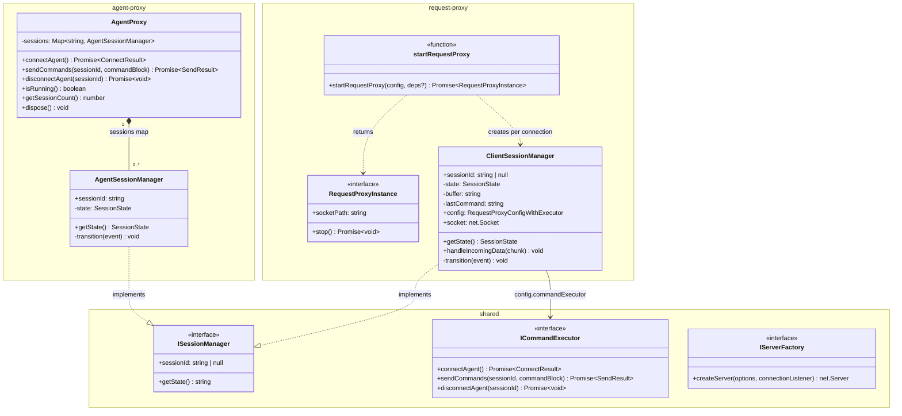
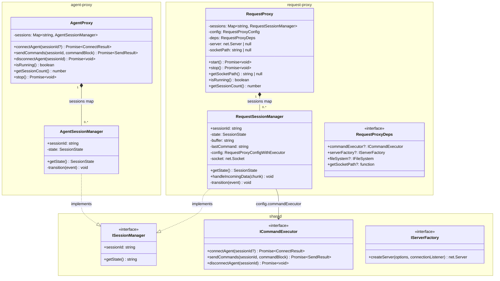

# Request Proxy Class Refactor

Refactor `request-proxy` to mirror the class structure of `agent-proxy`, and thread a
single caller-supplied `sessionId` across both extensions so both sides log the same UUID
for each end-to-end GPG session.

---

## Motivation

`agent-proxy` was already refactored into a proper class model:

- `AgentProxy` — owns the sessions `Map`, exposes `connectAgent()`, `sendCommands()`,
  `disconnectAgent()`, `dispose()` (will become `stop()`)
- `AgentSessionManager extends EventEmitter implements ISessionManager` — per-session
  state machine

`request-proxy` uses an older factory-function pattern:

- `startRequestProxy()` — top-level async factory
- `RequestProxyInstance` interface — returned handle with `socketPath` + `stop()`
- `ClientSessionManager extends EventEmitter implements ISessionManager` — per-session
  state machine

The goal is to replace the factory pattern with a `RequestProxy` class that mirrors
`AgentProxy`, rename `ClientSessionManager` → `RequestSessionManager` for symmetry, and
eliminate the now-redundant `RequestProxyInstance` interface.

As a prerequisite, `AgentProxy.connectAgent()` is extended to accept an optional
`sessionId?` hint so `RequestProxy` can mint the UUID and both sides log an identical
session identifier.

---

## Current Architecture



---

## Target Architecture



---

## Key Design Decisions

### Single `sessionId` across both extensions

`RequestProxy.start()` (or the connection handler) mints a UUID via `uuidv4()` and passes
it as an optional hint to `commandExecutor.connectAgent(sessionId)`. `AgentProxy.connectAgent(sessionId?)`
uses the caller-supplied value if provided, otherwise falls back to `uuidv4()`. Both
extensions then log the same UUID for every end-to-end GPG session — no more
`localSessionId` / `agentSessionId` skew.

### `RequestProxyInstance` eliminated

`RequestProxyInstance` was a plain interface wrapping `socketPath` and `stop()`. Moving
lifecycle ownership into `RequestProxy` makes it unnecessary. Callers hold a `RequestProxy`
reference directly (like `AgentProxy`).

### `ClientSessionManager` → `RequestSessionManager`

Naming mirrors `AgentSessionManager`. `Client` confused inbound vs outbound perspective.

### `sessionId` becomes non-nullable in `RequestSessionManager`

Today `ClientSessionManager.sessionId` is `string | null` because the agent assigns the
ID during `connectAgent()`. After this refactor `RequestProxy` mints the UUID before
creating the session manager — so `RequestSessionManager.sessionId` is `string` from
construction. `ISessionManager.sessionId` can then be tightened to `string` (non-nullable)
once both managers agree.

### `ICommandExecutor.connectAgent(sessionId?: string)`

Backward-compatible change. Existing `VSCodeCommandExecutor` and all mocks pass `undefined`
by default; only `RequestProxy`'s connection handler supplies the hint.

### `deactivate()` returns bare Promise

Both extensions' `deactivate()` use `return service?.stop()` — no `.catch()` wrapper.
Reason: `outputChannel` may already be disposed by the time `deactivate()` fires, making
it unsafe to log there. VS Code's typed `deactivate(): any` signature will await the
returned Thenable and handles unhandled rejections internally. Swallowing errors via
`.catch()` is both unnecessary and lossy.

---

## Phase Gate Rule

**Every phase must compile clean, pass all tests, then commit — before the next phase
begins.** Order is mandatory:

1. `npm run compile` from repo root — all packages must build clean
2. `npm test` from repo root — all unit tests must pass
3. `npm run test:integration` from repo root — all integration tests must pass
4. Only after all tests are green: commit (one commit per logical unit per AGENTS.md)

Do not commit failing code. Do not begin Phase N+1 until Phase N is committed.

---

## Phases of Work

### Phase 1 — `shared` + `agent-proxy`: accept optional `sessionId` hint

Prerequisite for Phase 2. Minimal, backward-compatible changes. Nothing in request-proxy
changes yet.

- [x] **1.1** `shared/src/types.ts`: add optional `sessionId?: string` to
  `ICommandExecutor.connectAgent()`
- [x] **1.2** `agent-proxy/src/services/agentProxy.ts`: update `AgentProxy.connectAgent(sessionId?: string)`
  to use caller-supplied value when present, otherwise `uuidv4()`
- [x] **1.3** `agent-proxy/src/services/agentProxy.ts`: rename `dispose()` → `stop()` for
  symmetry with `RequestProxy.stop()` (synchronous rename only; async implementation
  deferred to Phase 6)
- [x] **1.4** `agent-proxy/src/extension.ts`: update `connectAgent` command handler
  signature to forward optional `sessionId` arg from VS Code command payload
- [x] **1.5** `agent-proxy/src/extension.ts`: update `agentProxyService.dispose()` →
  `await agentProxyService.stop()` call site in `stopAgentProxy()` — add `await` now so
  Phase 6's async upgrade requires no further call-site change (`await` on a sync `void`
  return is a harmless no-op)
- [x] **1.6** `agent-proxy/src/extension.ts`: implement `deactivate()` — currently a TODO
  stub; use bare `return agentProxyService?.stop()` so VS Code can await the Promise during
  shutdown (see Key Design Decision above); do not use `.catch()` — `outputChannel` may
  already be disposed and VS Code handles deactivate rejections internally
- [x] **1.7** `agent-proxy/src/extension.ts`: replace all inline
  `error instanceof Error ? error.message : String(error)` patterns with
  `extractErrorMessage(error)` from `@gpg-relay/shared` (used correctly in request-proxy
  but never imported in agent-proxy)
- [x] **1.8** `request-proxy/src/services/commandExecutor.ts`: update
  `VSCodeCommandExecutor.connectAgent(sessionId?: string)` to accept and forward the
  hint as the first arg to `_gpg-agent-proxy.connectAgent`
- [x] **1.9** `shared/src/test/helpers.ts`: update `MockCommandExecutor.connectAgent(sessionId?: string)`
  to accept optional hint and record it in `calls` for test assertions
- [x] **1.10** `agent-proxy/src/extension.ts`: remove `gpg-agent-proxy.restart` command
  registration and the `restartAgentProxy()` function — `request-proxy` has no restart
  command and symmetry is the goal; a restart is just `stop()` + `start()` that callers
  can do explicitly if needed
- [x] **1.11** Compile full repo (`npm run compile`), run all tests (`npm test` +
  `npm run test:integration`), verify clean
- [x] **1.12** Commit items 1.1, 1.2, 1.4, 1.8, 1.9: `feat(agent-proxy): accept optional sessionId hint in connectAgent`
- [x] **1.13** Commit items 1.3, 1.5: `refactor(agent-proxy): rename dispose() to stop()`
- [x] **1.14** Commit items 1.6, 1.7, 1.10: `refactor(agent-proxy): implement deactivate, use extractErrorMessage, remove restart`
- [x] **1.15** ✅ Phase gate: all tests green, all commits done — proceed to Phase 2

---

### Phase 2 — `request-proxy`: rename `ClientSessionManager` → `RequestSessionManager`

Safe rename with no behaviour change. Isolated from Phase 3 to keep diffs readable.

- [x] **2.1** `request-proxy/src/services/requestProxy.ts`: rename class
  `ClientSessionManager` → `RequestSessionManager` throughout (declaration + all
  internal references + JSDoc)
- [x] **2.2** Remove now-dead `ClientSession` interface (was a plain data bag never used
  at runtime; replaced by `RequestSessionManager`)
- [x] **2.3** Update `request-proxy/src/test/requestProxy.test.ts`: rename all
  `ClientSessionManager` references (no references found — no-op)
- [x] **2.4** Compile full repo (`npm run compile`), run all tests (`npm test` +
  `npm run test:integration`), verify clean
- [x] **2.5** Commit: `refactor(request-proxy): rename ClientSessionManager to RequestSessionManager`
- [x] **2.6** ✅ Phase gate: all tests green, committed — proceed to Phase 3

---

### Phase 3 — `request-proxy`: introduce `RequestProxy` class

Replace the `startRequestProxy()` factory function and `RequestProxyInstance` interface
with a `RequestProxy` class.

- [x] **3.1** Add `RequestProxy` class to `requestProxy.ts`:
  - `private sessions: Map<string, RequestSessionManager>`
  - `private server: net.Server | null`
  - `private socketPath: string | null`
  - `constructor(config: RequestProxyConfig, deps?: Partial<RequestProxyDeps>)`
  - `async start(): Promise<void>` — contains logic currently in `startRequestProxy()`;
    the `'connection'` handler mints UUID per connection:
    ```ts
    server.on('connection', socket => {
        const sessionId = uuidv4();
        const session = new RequestSessionManager(config, socket, sessionId);
        sessions.set(sessionId, session);
    });
    ```
  - `async stop(): Promise<void>` — contains logic currently in `instance.stop()`
  - `getSocketPath(): string | null`
  - `isRunning(): boolean`
  - `getSessionCount(): number`
- [x] **3.2** `RequestSessionManager`: update constructor to accept `sessionId: string`
  as a third parameter and assign `this.sessionId = sessionId` at construction (replacing
  the current `sessionId: string | null = null` field initializer); then update
  `handleClientSocketConnected` to call `commandExecutor.connectAgent(this.sessionId)`
  passing the already-minted UUID as hint (UUID is set at construction, not assigned from
  `connectAgent()` result)
- [x] **3.3** Remove `RequestProxyInstance` interface (now dead)
- [x] **3.4** `startRequestProxy()` kept as `@deprecated` backward-compat shim returning
  `RequestProxy`; full removal deferred to Phase 4 (after extension.ts is migrated)
- [x] **3.5** Compile full repo (`npm run compile`), run all tests (`npm test` +
  `npm run test:integration`), verify clean
- [x] **3.6** Commit: `feat(request-proxy): introduce RequestProxy class`
- [x] **3.7** ✅ Phase gate: all tests green, committed — proceed to Phase 4

---

### Phase 4 — `request-proxy/src/extension.ts`: use `RequestProxy`

- [x] **4.1** Rename variable `requestProxyInstance` → `requestProxyService` throughout the file
  and change its type from `Awaited<ReturnType<typeof startRequestProxy>> | null` →
  `RequestProxy | null`
- [x] **4.2** Replace `startRequestProxy({...}, {...})` call with
  `new RequestProxy({...}, {...})` then `await requestProxyService.start()`
- [x] **4.3** Replace `requestProxyInstance.stop()` calls with `requestProxyService.stop()`
- [x] **4.4** Replace `requestProxyInstance?.socketPath` with
  `requestProxyService?.getSocketPath()`
- [x] **4.5** Update import: replace `startRequestProxy` with `RequestProxy`
- [x] **4.6** Rename `startRequestProxyHandler` → `startRequestProxy` (collision gone now
  that the service-layer export is `RequestProxy`, not `startRequestProxy`)
- [x] **4.7** Rename `stopRequestProxyHandler` → `stopRequestProxy` (matches
  `stopAgentProxy` in agent-proxy)
- [x] **4.8** Promote `outputChannel` to module scope (mirrors `agent-proxy`):
  - Declare `let outputChannel: vscode.OutputChannel` at module level (alongside
    `requestProxyService`)
  - Assign it at the top of `activate()` instead of using a local `const`
  - Remove the `outputChannel` parameter from `startRequestProxy()` and
    `stopRequestProxy()` — they reference the module-level variable directly
  - Update the two call sites inside `activate()` to not pass `outputChannel`
- [x] **4.9** `request-proxy/src/extension.ts`: fix `deactivate()` — currently calls
  `requestProxyInstance.stop().catch(...)` without `return`, so VS Code cannot await it;
  replace with bare `return requestProxyService?.stop()` to match the pattern established
  in Phase 1.6 and allow VS Code to wait for full shutdown
- [x] **4.10** Compile full repo (`npm run compile`), run all tests (`npm test` +
  `npm run test:integration`), verify clean
- [x] **4.11** Commit: `refactor(request-proxy): update extension to use RequestProxy class`
- [x] **4.12** ✅ Phase gate: all tests green, committed — proceed to Phase 5

---

### Phase 5 — Tighten `ISessionManager.sessionId` to non-nullable

Now that `RequestSessionManager.sessionId` is set at construction, both managers have
`readonly sessionId: string`. Tighten the shared interface.

- [x] **5.1** `shared/src/types.ts`: change `ISessionManager.sessionId` from
  `string | null` to `string`
- [x] **5.2** Update JSDoc on `ISessionManager` to remove nullable caveat
- [x] **5.3** Compile full repo (`npm run compile`), run all tests (`npm test` +
  `npm run test:integration`), verify clean
- [x] **5.4** Commit: `refactor(shared): tighten ISessionManager.sessionId to non-nullable`
- [x] **5.5** ✅ Phase gate: all tests green, committed — proceed to Phase 6

---

### Phase 6 — `agent-proxy`: make `AgentProxy.stop()` truly async

Change `stop()` from synchronous fire-and-forget to `async Promise<void>` that awaits
`CLEANUP_COMPLETE` on every triggered session before resolving. This mirrors the
deterministic shutdown guarantee already provided by `RequestProxy.stop()` and ensures
`deactivate()` can correctly signal VS Code to wait for full teardown.

**Implementation sketch:** `AgentSessionManager` already emits `'CLEANUP_COMPLETE'` (line
435 of `agentProxy.ts`) and `AgentProxy.connectAgent()` already wires
`session.once('CLEANUP_COMPLETE', ...)` for Map removal. The stop loop applies a
three-way split by current state:

1. **DISCONNECTED / FATAL**: skip entirely — already clean or unrecoverable;
   FATAL has no transitions so it will never emit `CLEANUP_COMPLETE`
2. **ERROR / CLOSING**: register `session.once('CLEANUP_COMPLETE', resolve)` into
   `cleanupPromises[]` only — these sessions are already progressing through teardown
   and will emit `CLEANUP_COMPLETE`; emitting `ERROR_OCCURRED` would throw because
   neither ERROR nor CLOSING has an `ERROR_OCCURRED` entry in `STATE_TRANSITIONS`,
   and the `once` handler is already consumed
3. **All other active states** (CONNECTING_TO_AGENT, SOCKET_CONNECTED, READY,
   SENDING_TO_AGENT, WAITING_FOR_AGENT): register listener into `cleanupPromises[]`
   **and** emit `ERROR_OCCURRED` to trigger teardown

`await Promise.all(cleanupPromises)` — resolves only when every triggered/in-progress
session has fully cleaned up and been removed from the Map.

- [x] **6.1** `agent-proxy/src/services/agentProxy.ts`: change `stop()` signature to
  `public async stop(): Promise<void>`
- [x] **6.2** In the sessions loop: apply the three-way split from the sketch above —
  skip DISCONNECTED/FATAL; for ERROR/CLOSING register `session.once('CLEANUP_COMPLETE',
  resolve)` only; for all other active states register the listener **and** emit
  `ERROR_OCCURRED`; push each promise to `cleanupPromises[]`
- [x] **6.3** After the emit loop: `await Promise.all(cleanupPromises)` so `stop()`
  resolves only when every triggered session has reached CLEANUP_COMPLETE
- [x] **6.4** `agent-proxy/src/extension.ts`: `stopAgentProxy()` already uses
  `await agentProxyService.stop()` from Phase 1.5 — no further change required
- [x] **6.5** Compile full repo (`npm run compile`), run all tests (`npm test` +
  `npm run test:integration`), verify clean
- [x] **6.6** Commit: `refactor(agent-proxy): make stop() async with deterministic cleanup`
- [x] **6.7** ✅ Phase gate: all tests green, committed — refactor complete

---

## Files Changed Summary

| File | Change |
|---|---|
| `shared/src/types.ts` | `ICommandExecutor.connectAgent(sessionId?)`, tighten `ISessionManager.sessionId` |
| `shared/src/test/helpers.ts` | `MockCommandExecutor.connectAgent(sessionId?)` records hint in calls |
| `agent-proxy/src/services/agentProxy.ts` | `connectAgent(sessionId?)` uses hint; `dispose()` → `stop()`; `stop()` made `async Promise<void>` with `await Promise.all(cleanupPromises)` |
| `agent-proxy/src/extension.ts` | forward `sessionId` arg from command payload; `dispose()` → `stop()` call site; implement `deactivate()`; use `extractErrorMessage` throughout; remove `restart` command and `restartAgentProxy()` |
| `request-proxy/src/services/commandExecutor.ts` | `VSCodeCommandExecutor.connectAgent(sessionId?)` forwards hint to VS Code command |
| `request-proxy/src/services/requestProxy.ts` | rename `ClientSessionManager`, add `RequestProxy`, remove `startRequestProxy`/`RequestProxyInstance` |
| `request-proxy/src/extension.ts` | `requestProxyService: RequestProxy`, `new RequestProxy().start()`, promote `outputChannel` to module scope, rename handlers, fix `deactivate()` to bare `return requestProxyService?.stop()` |
| `request-proxy/src/test/requestProxy.test.ts` | update rename + API references |

---

## Status

| Phase | Description | Status |
|---|---|---|
| 1 | `shared` + `agent-proxy`: optional `sessionId` hint | ✅ Complete |
| 2 | Rename `ClientSessionManager` → `RequestSessionManager` | ✅ Complete |
| 3 | `RequestProxy` class replaces factory function | ✅ Complete |
| 4 | `extension.ts` uses `RequestProxy` | ✅ Complete |
| 5 | Tighten `ISessionManager.sessionId` | ✅ Complete |
| 6 | `AgentProxy.stop()` async with deterministic cleanup | ✅ Complete |
