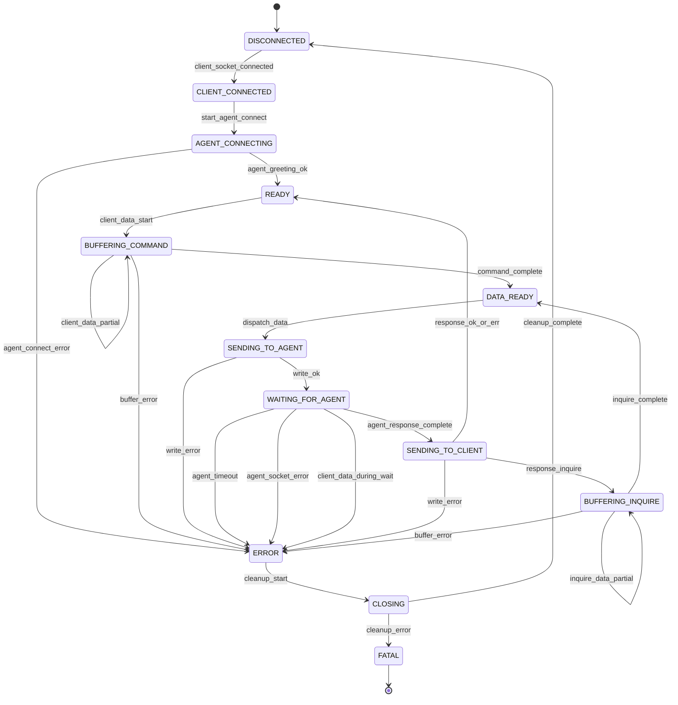

# Request Proxy State Machine Refactor

## Overview

Refactor `request-proxy` from an implicit event-driven model into an explicit function-pointer state machine with clear states, events, and transitions. This improves maintainability, testability, and visibility into protocol behavior.

## States

- `DISCONNECTED` — no client socket
- `CLIENT_CONNECTED` — client socket accepted, paused
- `AGENT_CONNECTING` — connecting to agent, awaiting greeting
- `READY` — agent connected, ready to buffer client commands
- `BUFFERING_COMMAND` — accumulating command bytes from client
- `BUFFERING_INQUIRE` — accumulating D-block bytes from client
- `DATA_READY` — complete command or D-block received, ready to send
- `SENDING_TO_AGENT` — sending command/D-block to agent
- `WAITING_FOR_AGENT` — awaiting complete response from agent
- `SENDING_TO_CLIENT` — sending response to client
- `ERROR` — error occurred, beginning cleanup
- `CLOSING` — cleanup in progress
- `FATAL` — unrecoverable error; terminal state
- (Terminal) ← DISCONNECTED after successful cleanup

## Events

- `CLIENT_SOCKET_CONNECTED` — new client socket accepted
- `START_AGENT_CONNECT` — initiate agent connection
- `AGENT_GREETING_OK` — agent greeting received successfully
- `AGENT_CONNECT_ERROR` — agent connection failed
- `CLIENT_DATA_START` — first chunk of client data arrives
- `CLIENT_DATA_PARTIAL` — data arrives but incomplete command
- `COMMAND_COMPLETE` — complete command line (with `\n`) received
- `INQUIRE_DATA_PARTIAL` — data arrives but incomplete D-block
- `INQUIRE_COMPLETE` — complete D-block (ending with `END\n`) received
- `BUFFER_ERROR` — error during buffering (e.g., encoding issue)
- `DISPATCH_DATA` — send complete command or D-block to agent
- `WRITE_OK` — write to agent/client succeeded
- `WRITE_ERROR` — write to agent/client failed
- `AGENT_RESPONSE_COMPLETE` — complete response from agent received
- `AGENT_TIMEOUT` — no response from agent within timeout
- `AGENT_SOCKET_ERROR` — agent socket error (ECONNRESET, etc.)
- `CLIENT_DATA_DURING_WAIT` — client sent data while waiting for agent
- `RESPONSE_OK_OR_ERR` — agent response is OK or ERR (transition to READY)
- `RESPONSE_INQUIRE` — agent response contains INQUIRE (transition to BUFFERING_INQUIRE)
- `CLEANUP_START` — beginning cleanup (ERROR → CLOSING)
- `CLEANUP_COMPLETE` — cleanup finished successfully (CLOSING → DISCONNECTED)
- `CLEANUP_ERROR` — cleanup encountered an error (CLOSING → FATAL)

## State Transition Diagram

## Implementation Plan

### Phase 1: Type Definitions & Infrastructure ✅ COMPLETE
**File:** `request-proxy/src/services/requestProxy.ts`

- [x] Define `ClientState` type with all 12 states
- [x] Define `StateEvent` union with all 20+ events (21 total)
- [x] Define `StateHandler` function signature
- [x] Create transition table (lookup: `(state, event) → nextState`)
- [x] Add validation that transition table covers all valid (state, event) pairs
- [x] Create `dispatch(event: StateEvent) → Promise<void>` function as central router (implemented as `dispatchStateEvent`)

### Phase 2: State Handlers ✅ COMPLETE
**File:** `request-proxy/src/services/requestProxy.ts`  
Implement handler for each state:

- [x] `handleDisconnected(event)` — only accepts `CLIENT_SOCKET_CONNECTED`
- [x] `handleClientConnected(event)` — only accepts `START_AGENT_CONNECT`
- [x] `handleAgentConnecting(event)` — accepts `AGENT_GREETING_OK`, `AGENT_CONNECT_ERROR`
- [x] `handleReady(event)` — only accepts `CLIENT_DATA_START`
- [x] `handleBufferingCommand(event)` — accumulates data; emits `COMMAND_COMPLETE` or stays in state
- [x] `handleDataReady(event)` — only accepts `DISPATCH_DATA`
- [x] `handleSendingToAgent(event)` — only accepts `WRITE_OK`, `WRITE_ERROR`
- [x] `handleWaitingForAgent(event)` — accepts `AGENT_RESPONSE_COMPLETE`, timeouts, socket errors, pipelined data
- [x] `handleSendingToClient(event)` — only accepts `WRITE_OK`, `WRITE_ERROR` plus determination of next state
- [x] `handleBufferingInquire(event)` — accumulates D-block; emits `INQUIRE_COMPLETE` or stays in state

- [x] `handleError(event)` — only accepts `CLEANUP_START`
- [x] `handleClosing(event)` — accepts `CLEANUP_COMPLETE`, `CLEANUP_ERROR` (goes to `FATAL`)
- [x] `handleFatal(event)` — no transitions out; log state and remain
- [x] `dispatchStateEvent()` — central router for state machine dispatch

### Phase 3: Socket Event Integration
**File:** `request-proxy/src/services/requestProxy.ts`  
Wire socket callbacks to emit events:

- [ ] Client `on('readable')` → emit `CLIENT_DATA_PARTIAL` or `CLIENT_DATA_START` based on state
- [ ] Client `on('error')` → emit appropriate error event
- [ ] Client `on('close')` → emit cleanup or error event
- [ ] Agent `on('data')` → accumulate and emit `AGENT_RESPONSE_COMPLETE` when ready
- [ ] Agent timeouts → emit `AGENT_TIMEOUT`
- [ ] Write callbacks → emit `WRITE_OK` or `WRITE_ERROR`

### Phase 4: Buffer Management
**File:** `request-proxy/src/services/requestProxy.ts`

Create a shared buffer utility to avoid duplication:

- [ ] Extract `extractFromBuffer(buffer, delimiter) → { extracted: string | null; remaining: string }` helper function
  - For `BUFFERING_COMMAND`: delimiter is `'\n'`
  - For `BUFFERING_INQUIRE`: delimiter is `'END\n'`
  - Returns extracted data (or null if incomplete) and remaining buffer
- [ ] Use latin1 encoding consistently throughout
- [ ] Remove calls to `extractNextCommand()` and `determineNextState()` from shared

Then in the state handlers:

- [ ] `handleBufferingCommand`: call `extractFromBuffer(buffer, '\n')`, emit `COMMAND_COMPLETE` if extracted, else stay in state
- [ ] `handleBufferingInquire`: call `extractFromBuffer(buffer, 'END\n')`, emit `INQUIRE_COMPLETE` if extracted, else stay in state

### Phase 5: Response Processing & INQUIRE Detection
**File:** `request-proxy/src/services/requestProxy.ts`

- [ ] In `handleWaitingForAgent`, accumulate agent response with proper binary handling
- [ ] Detect complete response (ends with OK/ERR/INQUIRE at line start)
- [ ] In `handleSendingToClient`, parse response to check for `INQUIRE`
- [ ] Emit `RESPONSE_OK_OR_ERR` or `RESPONSE_INQUIRE` event
- [ ] Transition to `READY` or `BUFFERING_INQUIRE` accordingly

### Phase 6: Error Handling & Cleanup
**File:** `request-proxy/src/services/requestProxy.ts`

- [ ] Implement `handleError` to initiate graceful shutdown
- [ ] Implement `handleClosing` to perform full session cleanup:
  - [ ] Remove socket event listeners (close, error, readable, etc.)
  - [ ] Destroy socket connection
  - [ ] Clear session buffer
  - [ ] Clear sessionId
  - [ ] Remove session entry from session map
  - [ ] Emit either `CLEANUP_COMPLETE` (success) or `CLEANUP_ERROR` (failure) event
- [ ] Implement `handleFatal` to log fatal state and ensure no recovery attempts
- [ ] Add explicit logging for all error transitions
- [ ] Ensure cleanup always runs, even on internal errors
- [ ] Validate that cleanup errors transition to `FATAL` (not loop back)

### Phase 7: Tests
**File:** `request-proxy/src/test/requestProxy.test.ts`

- [ ] Transition table validation: use TypeScript type system to ensure all (state, event) pairs are handled
- [ ] Add tests for each valid state transition in the table
- [ ] Add tests for each error transition
- [ ] Add tests for buffering scenarios (partial data arrival)
- [ ] Add tests for pipelined client data during `WAITING_FOR_AGENT`
- [ ] Add tests for INQUIRE response detection and transition to `BUFFERING_INQUIRE`
- [ ] Add tests for cleanup and full session teardown
- [ ] Add tests for `CLOSING` → `FATAL` on cleanup error
- [ ] Ensure all 12 states are exercised and transition paths are verified

### Phase 8: Cleanup
**Files:** `shared/src/protocol.ts`, `shared/src/test/protocol.test.ts`

- [ ] Check if `extractNextCommand()` is used elsewhere (agent-proxy, other extensions)
- [ ] Check if `determineNextState()` is used elsewhere
- [ ] If unused, mark as deprecated or remove entirely
- [ ] If used elsewhere, keep and ensure tests remain valid
- [ ] Remove import of these helpers from `request-proxy`

### Phase 9: Compile & Test
**Files:** Root directory

- [ ] Run `npm run compile` — all packages must compile without error
- [ ] Run `npm test` — all existing tests must pass
- [ ] Verify no regressions in agent-proxy or extension behavior

## Success Criteria

- [ ] All 12 states implemented with explicit handlers
- [ ] Transition table covers all valid (state, event) pairs
- [ ] All error paths explicitly listed and tested
- [ ] Socket callbacks emit events into dispatcher
- [ ] Buffering logic is explicit (not implicit)
- [ ] INQUIRE detection is clear and testable
- [ ] Client data during `WAITING_FOR_AGENT` properly rejected
- [ ] No calls to removed shared helpers remain in request-proxy
- [ ] All tests pass; no regressions
- [ ] Mermaid diagram matches implementation

## Notes

- **Event flow is deterministic** per the state diagram; socket callbacks emit events and handlers follow defined transitions. No async/sync debate—the state paths are fixed.
- **Handlers emit events** as defined in the plan; example: `handleBufferingCommand` accumulates data and emits `COMMAND_COMPLETE` when newline is detected, or stays in state on partial data.
- **Timeouts in request-proxy** are limited to `gpgconf` calls (socket path resolution). Agent-proxy handles its own response timeouts internally via `waitForResponse()` and emits `AGENT_TIMEOUT` to the dispatcher.
- **Full session cleanup** in `CLOSING` state must release all resources tied to the client session:
  - Remove socket and all event listeners
  - Clear buffer and sessionId
  - Remove session entry from session map
  - This allows a new client-initiated session to begin at `DISCONNECTED` without residual state.
- **Transition table validation** occurs via TypeScript type checking (ensure all state/event pairs are handled) and unit tests (verify each transition produces correct next state). No runtime validation needed.
- **Dispatcher is event-driven** (not a polling loop); socket callbacks emit events asynchronously into the dispatcher, which routes them through state handlers deterministically.
- **Logging** uses `log(config, message)` with `sanitizeForLog()` for protocol data (per AGENTS.md).
- **Binary safety** maintained via latin1 encoding throughout.
