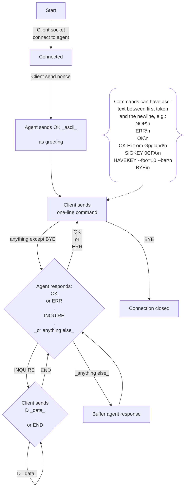

# Sequence Diagram

```mermaid
flowchart TD

    Start -- Client socket<br/>connect to agent --> Connected
    Connected -- Client send nonce --> GREETING

    %% Agent owns conversation
    GREETING[Agent sends OK _ascii_\n
    as greeting] --> SEND_COMMAND

    COMMAND_EXAMPLES@{ shape: braces, label: "Commands can have ascii
    text between first token
    and the newline, e.g.:
    NOP\\n
    ERR\\n
    OK\\n
    OK Hi from Gpgland\\n
    SIGKEY 0CFA\\n
    HAVEKEY --foo=10 --bar\\n
    BYE\\n"} -.-> SEND_COMMAND

    %% Client owns conversation
    SEND_COMMAND[Client sends
    one-line command]
    
    SEND_COMMAND -- anything except BYE\n --> WAIT_RESPONSE

    %% Any of these reponses moves conversation back to client
    WAIT_RESPONSE{Agent responds:
    OK\n or ERR\n,
    INQUIRE\n,
    _or anything else_} -- OK\n or<br/>ERR\n --> SEND_COMMAND
    WAIT_RESPONSE -- INQUIRE\n --> INQUIRE
    WAIT_RESPONSE -- _anything else_\n --> BUFFER_AGENT

    BUFFER_AGENT[Buffer agent response] --> WAIT_RESPONSE

    INQUIRE{Client sends
    D _data_\n,
    or END\n} -- D _data_\n --> INQUIRE
    INQUIRE -- END\n --> WAIT_RESPONSE

    %% SESSION END
    SEND_COMMAND -- BYE\n --> BYE
    BYE[Connection closed]

```
