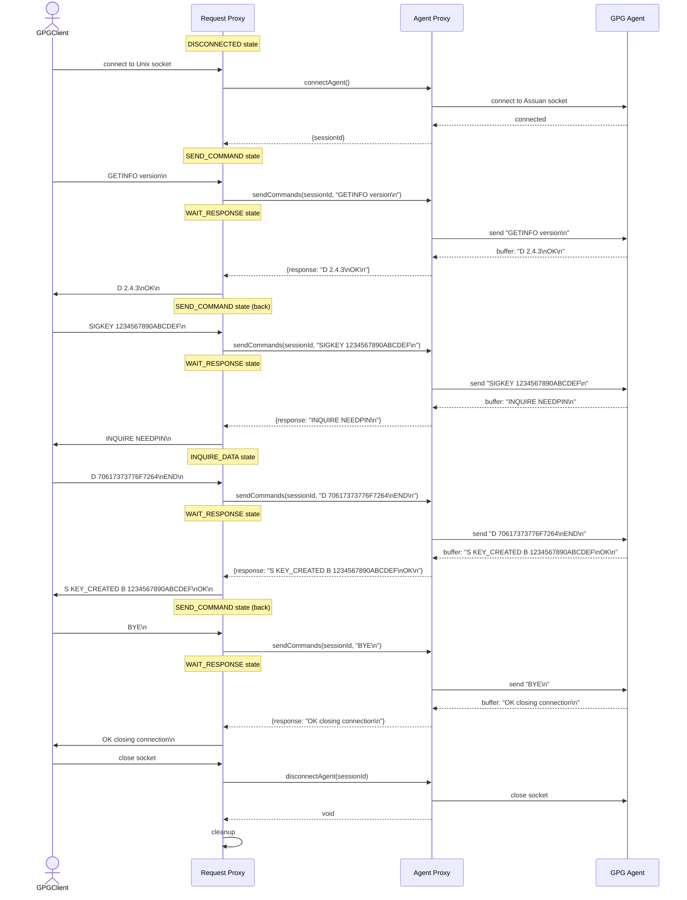

# Sequence Diagram

```mermaid
sequenceDiagram
    actor GPGClient
    participant ReqProxy as Request Proxy
    participant AgentProxy as Agent Proxy
    participant GPGAgent as GPG Agent

    Note over ReqProxy: DISCONNECTED state
    GPGClient->>ReqProxy: connect to Unix socket
    ReqProxy->>AgentProxy: connectAgent()
    AgentProxy->>GPGAgent: connect to Assuan socket
    GPGAgent-->>AgentProxy: connected
    AgentProxy-->>ReqProxy: {sessionId}
    
    Note over ReqProxy: SEND_COMMAND state
    GPGClient->>ReqProxy: GETINFO version\n
    ReqProxy->>AgentProxy: sendCommands(sessionId, "GETINFO version\n")
    
    Note over ReqProxy: WAIT_RESPONSE state
    AgentProxy->>GPGAgent: send "GETINFO version\n"
    GPGAgent-->>AgentProxy: buffer: "D 2.4.3\nOK\n"
    AgentProxy-->>ReqProxy: {response: "D 2.4.3\nOK\n"}
    ReqProxy->>GPGClient: D 2.4.3\nOK\n
    
    Note over ReqProxy: SEND_COMMAND state (back)
    GPGClient->>ReqProxy: SIGKEY 1234567890ABCDEF\n
    ReqProxy->>AgentProxy: sendCommands(sessionId, "SIGKEY 1234567890ABCDEF\n")

    Note over ReqProxy: WAIT_RESPONSE state
    AgentProxy->>GPGAgent: send "SIGKEY 1234567890ABCDEF\n"
    GPGAgent-->>AgentProxy: buffer: "INQUIRE NEEDPIN\n"
    AgentProxy-->>ReqProxy: {response: "INQUIRE NEEDPIN\n"}
    ReqProxy->>GPGClient: INQUIRE NEEDPIN\n
    
    Note over ReqProxy: INQUIRE_DATA state
    GPGClient->>ReqProxy: D 70617373776F7264\nEND\n
    ReqProxy->>AgentProxy: sendCommands(sessionId, "D 70617373776F7264\nEND\n")
    
    Note over ReqProxy: WAIT_RESPONSE state
    AgentProxy->>GPGAgent: send "D 70617373776F7264\nEND\n"
    GPGAgent-->>AgentProxy: buffer: "S KEY_CREATED B 1234567890ABCDEF\nOK\n"
    AgentProxy-->>ReqProxy: {response: "S KEY_CREATED B 1234567890ABCDEF\nOK\n"}
    ReqProxy->>GPGClient: S KEY_CREATED B 1234567890ABCDEF\nOK\n
    
    Note over ReqProxy: SEND_COMMAND state (back)
    GPGClient->>ReqProxy: BYE\n
    ReqProxy->>AgentProxy: sendCommands(sessionId, "BYE\n")

    Note over ReqProxy: WAIT_RESPONSE state
    AgentProxy->>GPGAgent: send "BYE\n"
    GPGAgent-->>AgentProxy: buffer: "OK closing connection\n"
    AgentProxy-->>ReqProxy: {response: "OK closing connection\n"}
    ReqProxy->>GPGClient: OK closing connection\n
    
    GPGClient->>ReqProxy: close socket
    ReqProxy->>AgentProxy: disconnectAgent(sessionId)
    AgentProxy->>GPGAgent: close socket
    AgentProxy-->>ReqProxy: void
    ReqProxy->>ReqProxy: cleanup
```
